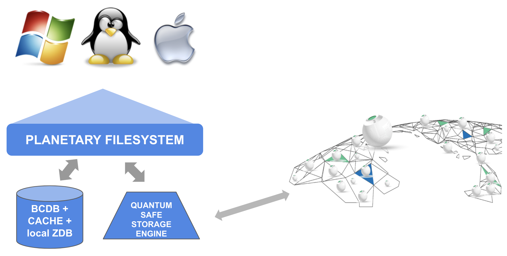
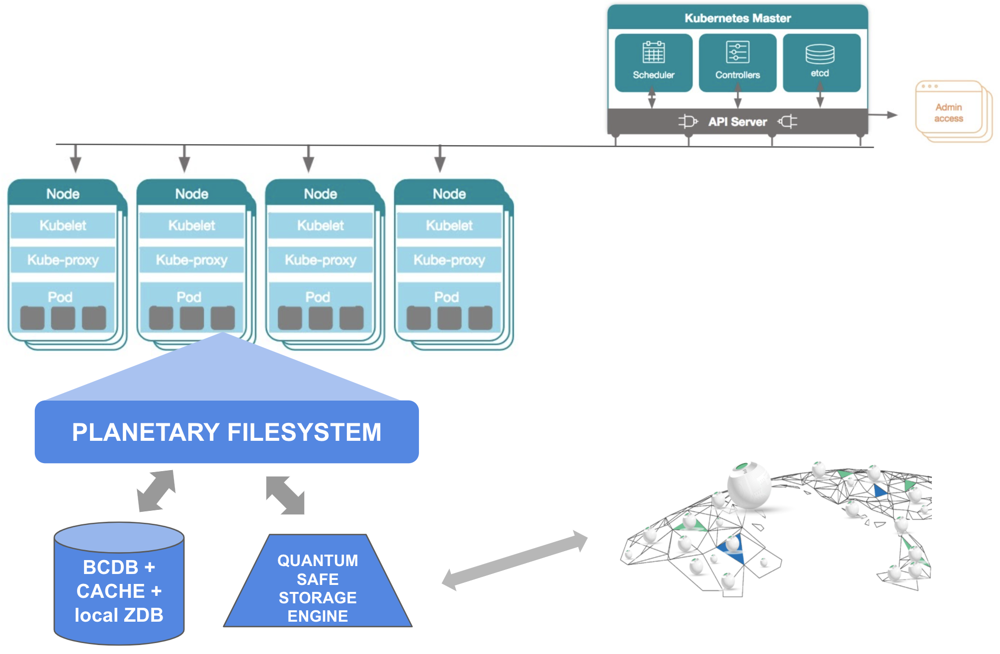

# Planetary Secure File System

- generic usable filesystem writes to the secure storage backend on planetary scale.
- allow anyone to run their storage apps (using existing interfaces & standards) everywhere in the world and securely connect and use the quantum safe storage system as backend.

