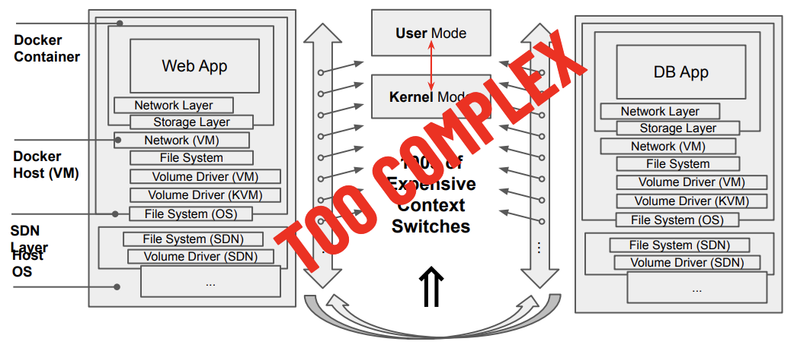

# An architecture that reduces complexity 

## Old-School architectures are overly complex

Since the launch of Commodore 64, 30 years back, hardware has improved about 10,000 times. However, we observe that user features and performance improvement have only improved less than 10 times. 
We see a number of reasons for this discrepancy, and all has to do with how the IT business has evolved over time : 
- Large IT companies have made many acquisitions. After each of these acquisitions, the question arises on how to integrate different systems. This has lead to integration strategies that complexify the architecture by adding layers. 
- The IT industry has often chosen for the 'Painkiller Approach' : instead of rewriting code to optimise the behaviour of a system, layers are built on top, as  quickfixes pay off more than more fundamental reviews.
- This has lead to a culture where many abstraction layers has become an evidence. This is even more stimulated by IT vendors, who wants to sell their layer, and it even found its way into the education on how IT should be organised. 

The result is an overly complex IT infrastructure, as too many abstraction layers MEANS loss in efficiency & performance. In the end, it leads to an increased cost of management and scalability of technology, and legacy systems which have become too complex to maintain.

## ThreeFold Tech architecture, rebuilt from scratch

ThreeFold Tech has built its system with simplicity as a key driver :  

### Lower the amount of context switches

Context switching is the process of storing and restoring the execution state (context) of a process towards CPU, so that execution can be resumed from the same point at a later time.
Each layer of abstraction involves multiple expensive user and kernel mode context switches. Even a simple network interaction between 2 applications results easily in hundreds of context switches.

The base principle is to use hardware way more efficiently, 'simply' by reducing the number of useless instructions from an end-user perspective, by eliminating code that does not bring any value to the final end-to-end user experience. 
Evidently, the value for the user can't be lost, but by completely re-engineering the OS and build security and privacy into it instead of having it in a layer around, we can optimise these same features of security and privacy, while improving also the overall performance. 

