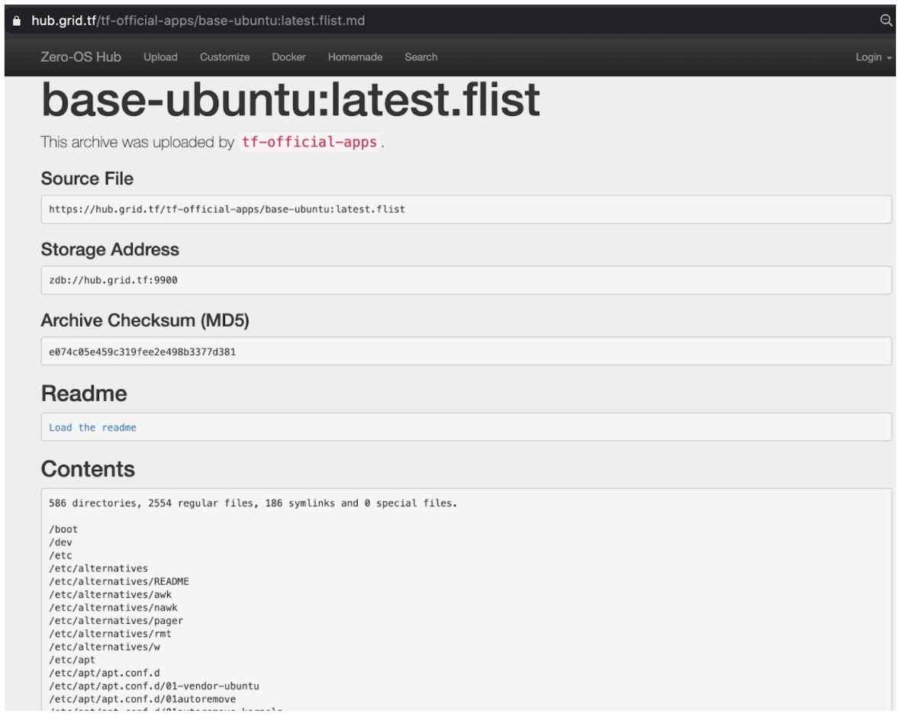

# Ultra Efficient Virtual File System for Zero-OS

## Zero-OS Virtual Filesystem Architecture

There are times when you need to download particular files from an archive, but in order to do so, you would need to download a heavy-sized archive from the internet. 

For example, from a 4 GB compiled archive, you only actually need the 2 MB files inside, but you are not able to specifically download these files and need to download the whole 4 GB... You then realized thay you've wasted both your time and your internet bandwidth.

If you're living in a country with a decent internet providers and infrastructure, this would not be a massive problem, but for people who are not living in these regions, this download would cost them hours, expensive amount of bandwidth of their internet.

It would be a lot more efficient if users are able to only download the files they actually want to keep. And the __Flist__ concept was born as a solution to this problem.

### Enter the Flist (Files List) Format and Concept

#### Metadata and Data

The main idea of Flist is to split 'metadata' and 'data' separately. Metadata is the referential information about everything you need to know about the content of the archive without the payload. The payload is the content of the referred files.

If you are able to only download the metadata (which is really small) and download only the payload you want, you could dramatically improve bandwidth usage and download time, as mostly, you only need a small part of the archive you're downloading.

Imagine, you store the payload of your files somewhere and only keep the metadata somewhere else. If you download the metadata of an archive, you'll know the contents (files list, names, permissions, files size, etc.). If you add extra information to explain how to reach the payload, you have a lightweight archive which looks like a real archive but with a way smaller size, because the payloads are the ones taking the most bandwith of a conventional archive.

In brief, an Flist is a metadata with references pointing to the location of the payload itself. Allowing payloads to only be downloaded when it's referred. By using this Flist, users could eventually benefit by saving the time, and bandwidth workload.

#### How Does it Work ?

To understand further how Flist works, we would need to understand the concept of __CAS (Content Addressed Storage)__. We store metadata and data in two ways. Data is stored in a 0-DB somewhere. We split files into chunks, and then we save each chunk (content) and its hash (address) into the database (storage).

The Flist itself is the metadata. It's a database that contains a list of directories and files, all their information (name, size, permissions, ...) and the list of chunk addresses (the list of hashes we could use to query the database).

We store Flist files into our [<< hub >>](https://hub.grid.tf). For example, you could see the file ubuntu:18.04 which is mostly the same as ubuntu:18.04 docker image, but the Flist is 3.16 MB large. By downloading this, you have enough information to know everything in the archive.

With some tools like __0-FS__, you could even mount that Flist and use it like a real directory.

## More information 

- [container virtual filesystem details](container_vfs_details)
- [how to build and upload Flist](flist)
