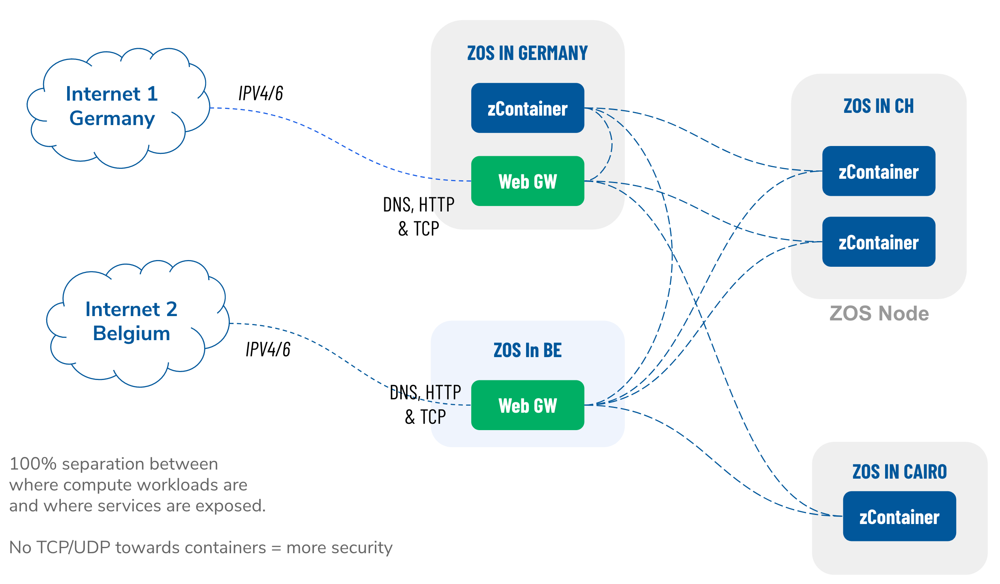

## Network Architecture

### Introduction
True peer-to-peer is a principle that exists everywhere within Threefold's technology stack, especially on its Network Architecture. Farmers produce IT capacity by connecting hardwares to the network and installing Zero-OS. The peer-to-peer network of devices forms the TF Grid. This TF Grid is a universal substrate of which a large variety of IT workloads exist and run.

### Peer-to-peer networking
The TF Grid is built by 3Nodes (hardware + Zero-OS) that are connected to the internet by using the IPv6 protocol. To future-proof this grid, IPv6 has been chosen as ThreeFold Grid's native networking technology. The TF Grid operates on IPv6 (where available) and creates peer-to-peer network connections between all the containers (and other primitives). Please find more about Zero-OS primitives [here](https://manual-testnet.threefold.io/#/code) 

This creates a many-to-many web of (encrypted) point-to-point network connections which together make a (private) secure __overlay network__. This network is completely private and connects only the primitives that have been deployed in your network.

TF Network Characteristics:
- Connect all containers point-to-point
- All traffic is encrypted
- High performance
- The shortest path between two end-points, multi-homed containers
- Could span large geographical areas and create virtual data centers
- All created and made operational **without** public access from the internet

### Networking possibilities 
The TF Grid is built by 3Nodes connected to the internet (IPv6) and watchers on these 3Nodes initialize outbound connections to blockchain databases (BCDB) to "read" what they have to do. By design, the 3Nodes do not accept any inbound connections from anywhere. The only exception to this, is when public services are being built on these 3Nodes, then containers (or other Zero-OS primitives) need to have a way of accepting (IPv4 or IPv6) connections.

To facilitate this need, TF Grid has invented a feature called the __Web Gateway__. The Web Gateway is a container that is connected to the outside network with a public (IPV4 or IPv6) address and a point-to-point encrypted connection to your private overlay network. This Web Gateway could exist anywhere on the TF Grid.

This provides ample possibilities to create distributed architectures where processing and storing information happen next to the data creation point, while actual access to this data could be provided through private (encrypted tunnel) and public (Web Gateway) locations. It leads to reliable, redundant accesses (creating two or more, and have DNS load balancing between the two) to online content and this could extend all the way to build a private CDN.

### Existing Enterprise Private Networks
At Threefold, we are aware of the existence of private networks, IPsec, VPN, WAN's and more. We have the facility to create bridges to make those networks part of the deployed private overlay networks. This is in an early stage development, but with the right level(s) of interest this could be built out and carried out in the near future.

