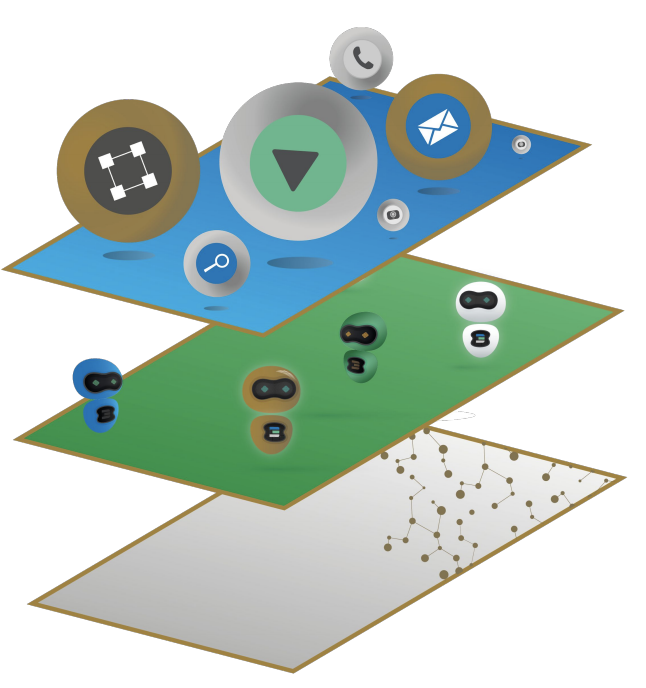
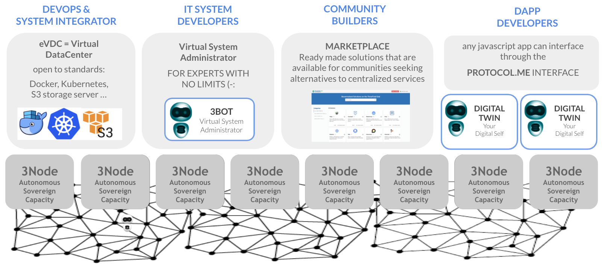

# Architecture 

## Inspired by Nature

## Three Layers

- [Capacity Layer](architecture_layers_capacity)
  - [Zero-OS](tftech:magic_zos)
- [Autonomous Layer](architecture_layers_autonomous)
  - [Smart Contract for IT](archi_smartcontract4it)  
- [Experience Layer](architecture_layers_experience)

## Functional Breakdown

- [Quantum Safe Compute](archi_qscompute)
- [Zero-OS Filesystem](architecture_flist)
- [ZOS-FS 2](threefold:zos_fs)
- [Quantum Safe Storage](archi_qsstorage)
- [Planetary Secure File System](archi_psfs)
- [Quantum Safe Network](archi_qsnetwork)
- [Planetary Secure Network](archi_psnw)
- [Web 3.0 Interface](archi_interface)
- [Web Gateway](archi_webgateway)
- [Zero-OS Network](capacity_network)
- [3Node](threefold:3node)
- [3Bot](threefold:3bot)

## Benefits 

- [Simple](archi_usp_simple)
- [Energy Efficient](archi_usp_energy_efficient)
- [Compatibility with IT standards](archi_usp_compatible_fs)
- [Privacy by Design](archi_usp_private)
- [Secure](archi_usp_secure)
- [Scalable](archi_usp_scalable)
- [Self-healing](archi_usp_selfhealing)
- [Low Redundancy](archi_usp_redundant)
- [Energy Efficient](archi_usp_energy_efficient)

# Foundational layer for the digital world

- [Foundational](archi_foundational)

**More info:**

- TFGrid
  - [ThreeFold Connect](threefold:tfconnect)
- Payments
  - [AutoPay](twin:autopay)
  - [TFGrid Wallet](cloud:cloud_wallet)

> TODO: webgateway
> TODO: zos_network
