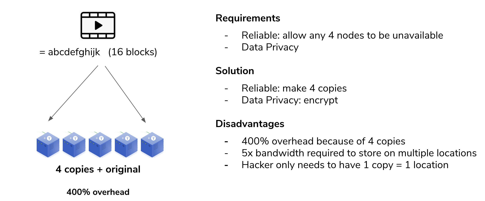

## Storage architecture

### Introduction
The storage architecture follows the true peer2peer design of the TF grid. Any participating node could store elements of objects (files, photos, movies, databases...) by offering a slice of the present (local) storage devices. Managing the storage and retrieval of all of these distributed fragments is done by a software that creates development or end-user interfaces for this storage algorithm. We call this '__the dispersed storage__'.

Peer2peer provides the unique proposition of selecting storage providers that match your application and service of business criteria. For example, you might be looking to store data for your application in a certain geographic area (for governance and compliance) reasons. Also, you might want to use different "storage policies" for different types of data. Examples are live versus archived data. All of these uses cases are possible with this storage architecture and could be built by using the same building blocks produced by farmers and consumed by developers or end-users.

### Dispersed Storage Architecture Design Philosophy

#### Classic Storage
Classic Storage designs reliability around (multiple) copies of the same data. The reasoning is to build storage solutions around the following structure:
- The first copy is the active one which is being worked on. Intense storage and retrieval processes.
- Then there is a (hot) second copy of the data that is continuously being synchronized with the live one and is available in case the active copy fails for immediate (uninterrupted) failover.
- The third copy is a cold, off-line copy, also referred to as a backup. This is a complete copy of the data which is available but not (live) accessible
- The fourth copy is what is usually referenced to as an "archive". On off-site, securely stored (physical storage) offline copy of the data that could be pulled in, in case all of the above fails.

The overhead is 100% per copy, so you quite easily end off with 400% overhead for reliability.
All of the above concepts were invented when datasets were small(er) and could still fit on one device, or is a single (dual redundant) box. This is no longer the case and therefore these storage principles are outdated.



#### ThreeFold Space Algorithm (Dispersed Storage)

Today we produce more data than ever before. We could not continue to make full copies of data to make sure it is stored reliably. This will simply not scale. We need to move from securing the whole dataset to securing all the objects that make up a dataset.

Dispersed Dtorage is using space technology to store data (fragments) over multiple devices (physical storage devices in 3Nodes). The solution does not distribute and store parts of an object (file, photo, movie...) but describes the part of an object. This could be visualized by thinking of it as equations.


Let a,b,c,d.... be the parts of that original object. You could create endless unique equations using these parts. A simple example: let's assume we have 3 parts of original objects that have the following values:
```
a=1
b=2
c=3
```
(and for reference that part of real-world objects is not a simple number like `1` but a unique digital number describing the part, like the binary code for it `110101011101011101010111101110111100001010101111011.....`). With these numbers we could create endless amounts of equations:
```
1: a+b+c=6
2: c-b-a=0
3: b-c+a=0
4: 2b+a-c=2
5: 5c-b-a=12
......
```
Mathematically we only need 3 to describe the content (=value) of the fragments. But creating more adds reliability. Now store those equations distributed (one equation per physical storage device) and forget the original object. So we no longer have access to the values of a, b, c and see and we just remember the locations of all the equations created with the original data fragments. Mathematically we need three equations (any 3 of the total) to recover the original values for a, b or c. So do a request to retrieve 3 of the many equations and the first 3 to arrive are good enough to recalculate the original values. Three randomly retrieved equations are:

```
5c-b-a=12
b-c+a=0
2b+a-c=2
```
And this is a mathematical system we could solve:
- First: `b-c+a=0 -> b=c-a`
- Second: `2b+a-c=2 -> c=2b+a-2 -> c=2(c-a)+a-2 -> c=2c-2a+a-2 -> c=a+2`
- Third: `5c-b-a=12 -> 5(a+2)-(c-a)-a=12 -> 5a+10-(a+2)+a-a=12 -> 5a-a-2=2 -> 4a=4 -> a=1`

Now that we know `a=1` we could solve the rest `c=a+2=3` and `b=c-a=2`. And we have from 3 random equations regenerated the original fragments and could now recreate the original object. 

The redundancy and reliability in such system comes in the form of creating (more than needed) equations and storing them. As shown these equations in any random order could recreate the original fragments and therefore
redundancy comes in at a much lower overhead.

Example: each object is fragmented into 16 parts. So we have 16 original fragments for which we need 16 equations to mathematically describe them. Now let's make 20 equations and store them dispersedly on 20 devices. To recreate the original object we only need 16 equations, the first 16 that we find and collect which allows us to recover the fragment and in the end the original object. We could lose any 4 of those original 20 equations.

The likelihood of losing 4 independent, dispersed storage devices at the same time is very low. Since we have continuous monitoring of all of the stored equations, we could create additional equations immediately when one of them is missing, making it an auto-regeneration of lost data and a self-repairing storage system. The overhead in this example is 4 out of 20 which is a mere **20%** instead of (up to) **400%.**

### Available Today

Dispersed Storage is a very important building block for our TF's autonomous Grid, we store all kinds of data (blockchain databases included) by using this method. This underlying storage method will be presented in many different forms for developers and end-user protocols.

What is currently available is an __S3 interface__ based on the [min.io](https://min.io/) S3 Interface. With the dispersed storage layer available, you could build fast, robust and reliable storage and archiving solutions. Herr are some examples of code and deployment schedules shared on this manual:


A typical master-slave setup would look like:


