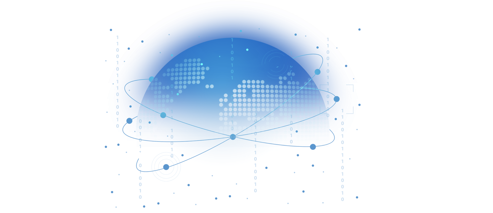

# ThreeFold Planetary Lan

ThreeFold is working on a Planetary Lan, a peer2peer network which connects everthing with everyone in a direct peer2peer encrypted connection.

This is an overlay network which lives on top of the existing internet or other peer2peer networks created.

Benefits of this planetary lan

- finds shortest possible paths between peers
- end to end encrypted 
- allows for peer2peer links like meshed wireless
- can survive broken internet links and re-route when needed
- resolves the shortage of IPV4 addresses

We are creating and packaging clients for the multiple platforms (mobile and desktop).

The underlying technology is based on Ygddrasil

