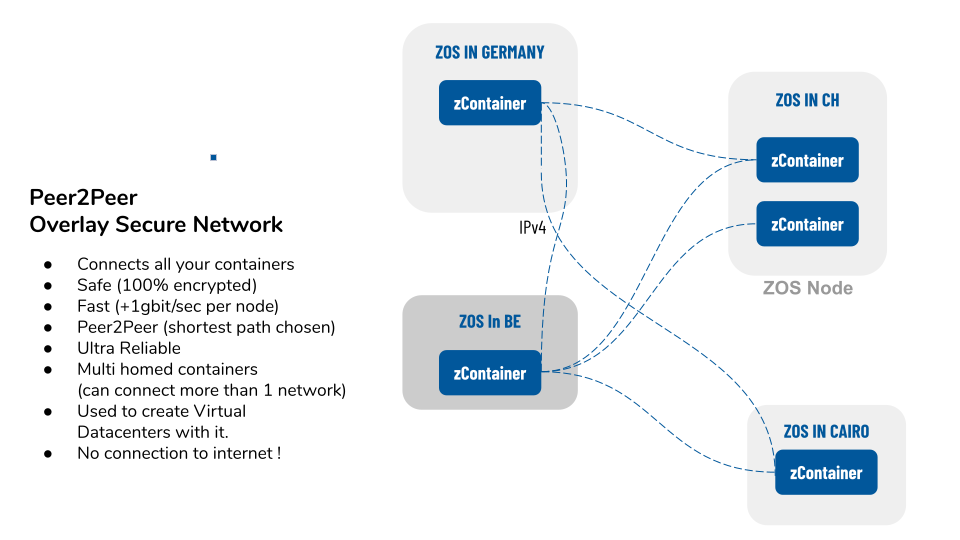

# overlay network

The network primitive allows a user to define its own overlay network between any of the nodes running 0-OS.  
The technology we used to create the overlay network is [wireguard](https://www.wireguard.com/).  
When you send a reservation that contains a network primitive, the overlay network will automatically get installed and started on all the nodes defined in your reservation.

This is the building block on top of which containers and kubernets cluster communicates.

The end goal is to build a secure and fully encrypted channel between all your application running on the grid.



## How to define a network ?

A network is defined by its name and its subnet. 
The network subnet must be a 16-bit block within the private address space define in [RFC1918](https://tools.ietf.org/html/rfc1918). So one from:

- 10.0.0.0        -   10.255.255.255  (10/8 prefix)
- 172.16.0.0      -   172.31.255.255  (172.16/12 prefix)
- 192.168.0.0     -   192.168.255.255 (192.168/16 prefix)

The 16-bit block is then splitter into 24-bit block and each node get assigned one of these 24-bit block.  
So for example if you picked `192.168.0.0/16` as global network subnet, all the nodes get assigned an subnet from `192.168.1.0/24` to `192.168.254.0/24`.

to recap, to create a network you must:

- pick a name
- pick a 16-bit block subnet
- choose all the node to add to your network and assigned them a 24-bit block out.

### How do I access my overlay network from outside ?

So far we only talked about how to interconnect all the nodes together. This is great but you as a user, also needs to be able to access the network. Would it be from your laptop or any part your existing infrastructure.

To do so, you need to add an `external access` into the network. An external access is usually define on one single node of your network, called the `entrypoint`.
An `entrypoint` is actually just a node part of you network that has special configuration that allow you to connect to all the node of your network. The entrypoint is responsible to route the traffic coming from your laptop to all the other nodes of the network.

When creating such an `entrypoint`, the SDK returns you a wireguard configuration that you need to install on the laptop/server you want to use to access the overlay network. Make sure to always copy this configuration in a safe place.

#### IPv4 versus IPv6

0-OS is IPv6 first. ALl the communication between nodes goes over IPv6. This allow to greatly reduce the amount of work needed to achieve real peer to peer.
But when it comes to `external access`. IPv6 is maybe not the way to go since most of the world has not made the switch yet.

If you are creating a `external access` to your network and want to use IPv4 to access the network, is it possible and the SDK has all the tools for it.
To achieve this you need to search for nodes with public IPv4 and use it as `entrypoint` when defining the `external access`. See the example below for more detail.

## Example using SDK

The network creation tool provided by the SDK tries to create a full mesh network. It means that it will tries to make all the nodes directly connect to all the others nodes.

The API provided by the SDK abstract all the complex logic required to create such a mesh. The only thing you need to care of is the subnet of the network and which node to add into your network. 

```python
zos = j.sal.zosv2

# create a reservation
r = zos.reservation_create()

# create a network with name <network_name> and add it to the reservation
# the 16-bit block subnet chosen here is 172.24.0.0/16
network = zos.network.create(r, ip_range="172.24.0.0/16", network_name="<network_name>")

# find all node from farm with id <farm_id>
nodes = zos.nodes_finder.nodes_search(farm_id=<farm_id>)
# add each node into the network and assigned them a 24-bit block
for i, node in enumerate(nodes):
    iprange = f"172.24.{i}.0/24"
    zos.network.add_node(network, node.node_id, iprange)

# find a node that is public and has ipv4 public IP
node = list(filter(zos.nodes_finder.filter_public_ip4, nodes))
# create an 'external access' to the network for user laptop access using the public node as entrypoint
# we store the result of this command cause this is the configuration the user has to use to connect to
# the network from his laptop
wg_config = zos.network.add_access(network, node.node_id, "172.24.100.0/24", ipv4=True)


expiration = j.data.time.epoch + (3600 * 24 * 365)
# register the reservation
registered_reservation = zos.reservation_register(r, expiration)
time.sleep(5)
# inspect the result of the reservation provisioning
result = zos.reservation_result(registered_reservation.reservation_id)

print("wireguard configuration")
print(wg_config) # this is the config you need to use to configure the wireguard of your laptop
print("provisioning result")
print(result)
print("network")
for n2 in network.network_resources:
    print(n2.node_id, n2.iprange)
```