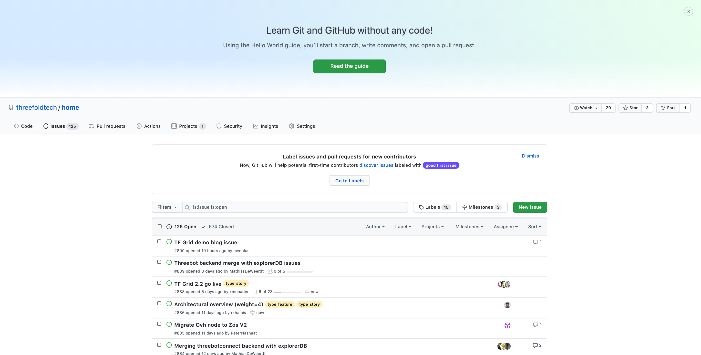
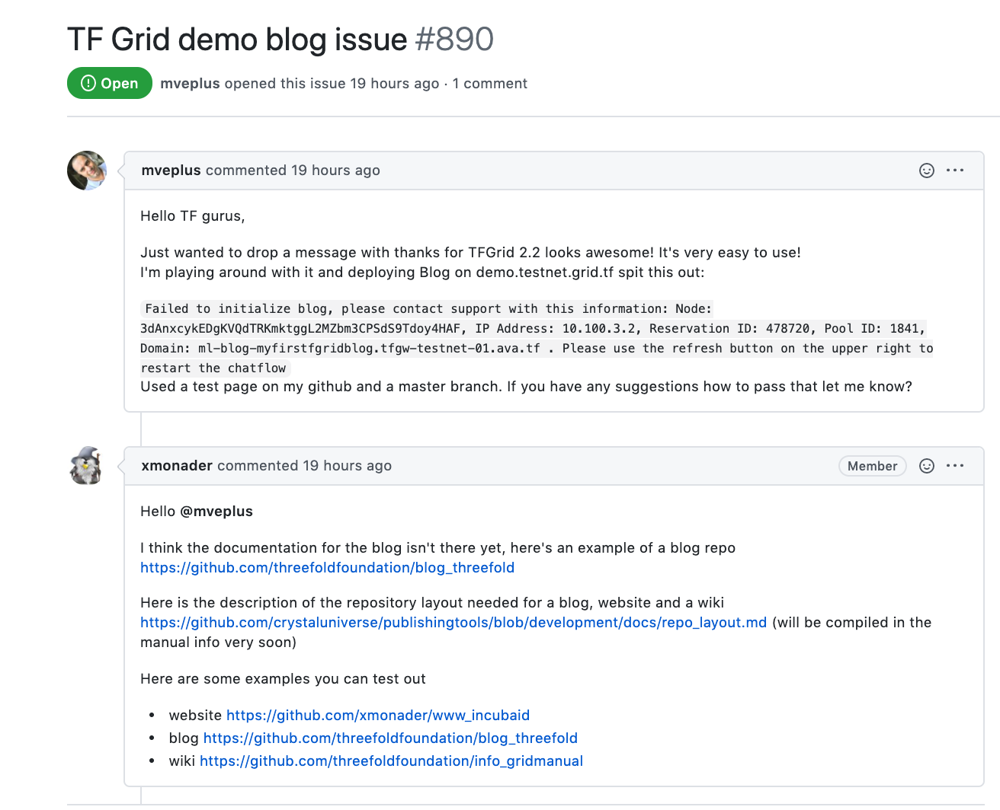

# Open Source Collaboration

## Reporting Issue and Feedback on Github 

As an organization, Threefold upholds open source collaboration as one of our core values. We thrive from our community members' feedback and participation. Therefore, we would like to invite you to become a part of our project by testing out, using our product components, documenting processes, giving feedback and reporting issues or problems faced during the usage and deployment of our product components.

If you have advices, suggestions on our product components or our manual, or if you are having an issue while using our product component deployments; deploying the 3Bot, installing ThreeFold Connect, using the features of TF Grid Demo, and others... Simply go to [__Threefold Tech Github__](https://github.com/threefoldtech/home/issues) and __create an issue__ as shown above for the tech team. Our team will get back to your issue and resolve your problem as soon as possible. Feel free to read this [__Github Tutorial__](https://docs.github.com/en/enterprise/2.15/user/articles/creating-an-issue) to learn about how to create an issue on Github.

> [Report an issue on __Threefold Tech Github__](https://github.com/threefoldtech/home/issues)

> [Learn How to Create an Issue on Github](https://docs.github.com/en/enterprise/2.15/user/articles/creating-an-issue)

> [Become a Grid Tester](test_grid)
