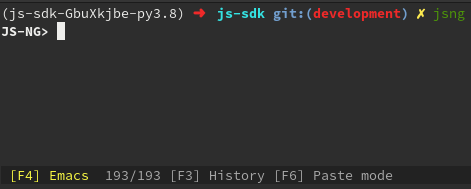

## System requirements for installation on the host

The SDK uses python3, pip3, git, poetry, nginx, redis to be completely functional. the following are the instructions for installations on ubuntu, arch and mac osx.


### Ubuntu
- Ubuntu 18.04 or later.
- packages needed [python3](python.org), python3-pip, [git](https://git-scm.com), poetry, [nginx](https://www.nginx.com), [redis](https://redis.io)

 ```
 apt-get update
 apt-get install -y git python3-venv python3-pip redis-server tmux nginx;
 pip3 install poetry
 ```

### Arch Linux
- packages needed [python3](python.org), python3-pip, [git](https://git-scm.com), poetry, [nginx](https://www.nginx.com), [redis](https://redis.io), tmux

```
yay -S python3 python-pip poetry nginx redis tmux
pip3 install poetry
```

### Mac OSX
Install packages (git, nginx, redis-server, tmux, python3) on MacOS
 ```
 brew install nginx redis-server tmux git python3
 ```


## Installing js-sdk

After preparing the dependencies on your system

### Installation using pip

Just doing `python3 -m pip install js-sdk` is enough 

### Installation for experts or developers

This version of the SDK tries to be isolated as possible in case of developers or the endusers, and we are achieving that level of isolation using poetry for the whole development/publishing process

- To install poetry `pip3 install poetry` or from [here](https://python-poetry.org/docs/#installation)
- Clone the repository `git clone https://github.com/Threefoldtech/js-sdk`
- Prepare the environment and the python dependencies

 ```bash
 cd js-sdk
 poetry update
 poetry install
 poetry shell
 ```

After installing the js-sdk you can invoke it in your shell by executing `jsng`. This should spawn a shell inside your terminal.

