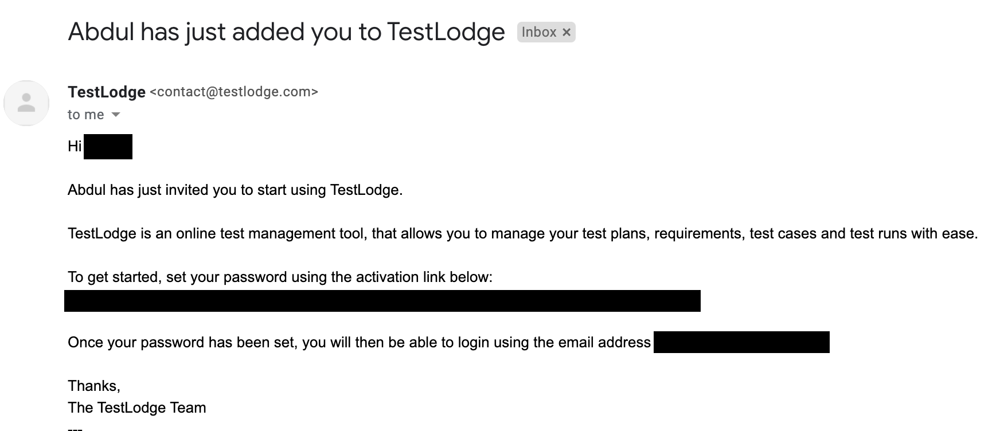
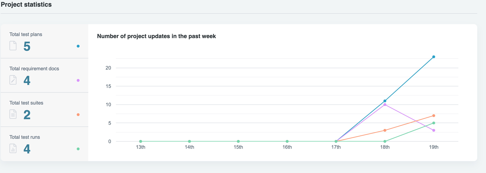
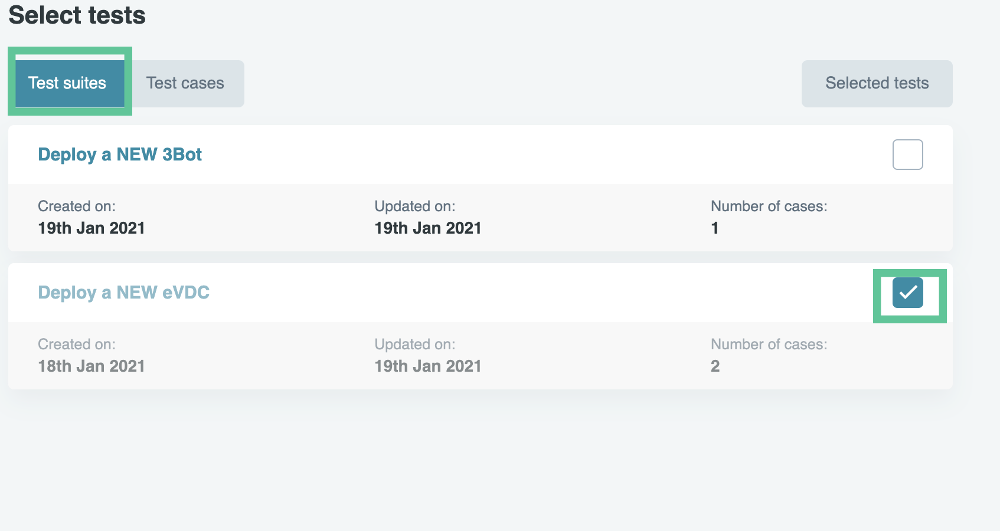
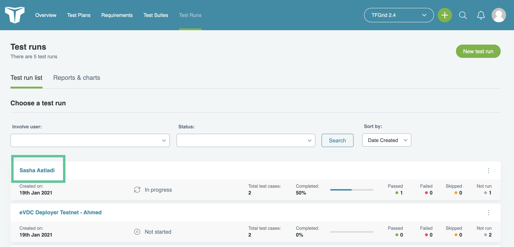
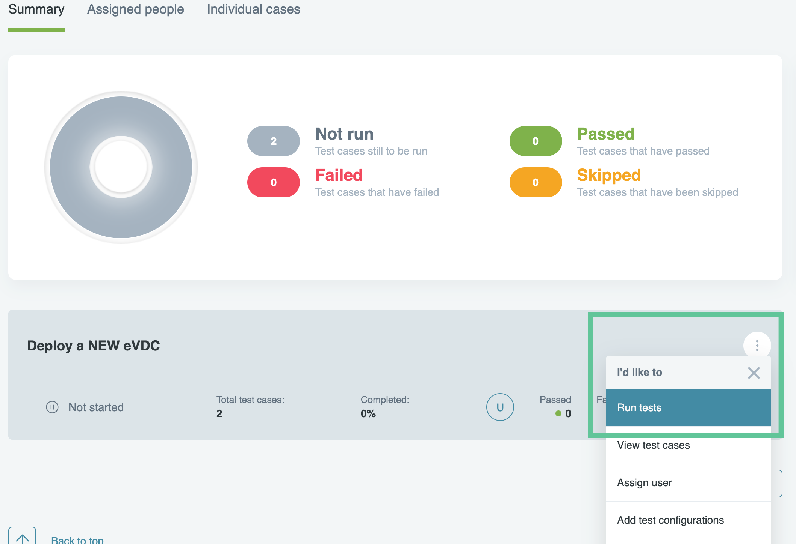
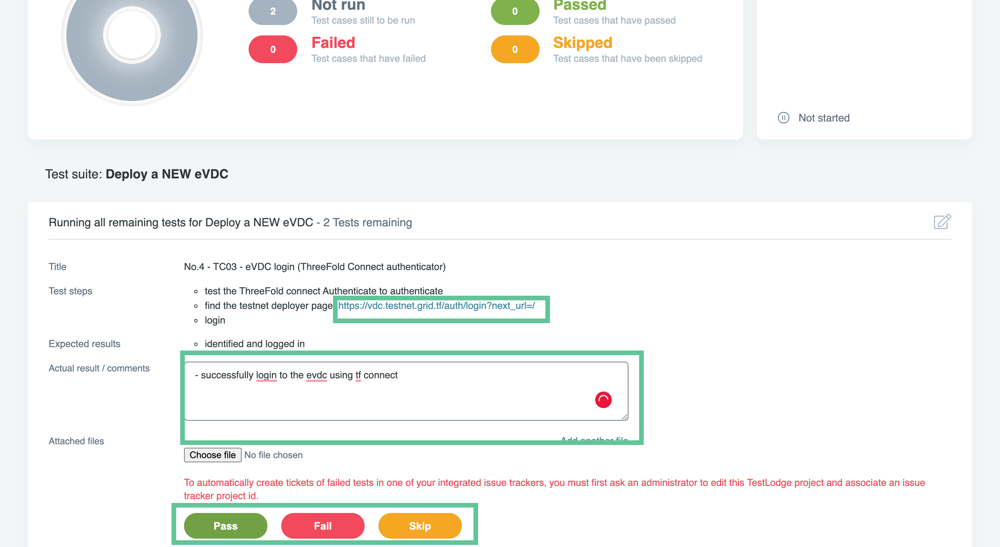
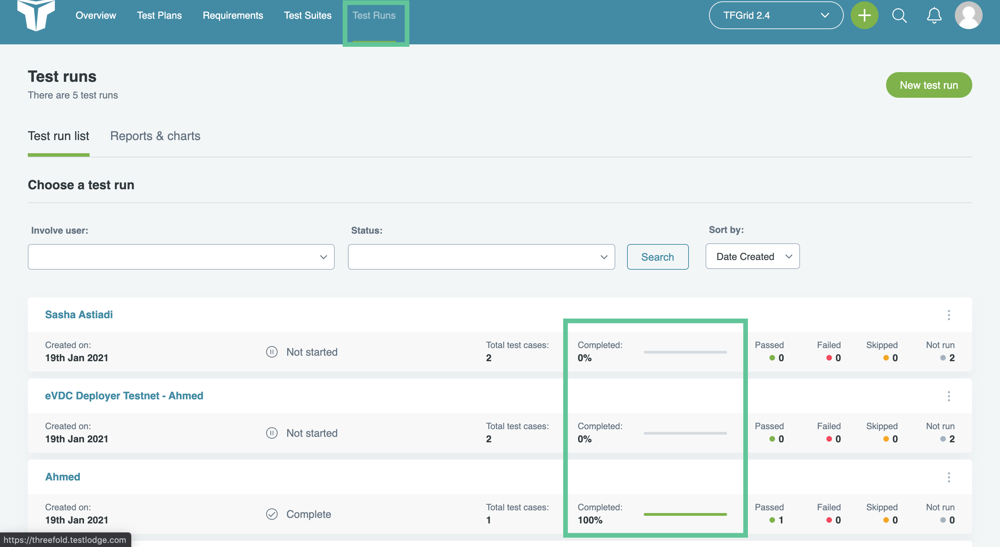

# Testing The ThreeFold_Grid using TestLodge

After each release of every newer grid version, we invite everyone within ThreeFold Community to test the grid's product components and give our engineering team constructive feedback on our product development.

We have chosen to use TestLodge as our QA and testing platform. Testlodge is a platform that enable ThreeFold to manage our products' test plans, test cases & test runs with ease. By joining TestLodge as a user, you could then assist us in running test use cases and reporting issues found during our product deployment processes.

## Getting Started on TestLodge

### Join TF GRID Project on Testlodge by Invitation

If you would like to become one of our testers on TestLodge, please request an invitiation by joining our official [**TF Grid Tester Telegram Group**](https://t.me/joinchat/R75FxI_6J6tgn1jK) and send a personal message providing your email to the group's moderator.

Once invited, please check your invitation email and create an account on Testlodge to be able to access the TF GRID Project on Testlodge.

### Accessing TF GRID 2.4 Project

Once your account is created successfully, you would be able to access **TF GRID 2.4 Project** on your dashboard. Simply click on the project to get started on your testing process.

### Project Overview

Inside the project, you would see a display of the project overview to see the content of the project testing environment. Below is a brief description of the project content.

- **Total Test Plans**: is the amount of test plans, or products being tested on this project.
- **Total Requirement Docs**: is the amount of testing documentation provided for each test on this project.
- **Total Test Suites**: is the amount of individual test use cases for every product being tested on this project. This is the test procedures you would be doing as a user / tester.
- **Total Test Runs**: is the amount of individual testing round of every user that has been created for this project. Each tester would have their own Test Run serving as a testing dashboard where you can report the result of every test. You would need to **create a Test Run** with your name as the title to get started with testing the **TF Grid Test Suites**.

### Creating Your Own Personal Test Run

#### An example of a test run: Test the deployment of eVDC using eVDC Deployer

Click on 'Test Runs' tab on the top navigation bar and create a new test run by clickin on 'New Test Run'.

Insert your name as the test name, and since it is a test run for eVDC Deployer, choose 'eVDC Deployer' as your test suite. Click on 'Select Test Suites and Cases' to see the details of use cases you would like to test.

On the 'Select Test Suites and Cases' page, check 'Deploy a new eVDC' test suite as your Test Suite... Your test suite will include 2 types of different use cases needed to deploy an eVDC.

Click 'Add Test Run' to finish registering your new test run.

You will then proceeds to the list of all created test runs from you and other users / testers in this project. Click on the test run you just created.

You will be redirected to your own test run profile with the summary and list of the test suite(s) you will need to run.

On the 'test suite' list shown, click on the 'Deploy eVDC' test suite, and click 'run test' to start testing.

Go to the eVDC Deployer and begin your test.

Write your remark on the provided comment box, and click on 'pass' , 'fail' or 'skip' depending on the result of your test run to provide feedback to the QA Team of ThreeFold.

Repeat the last step to finish all use cases test run to complete your test run.

Go back to the 'test runs' page to see the overview of all test runs, and make sure that you completed your own test runs as shown below.

Thank you for completing test runs for ThreeFold_Grid Project!
