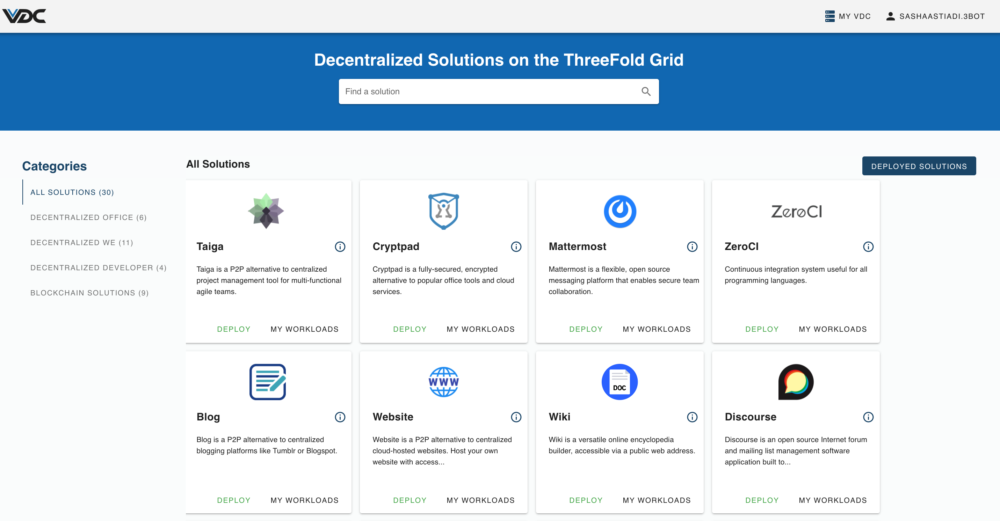

# eVDC Admin Panel

After successfuly deploying an eVDC from the eVDC Deployer, you can access your eVDC Admin panel via the given link on your [Deployed eVDCs List](evdc_manage).

With __eVDC Admin Panel__, you can now deploy and manage your workloads on each active eVDC. This admin panel will support you to execute many eVDC functionalities, such as accessing your eVDC wallet, deploying decentralised solutions on the marketplace, upgrading your eVDC compute nodes, and many more.

The eVDC Admin Panel is consisted of 2 sections: 

- __My VDC__ gives you the access to overview your compute nodes, storage nodes and the wallet that is set up specifically for funding the resource provisioning of your VDC. 

- __TF NOW Marketplace__ allows you to deploy workloads onto your VDC.

> Go to [__My eVDC__](evdc_my_evdc) to manage and provision your eVDC resources.

> Go to [__TFNOW Marketplace Solutions in your eVDC__](evdc_tfnow) to deploy a solution.
