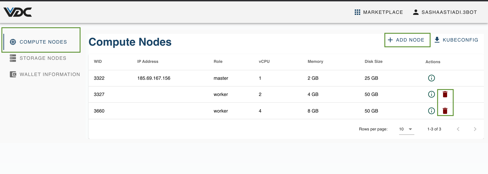

# Manage Compute Nodes in an eVDC

Compute Nodes are the capacity inside your Kubernetes cluster. This capacity is used to deploy and maintain deployed workloads and inside your eVDC. 

You can easily upgrade or downgrade capacity inside your eVDC by adding or removing worker nodes via the Compute Nodes page on your Admin panel.

## How to Access Compute Nodes

Once youre logged in the eVDC, click on __'My VDC'__ menu on the top right corner of the navigation bar on your eVDC admin panel home.

You will be directed to the 'Compute Nodes' page within your eVDC Management page where you can add or remove nodes based on your necessity.

> [Upgrade eVDC Capacity by Adding a Node](evdc_upgrade)

> [Downgrade eVDC Capacity by Removing a Node](evdc_downgrade)

> [Manage your Kubernetes Cluster](evdc_k8s)
