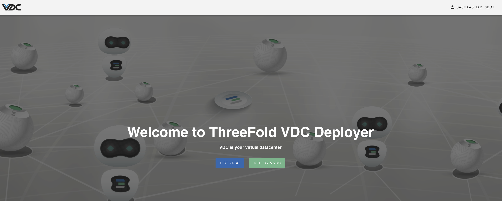
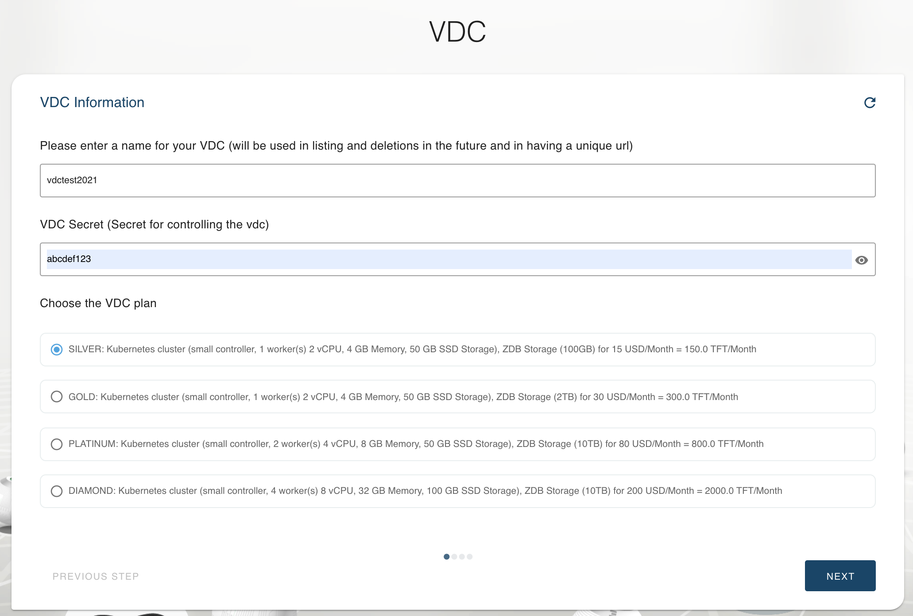
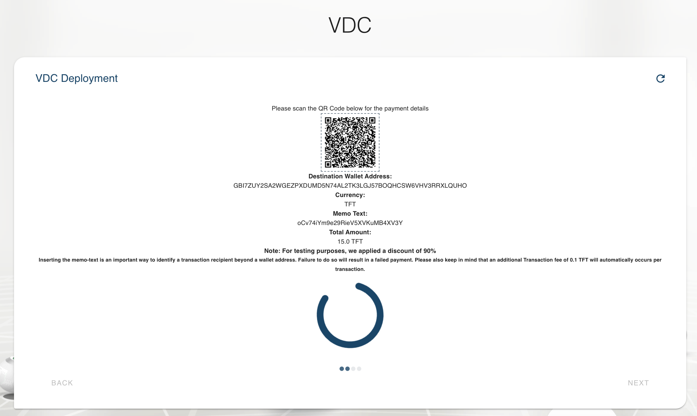
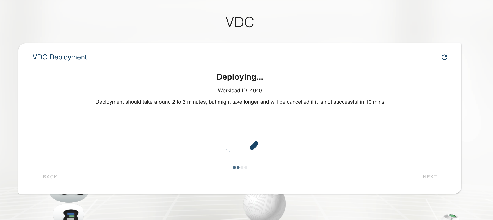
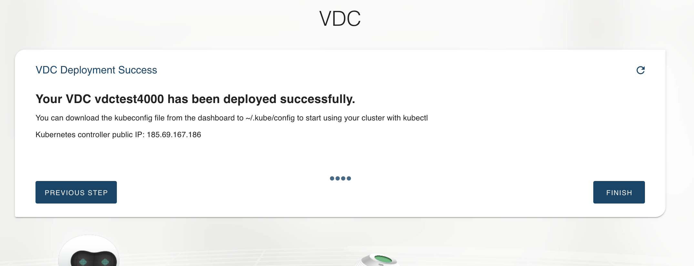

# Deploy a New eVDC

To provision any workload using TF eVDC, there are some pre-requisites that need to be done:

- Get ThreeFold Connect App;ThreeFold Connect is a mobile app that facilitate you with your own 3Bot Wallet where and 3Bot ID; your digital identity on top of the ThreeFold Grid.
- Get and store TFT into your TF Connect Wallet to reserve IT Capacity and pay for your workload on top of the TF Grid.

> Read more on the prerequisites on [__TF Getting Started Manual__](all_getting_started)

## How to Deploy eVDC 

Go to [__eVDC Deployer website__](https://vdc.testnet.grid.tf/vdc/#/) and login the eVDC platform by using your [TF Connect account](threefold_connect_install). Follow the instructions on your desktop screen and on your TF Connect mobile app to log into the eVDC Deployer.

Once logged in, click on __Deploy a VDC__ button.

Define the name and password of your new eVDC, as well as the size / plan of the new eVDC you would like to deploy. You can see more information by clicking on this [eVDC Pricings page on eVDC Wiki](https://vdc.threefold.io/docs/start-pay/) on a new tab. Click 'Next' when you have finished completing the new eVDC information page.

Depending on your selected eVDC size / dplan, you will now be redirected to the payment page consisting of the QR Code of the payment address and the ampunt of TFT you would need to pay to activate your new eVDC.

Scan the QR page using your TFT Wallet on your TF Connect Mobile App, send the TFT to the displayed wallet address and confirm your payment. 

The payment screen will automatically reload itself if payment is successful and start to deploy the new eVDC immidiately. The new eVDC deployment will take a few minutes, please do not close this deployment window in the meantime until it succeeded.

You will be notified once the new eVDC deployment is finished. Click on Finish to access your deployed eVDCs list.

You can also access and manage your newly deployed eVDC on your 'List VDCs' page accessible via the evDC Deployer Homepage.

> Read more on [__How to Access and Managed Your Deployed eVDCs__](evdc_manage)

## Where to ask questions

- Feel free to ask us any questions you might have on [our forum](https://forum.threefold.io) in the feedback category.
- We also have a Telegram Group for TF Grid testers [here](https://t.me/joinchat/BwOvOxxgK59GmRoZ2_sM0w).

*Please keep in mind that eVDC is currently running on testnet. Mainnet is planned to be released early 2021.*

*Please forgive any instability you might encounter while our developers continue to work to bring you the best solutions possible and keep in mind the forum (linked directly above) is there for you to bring questions or report any issues.*
