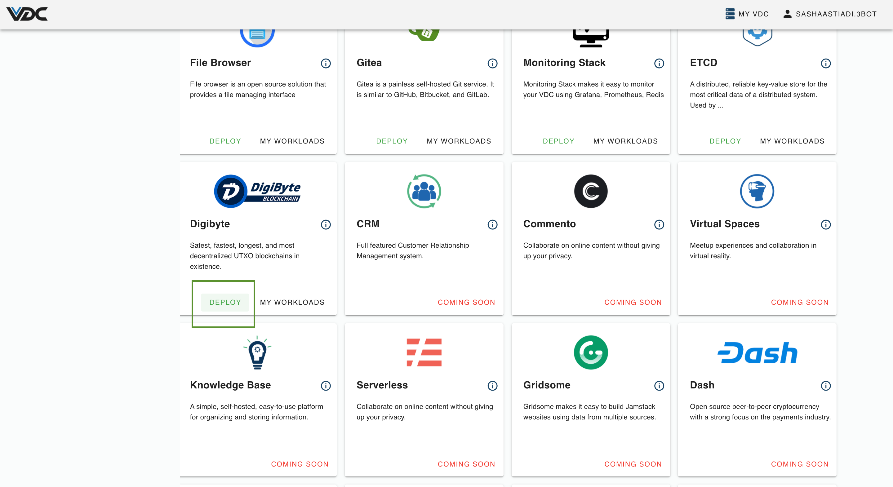
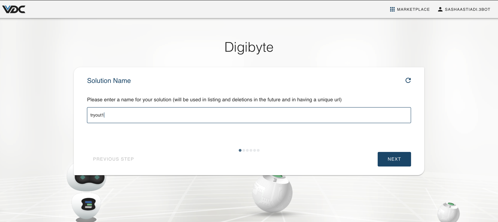
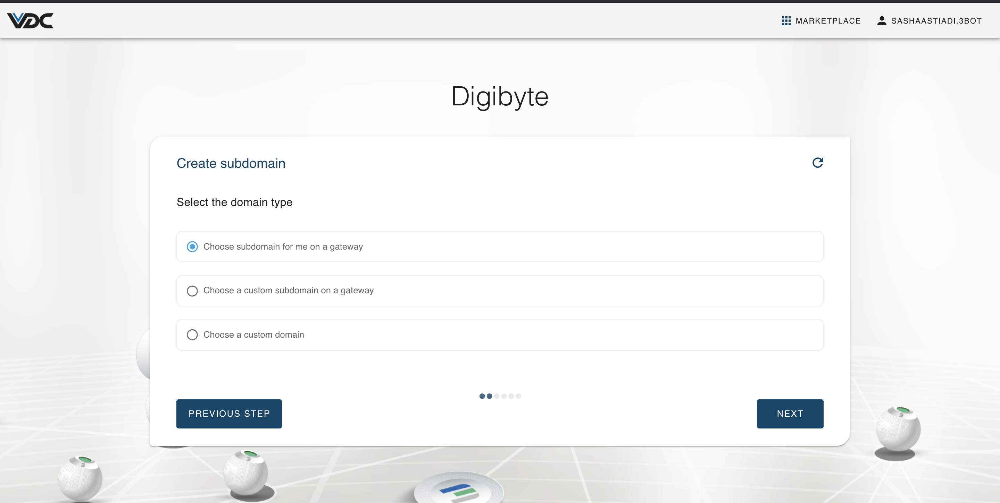
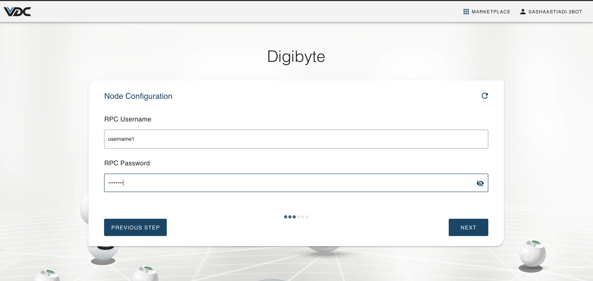
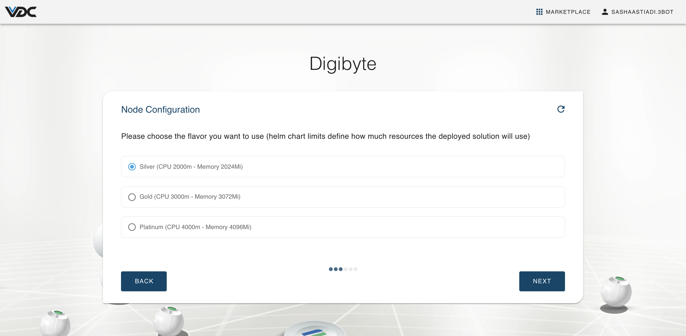
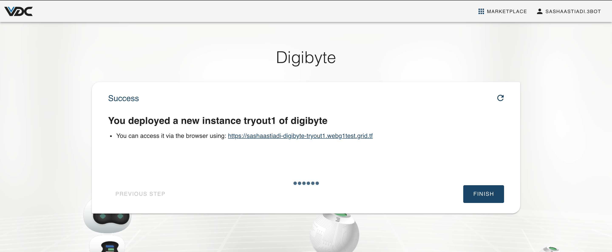
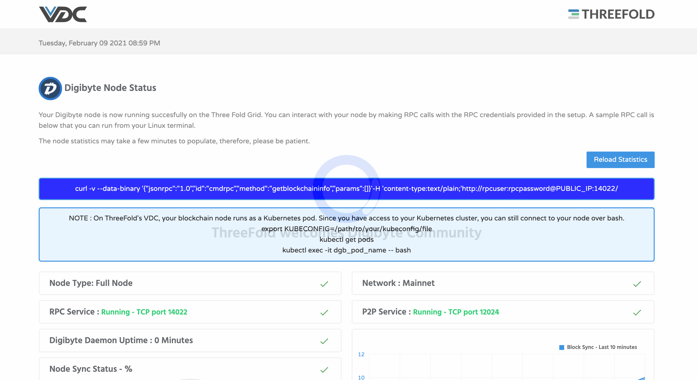
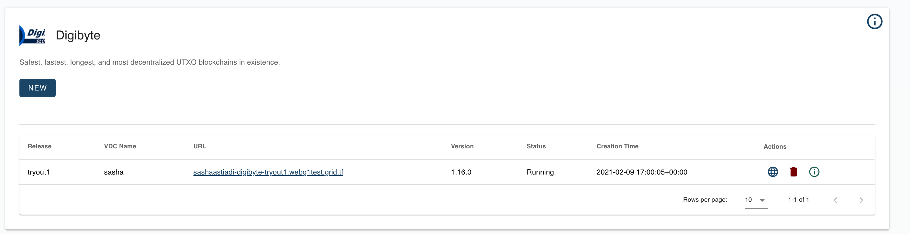

# How to Deploy Digibyte Node on eVDC

Through our partnership with the DigiByte Foundation, we empower the DGB community with a decentralized cloud infrastructure to deploy DigiByte nodes and help secure and expand the DGB network across the geographical edges.

- Anyone can contribute and build upon the DigiByte Blockchain using the ThreeFold P2P cloud and its developer tools that provide significant advantages over centralized cloud providers.
- Thousands of people are running DigiByte software all across the planet.
- Any server, computer, tablet or mobile phone connected to the DigiByte network becomes a node that helps relay transactions.

# Get Started

You can now deploy your own DigiByte full Node via the ThreeFold Now Marketplace's dashboard on your eVDC admin panel in a few clicks.

First step, find the __Digibyte Widget__ on the marketplace and click on __'Deploy'__ button. You will now will be directed to the chatflow of the deployment process.

Create a name for your new node deployment. This name will be used to identify your deployment on your 'Deployed Solutions' list.

Select the domain type for your Digibyte Node. For deployment with random subdomain, select 'Choose subdomain for me on a gateway',. For deployment with a particular available subdomain, select 'Choose a custom subdomain on a gateway. To deploy a Digibyte Node using your own domain, select 'choose a custom domain'.

Create a new username and password for the access of your new Digibyte Node.

Select the vdc capacity plan for your  Digibyte Node workload usage.

Congratulations! you just successfully deployed a Digibyte Node on the ThreeFold Grid! You can now click on the given link to access your new Digibyte Node.

When you clicked it, you will then be directed to the Node stat page of your new Digibyte Node where you can find all the information you need to start building solutions on top of your Digibyte Node.

## Accessing Your Deployed Node

To find and access the Digibyte Node you just deployed, simply go to your eVDC Admin Panel home and find the Digibyte Widget. Click on __My Workloads__ to go to the list of your successfully deployed Digibyte Nodes.

You can now click the link to go to your deployed Digibyte Node Stats Page.

