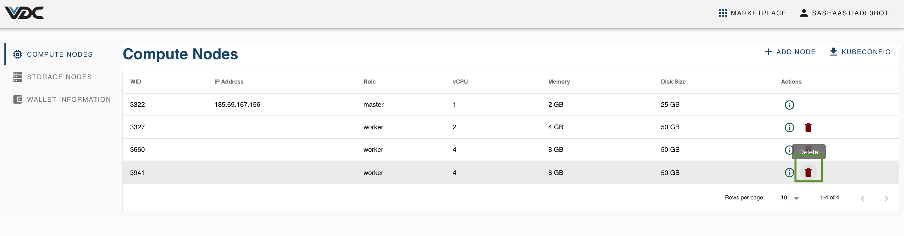
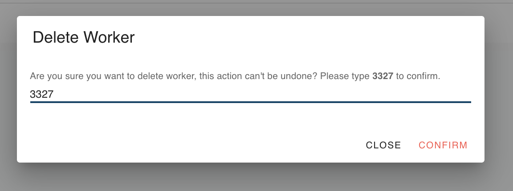

# How to Downgrade your eVDC Capacity

To downgrade your eVDC Capacity, you can simply remove a worker node from your kubernetes cluster through a few clicks.

On your eVDC admin panel home page, click on ‘My VDC’ menu. You will now be redirected to the ‘Compute Nodes’ page.

On your __Compute Nodes__ page, click on the __red trash button__ on one of the worker nodes you would like to remove from your eVDC.

You will then now see a pop up to confirm the node removal. Type the numerical value shown on the pop up window and click 'Confirm' to finalize your node removal, or click 'Close' to cancel. 

__Please keep in mind that there is no way to recover a node once it's removed from your eVDC.__

> Go back to [__Compute Nodes Management__](evdc_compute)
