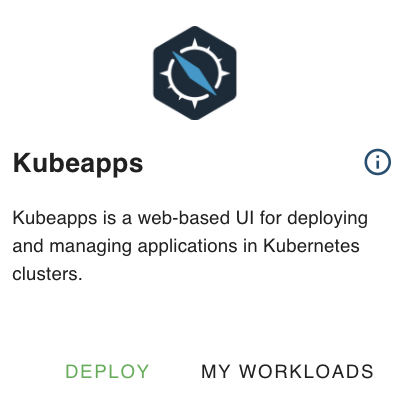
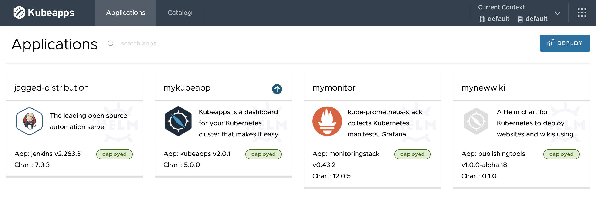

<!-- todo geert - dont erase this note
- intro: explain what kubeapps is
- requirement: add requirement section
- getting startws: how to get access to kubeapps steps (start deploy via marketplace)
- use case: example what you can build (step by step ) after its been deployed (build an app inside your kubeapp panel) -->

## How to deploy Kubeapps on eVDC

An easy way to easily manage your Kubernetes clusters is through kubeapps. 

Kubeapps is a web-based UI for deploying and managing applications in Kubernetes clusters.

### Getting started

In the marketplace, there is a widget available to deploy a kubeapps instance. 

A few chatflow clicks activates your instance of the application.

