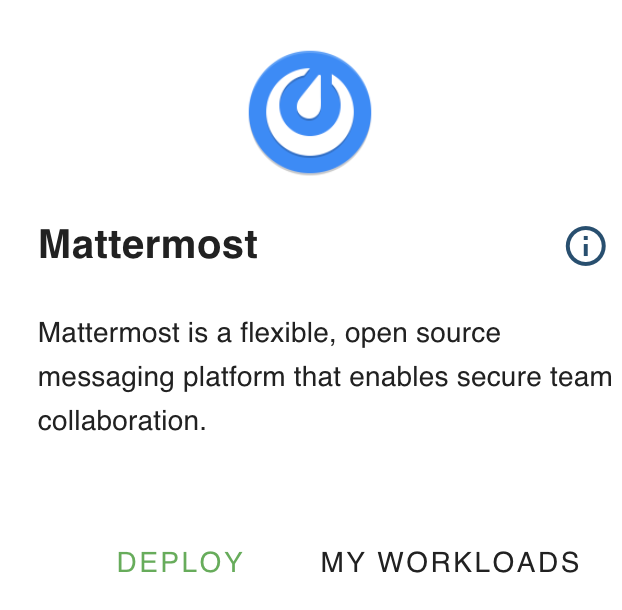
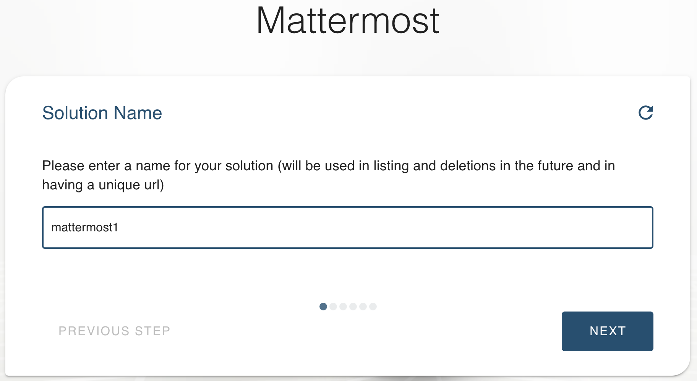
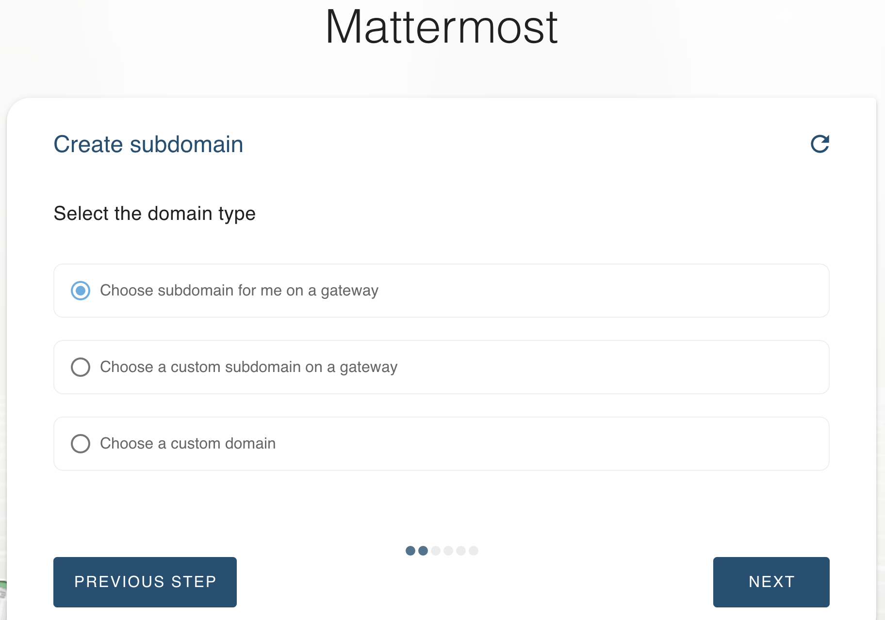
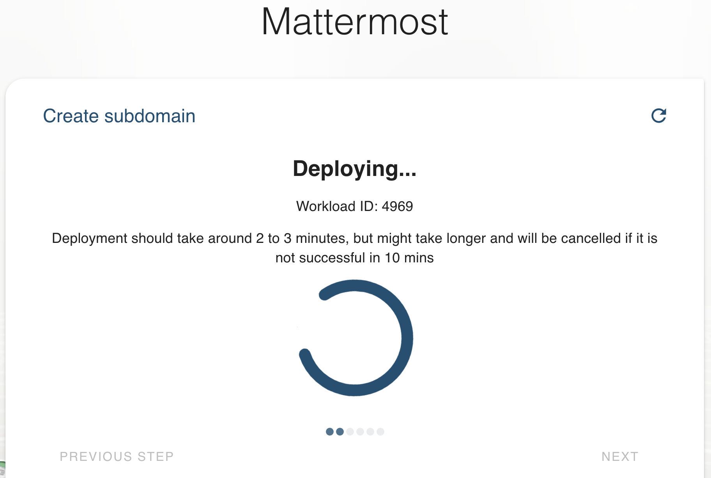
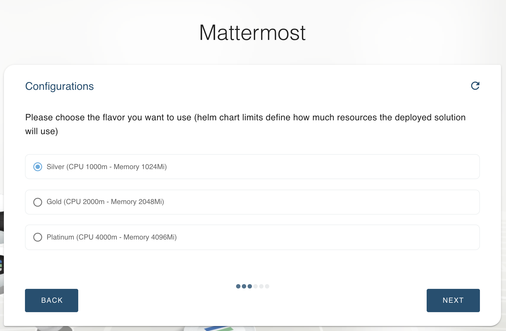
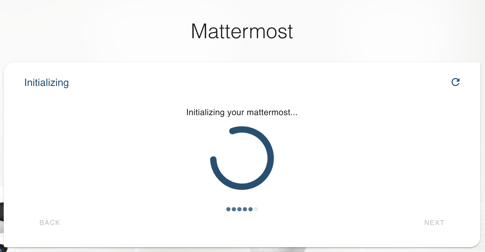
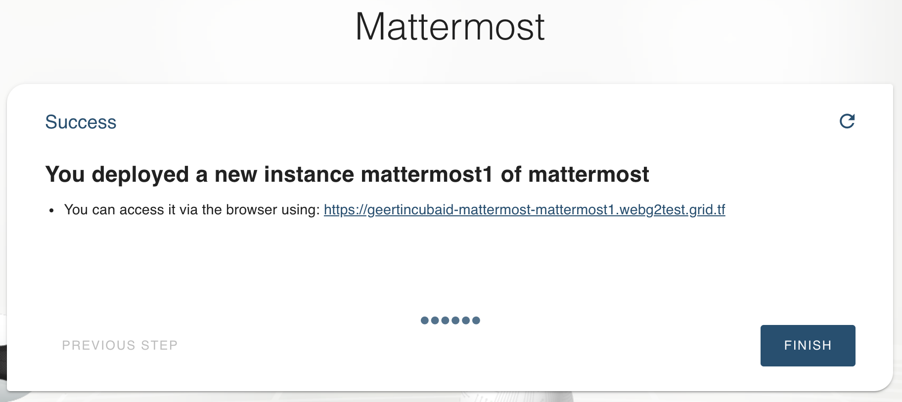
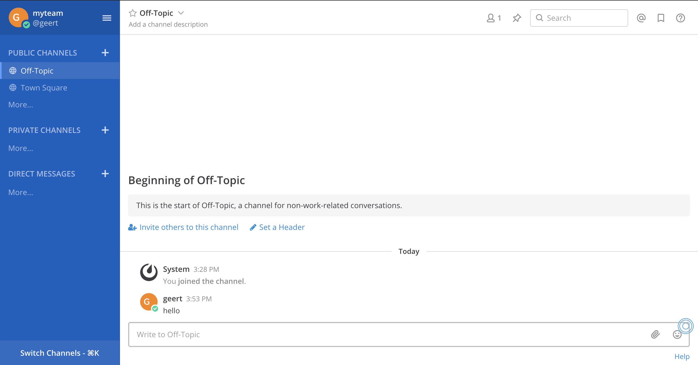

# Deploy Mattermost in your VDC

Mattermost is a widely-trusted open-source and self-hosted collaboration tool, as well as a messaging platform that enables secure team collaboration. 

### How to deploy

In the marketplace, click on the `DEPLOY` button. 

Give your solution a name.

You can choose to create a url which is part of your domain, or have one auto-generated. 

Once this info is entered, wait for the solution to be deployed. 

The owner has access to the SQL database inside and can protect it with a password. 

Choose the size of the capacity that you want to reserve for this solution. 

Now all info is available to create your environment. 

The url that gives access to it can be found on the next screen, or in the deployed solutions overview. 

Now all what remains to be done, is the configuration of your Mattermost instance, create your teams, and get started. Good luck using your Mattermost solution !

