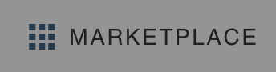
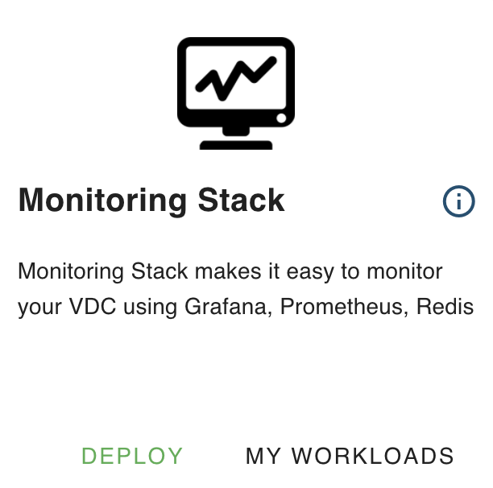
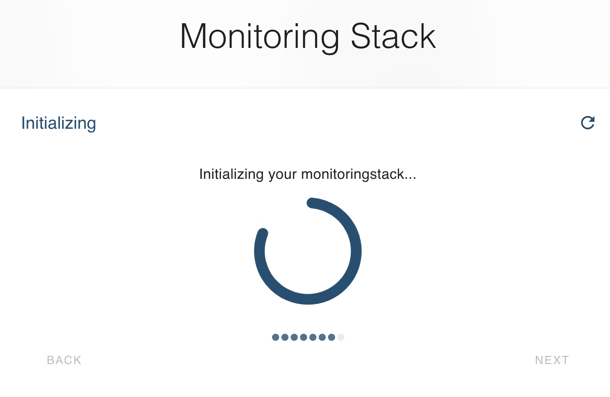
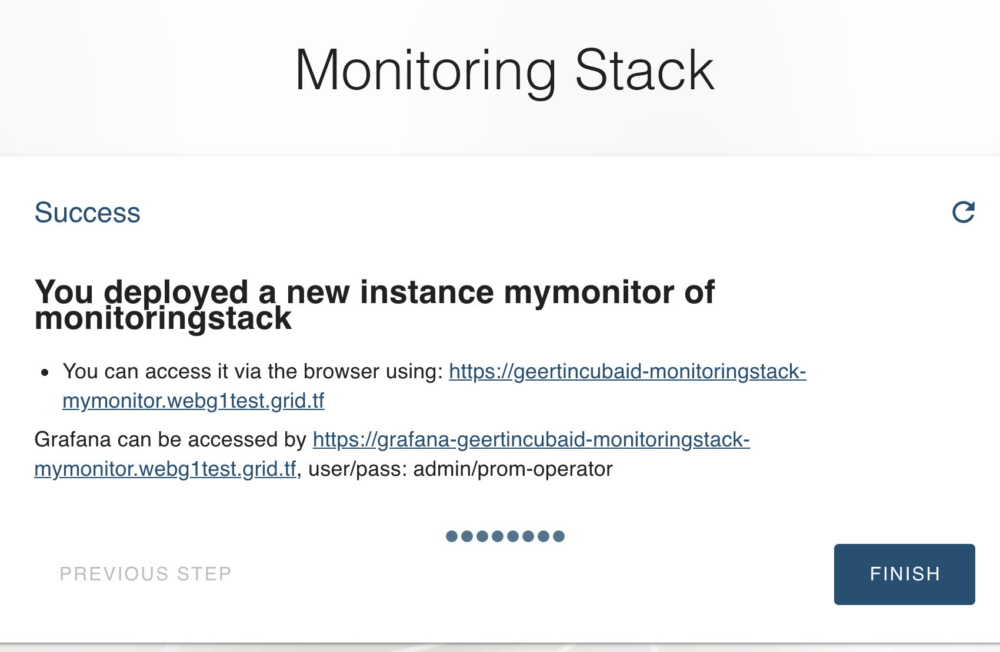
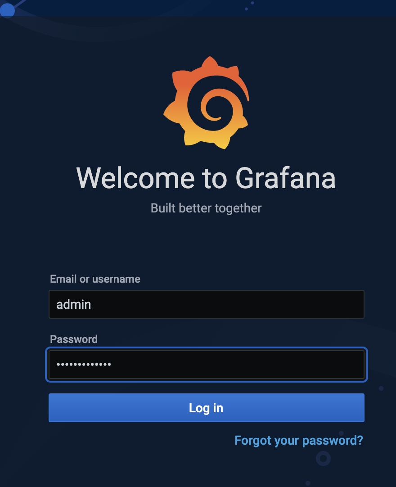
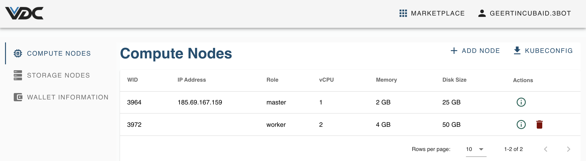

# Monitor K8s clusters 

The health of the VDC you deploy can be monitored. A stack has been prepared that offers monitoring through Prometheus and Grafana. A Helm chart `kube-prometheus-stack` is available, which offers Prometheus and Grafana as tooling to monitor your VDC. 

## Monitoring Walkthrough

The monitoring stack is available as a solution in the marketplace. 

Click `Deploy` and go through a simple chatflow to configure the monitoring on your cluster. 

A few elements need to be provided. 
First give your monitoring the name you want (will be part of the url).

You can configure the url to be auto-generated, or part of your own domain. 

This information is enough to prepare the Monitoring Stack. 

Choose the size of the hardware to be reserved for your monitoring solution. 

Now there is enough information to set up the monitoring stack on your Kubernetes cluster. 

And that's it: the url's are available to access your monitoring solution, with both UIs on Prometheus and Grafana. 

Alternatively you can also set up monitoring from your local computer, as an example through the [Lens](https://k8slens.dev/) IDE. To configure the K8S into Lens, you need to download the VDC `Kubeconfig` file. 

Import this file into the IDE.

And you're done !

