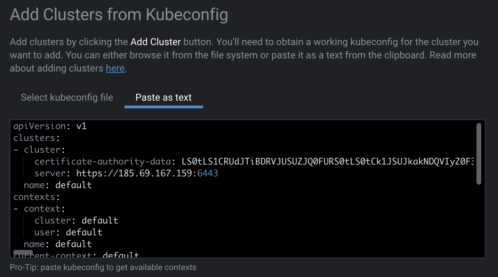
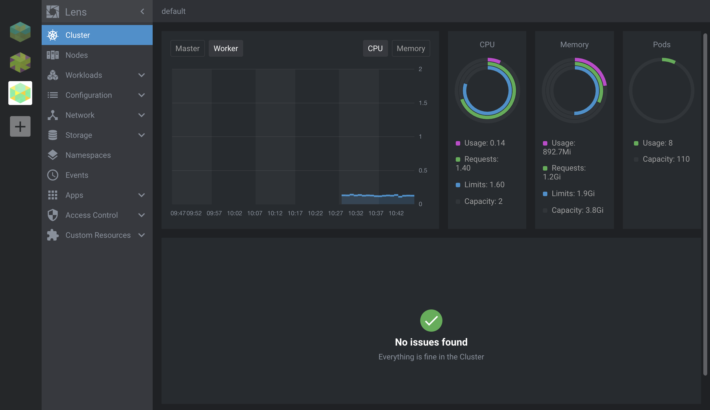

# Monitor K8s clusters Locally using Lens IDE
<!-- to do Geert 
TODO GEERT
- intro: explain what is lens ide , 
what can it monitor, what's the use / what can it monitor.
- requirement: explain requirements
- getting started: explain how to set up / deploy steps (steps)
- use case: give an example of a monitoring use case once user has a lens ide (steps) -->

The health of the VDC you deploy can be monitored, either using online tooling such as the Prometheus/Grafana online monitoring stack, or on your local computer, as an example through the [Lens](https://k8slens.dev/) IDE. 

Lens is an IDE for people who need to deal with Kubernetes clusters on a daily basis. It is a standalone application for MacOS, Windows and Linux operating systems. 

- It ensures your clusters are properly setup and configured. 
- It gives increased visibility, real time statistics, log streams and hands-on troubleshooting capabilities. 

### Requirements
- [Deploy](evdc_deploy) first your VDC 
- Lens IDE can be used on MacOS, Windows and Linux. Download the application from the [official website](https://k8slens.dev/).

### Getting Started

#### Configure your TFGrid Kubernetes cluster in Lens 

To configure the K8S into Lens, you need to download the VDC `Kubeconfig` file, which can be found as follows: 
- Go to `My VDC`
- Click on the `KUBECONFIG` button in the upper right corner

Import this file into the IDE.

And you're done !

> For the installation of Kubernetes monitoring using the tooling on the Marketplace, please read [__Monitoring Stack__](evdc_monitoring_stack).

