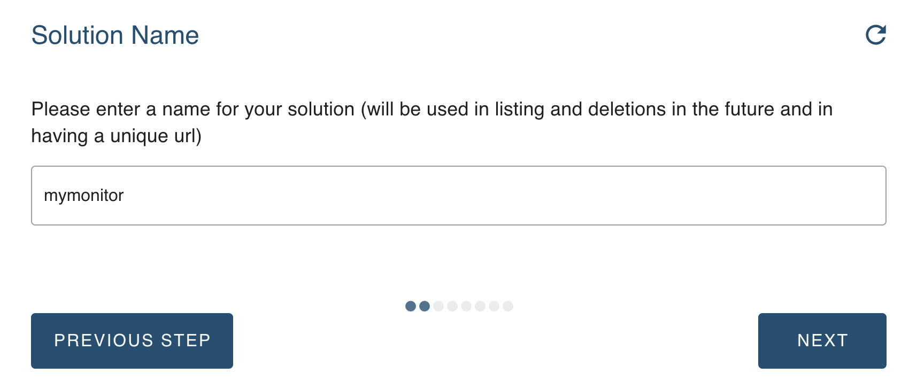
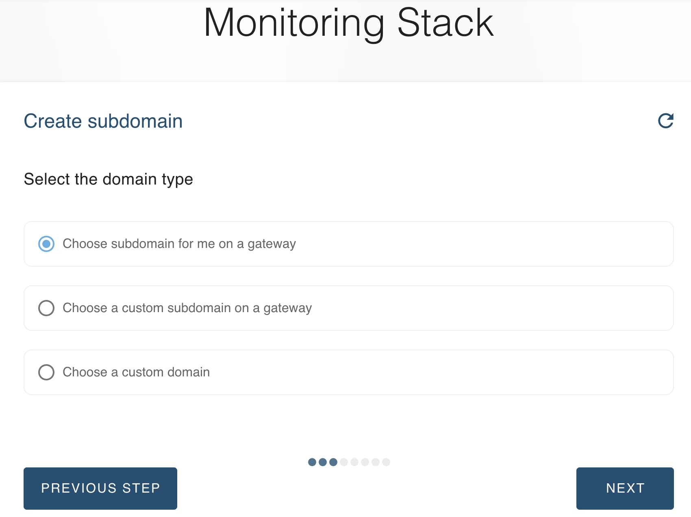
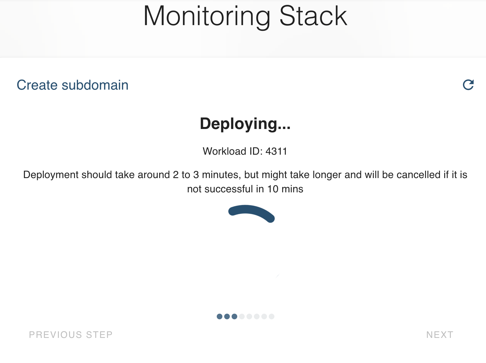
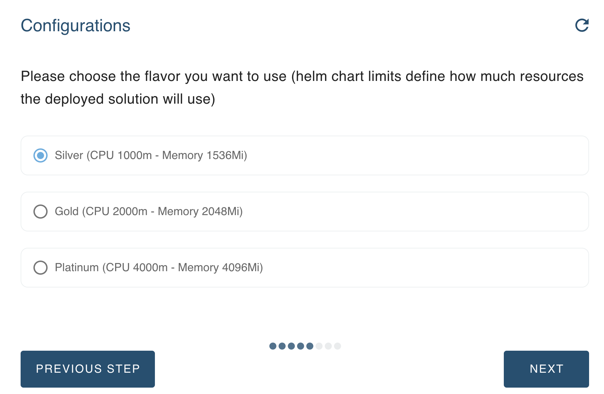
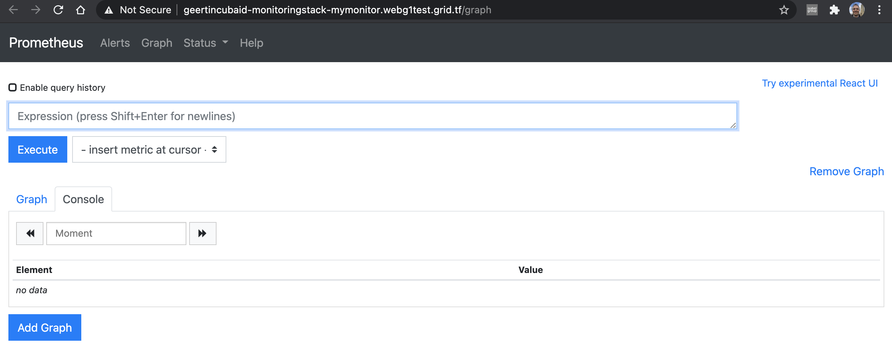
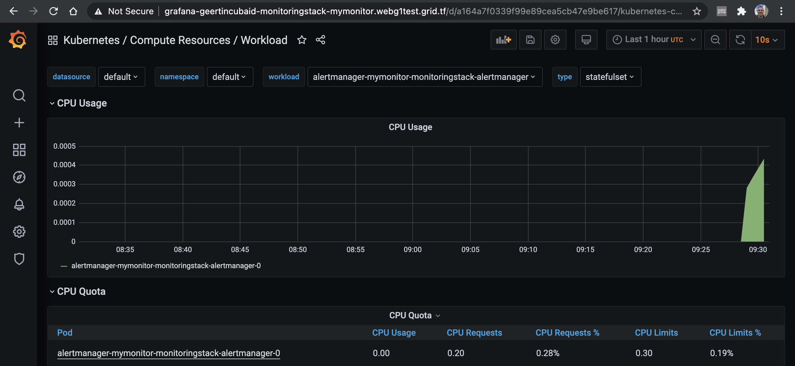

# # Monitor Kubernetes Clusters using Monitoring Stack
TODO 
- intro: what is mnonitoring stack what are included in monitoring stack
- explain what is prometheus, what's the use / what can it monitor
- explain what isgrafana , what can it monitor, what's the use / what can it monitor
- requirements: explain requirements
- getting started explain deploymnent steps
- use case: give 1 example of monitoring on the deployed  grafana / prometheus
--------------

The health of the VDC you deploy can be monitored. A stack has been prepared that offers monitoring through Prometheus and Grafana. A Helm chart `kube-prometheus-stack` is available, which offers Prometheus and Grafana as tooling to monitor your VDC. 

## Monitoring Walkthrough

The monitoring stack is available as a solution in the marketplace. 

Click `Deploy` and go through a simple chatflow to configure the monitoring on your cluster. 

A few elements need to be provided. 
First give your monitoring the name you want (will be part of the url).

You can configure the url to be auto-generated, or part of your own domain. 

This information is enough to prepare the Monitoring Stack. 

Choose the size of the hardware to be reserved for your monitoring solution. 

Now there is enough information to set up the monitoring stack on your Kubernetes cluster. 

And that's it: the url's are available to access your monitoring solution, with both UIs on Prometheus and Grafana. 

> For the installation of Kubernetes monitoring on your local machine, please read [__Local Monitoring__](evdc_monitoring_local)).

