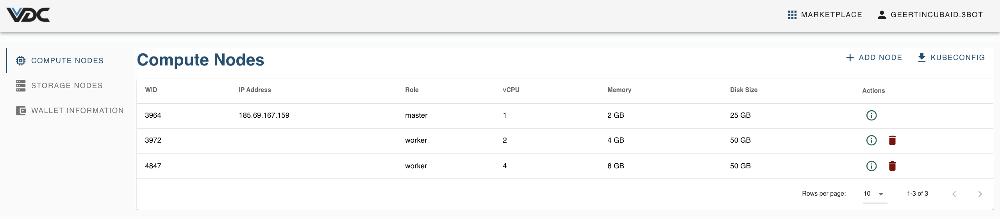
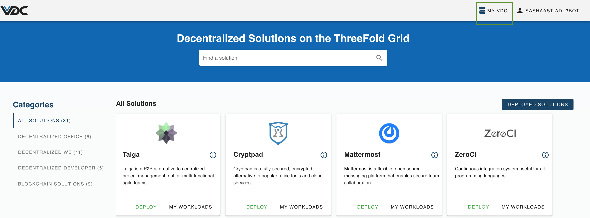

# My eVDC

The panel `My VDC` gives an overview of the resources that make up your Kubernetes cluster, both compute and storage nodes. It also manages the wallet that is set up specifically for this eVDC. 

## Accessing My eVDC

You can easily access My VDC page by simply clicking on `My VDC` button on the top right corner of your eVDC Admin Panel.

## Functionalities

- [Manage Compute Nodes in your eVDC](evdc_compute)
- [Manage Storage Nodes in your eVDC](evdc_storage)
- [eVDC Wallet](evdc_wallet)
- [Manage your workloads in a Kubernetes Cluster](evdc_k8s)
