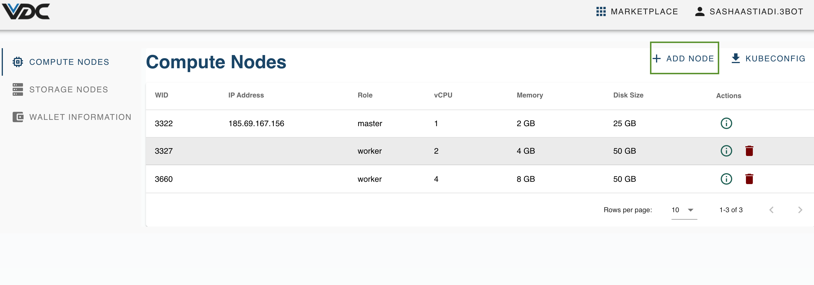
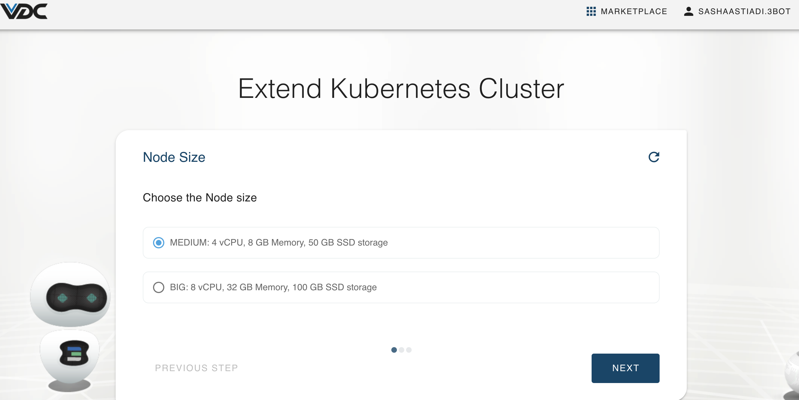
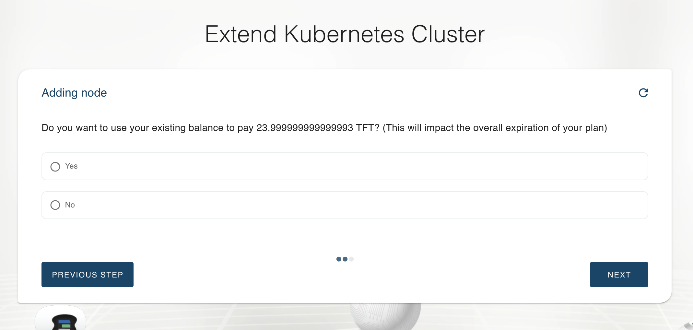
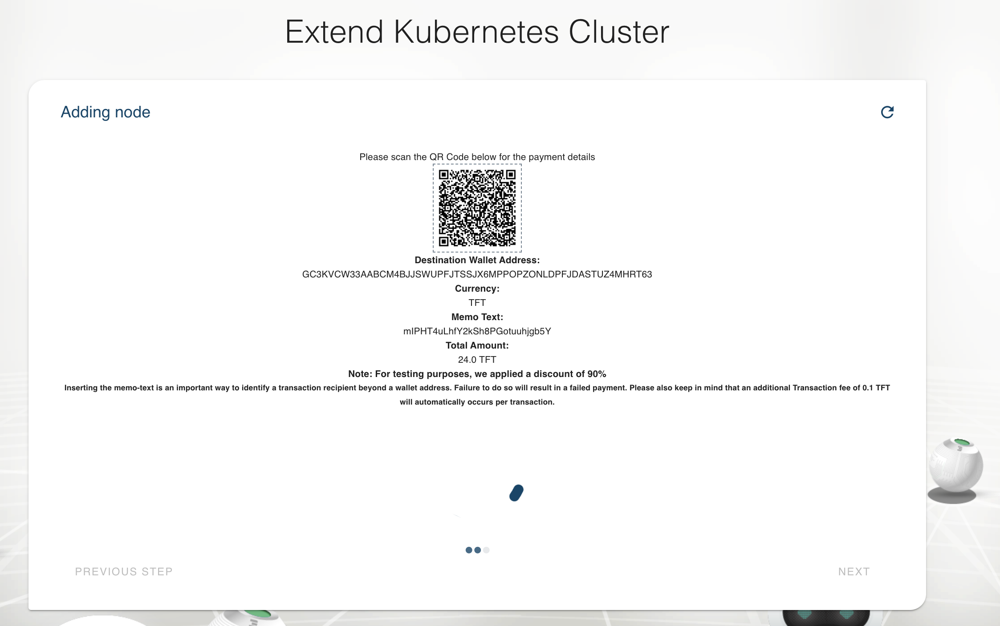
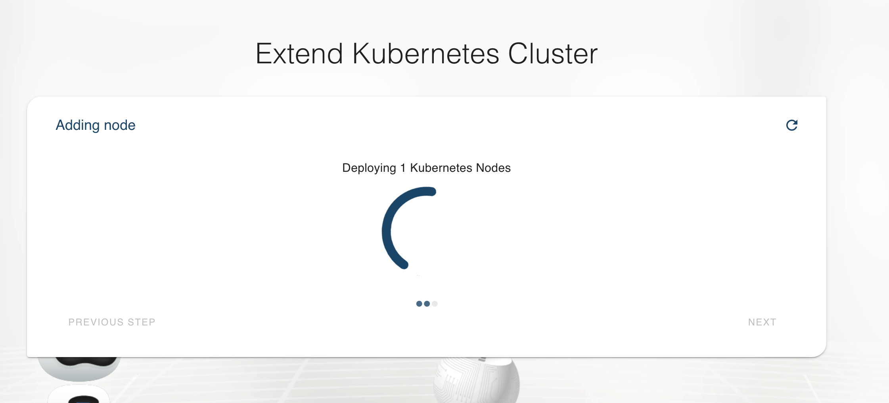
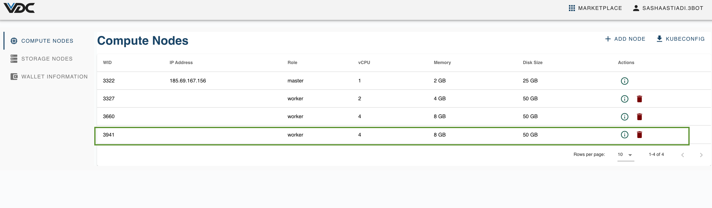

# How to Upgrade eVDC Capacity

To upgrade eVDC Capacity, you can extend your kubernetes cluster by adding an additional worker node, simply through a few clicks.

On your __Compute Nodes__ page, click on __Add Node__ button on the top right corner of the page.

Select the preferred node size you would like to add onto your Kubernetes Cluster, and click 'Next' button.

On the next page you will be asked of whether you would like to use your existing TFT balance within your eVDC Wallet, or transfer TFT exclusively to pay for this new node. Click 'Yes' if you'd like to pay by using the balance in your eVDC Wallet, or click 'No' if you would rather pay by transfering TFT instead. On this tutorial we would assume that you don't have enough balance inside your wallet, therefore we would select 'No' and move on to the payment page.

On the payment page, you would be instructed to transfer some TFT to pay for your new node, by sending your TFT from an external stellar wallet to your eVDC Wallet. In this tutorial we would be using inside the ThreeFold Connect Mobile App as our medium of transfer.

Scan the QR Code by using ThreeFold Connect app on your phone and confirm your payment. 

The payment screen will automatically reload itself if payment is successful and start to deploy the new node immidiately. The new node deployment will take a few minutes, please do not close this deployment window in the meantime.

Once the new node deployment is finished, you will be directed to the final screen that shows that your eVDC has been extended / upgraded successfuly. You can now go back to 'My VDC' page and see that a new worker node has been deployed successfully.

> Go back to [__'Compute Nodes Management Manual'__](evdc_compute)
