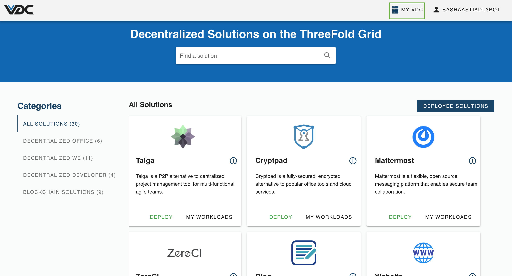
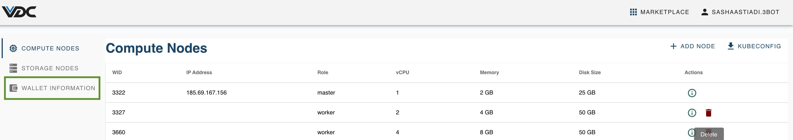
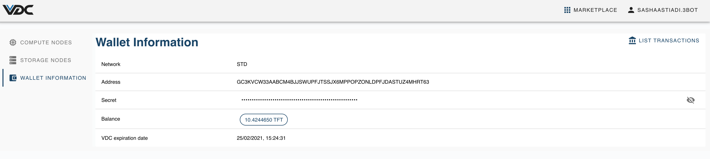

# How to Access Your eVDC Wallet

Once youre logged in the eVDC, click on __'My VDC'__ menu on the top right corner of the navigation bar on your eVDC admin panel home.

You will be directed to your eVDC Management page with Compute Nodes page as its default display. Click on 'Wallet Information' page on the left sidebar

You will then redirected to your eVDC Wallet page.

> Read more on [How to Top up Your TFT Balance onto Your eVDC Wallet](evdc_wallet_topup)

> Go back to ['eVDC Management' Manual](evdc_manage).
