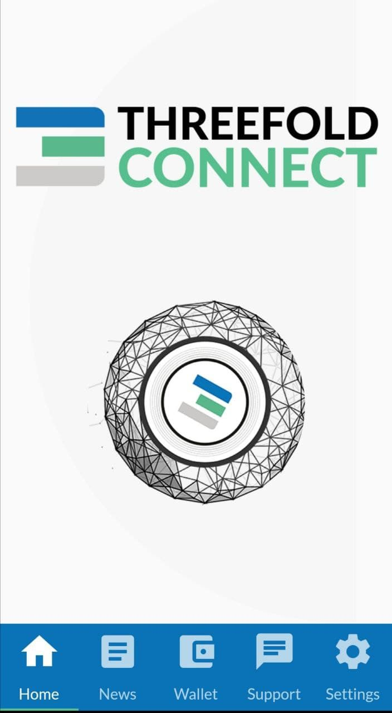
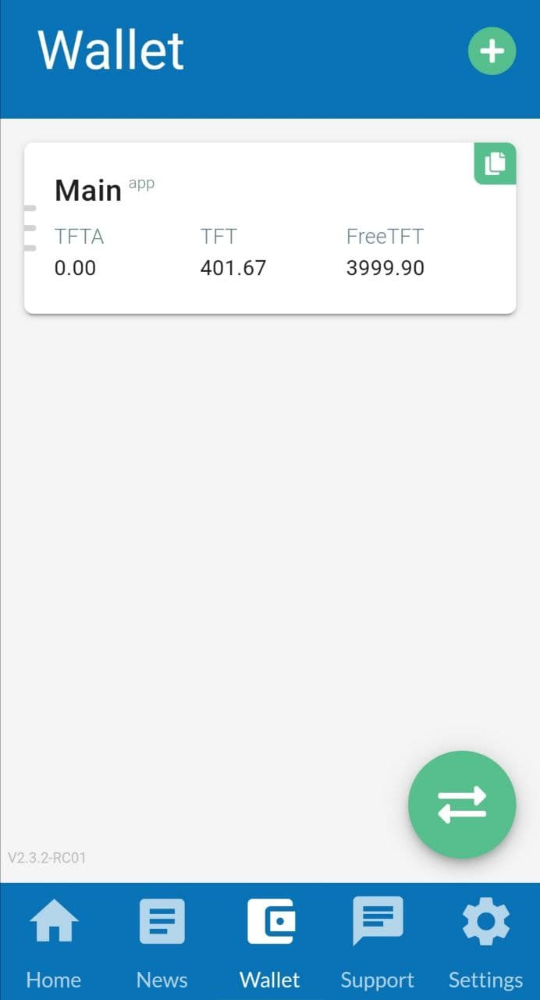
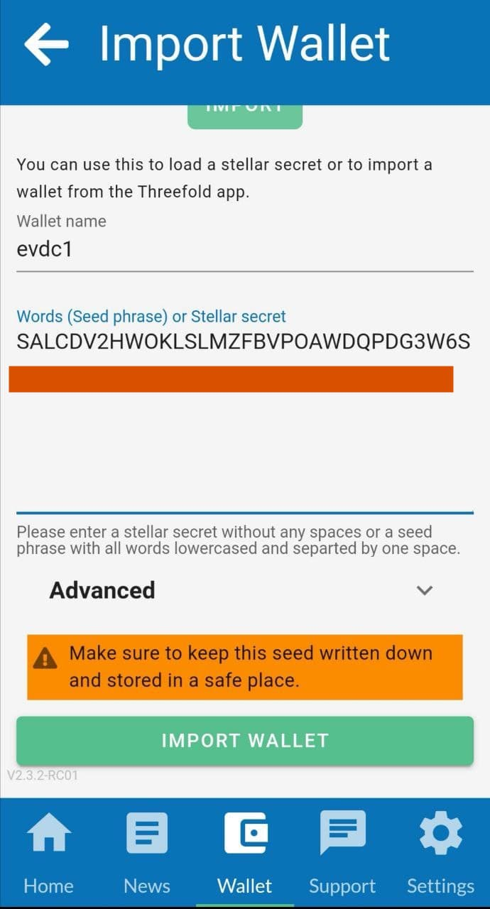
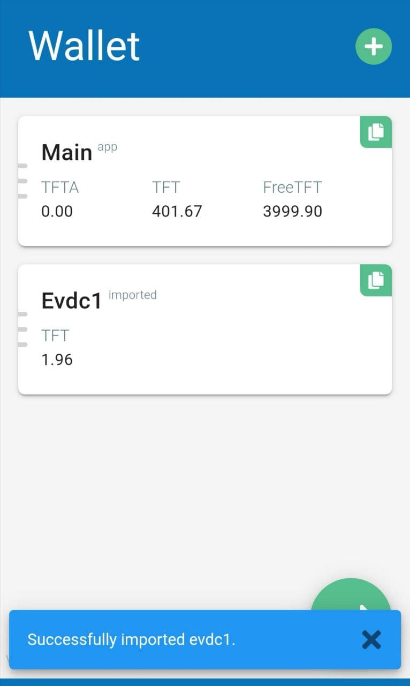

# Import eVDC Wallet to TF Connect Wallet

You can transfer your TFT from eVDC mainnet or testnet, and import your wallet into a TF Connect Wallet or a third party Stellar wallet (mainnet), like Sollar Wallet or Interstellar Wallet. On this tutorial, we will be transfering TFT from eVDC Wallet to __TF Connect Wallet__ as an example.

## Prerequisites

- An active eVDC on testnet / mainnet, with some TFT funds on its [eVDC Wallet](evdc_wallet)
- ThreeFold Connect App (TF Connect App). TF Connect App is equipped with a built-in wallet. Read more on how to download a TF Connect App [here](threefold_connect_install) if you have not downloaded yet.

## Import eVDC Wallet to TF Connect Wallet

### Open your eVDC Wallet

Once you logged into your eVDC account, access your eVDC Wallet by clicking '__My VDC__' menu on the top navigation bar.

You will be directed to your eVDC Management page with Compute Nodes page as its default display. Click on 'Wallet Information' page on the left sidebar

You will then redirected to your eVDC Wallet page.

Copy your eVDC Secret Key. _(Please copy secret key, not your wallet address)_

## Open your TF Connect App 

On your TF Connect mobile app home screen, click on 'wallet' button on the bottom navigation bar.

On your wallet page, click on '+' button on the top corner of the screen. 

Name your wallet and paste the copied eVDC wallet secret key onto the form, add a password to your new TF Connect Wallet account and click 'Import Wallet'.

Congratulations! You now have successfully imported your eVDC Wallet into TF Connect Wallet.

