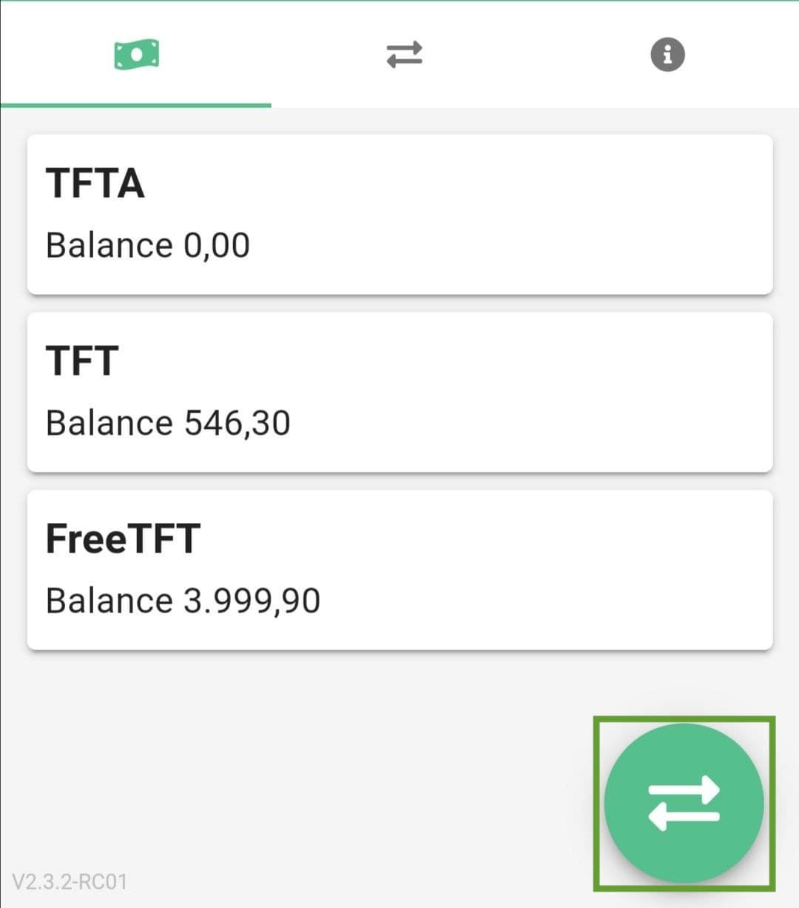
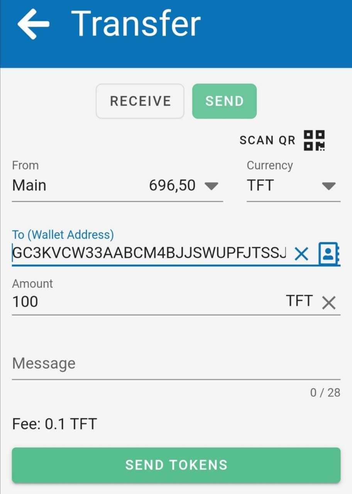
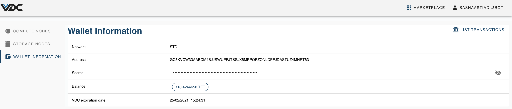

# Top up TFT Balance onto Your eVDC Wallet

You can top up the amount of TFT on your eVDC Wallet by sending some TFTs from your wallet via TF Connect Mobile App.

On your eVDC Wallet page, copy your wallet address and send it to your mobile phone, and copy it.

Access your TFT Wallet via ThreeFold Connect App on your mobile phone and click on the transfer icon.

On the transfer page, paste your copied eVDC wallet address key and define the amount of TFT you would like to top up onto your eVDC Wallet, and click 'Send Tokens'.

You will be then redirected to the confirmation page. After making sure that you inserted the right transfer information, you could click on the 'Confirm' button to start your top up process. Your mobile screen will show a 'successful transfer' notification in a few seconds, once the transfer has succeeded.

Reload your eVDC Wallet Information page on your desktop after the successful transfer and see how your TFT amount has been successfully increased.

> Go back to [My eVDC Wallet page](evdc_wallet)

> Read more on [how to upgrade eVDC Capacity by using your TFT Balance in Your eVDC Wallet](evdc_upgrade).
