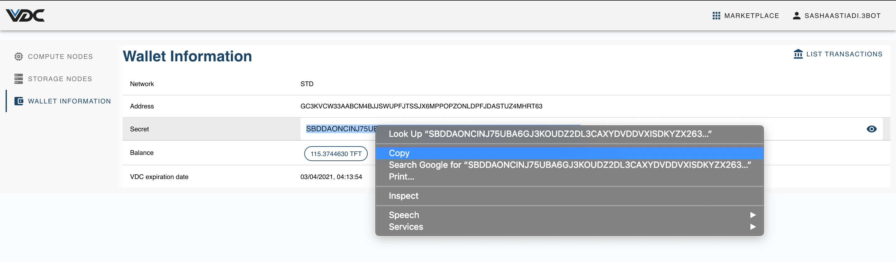
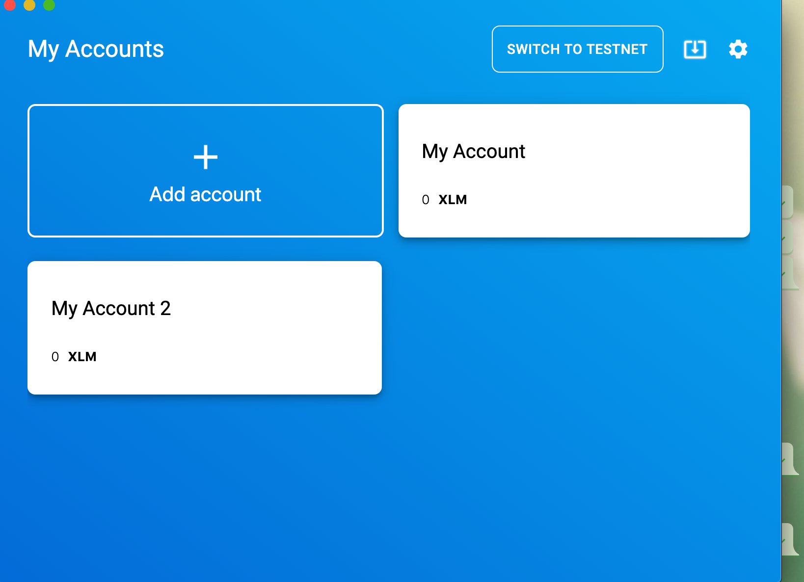
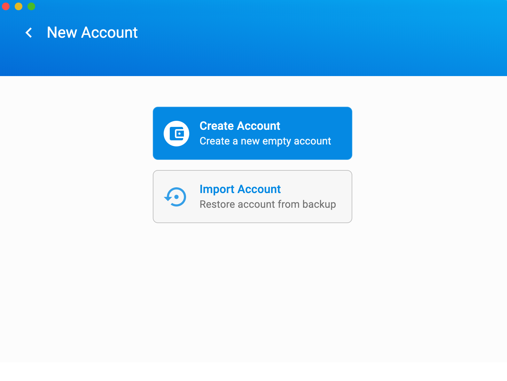
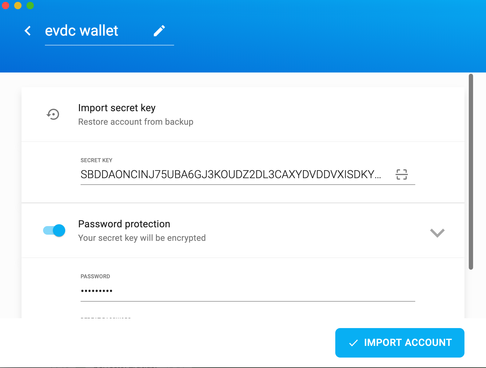
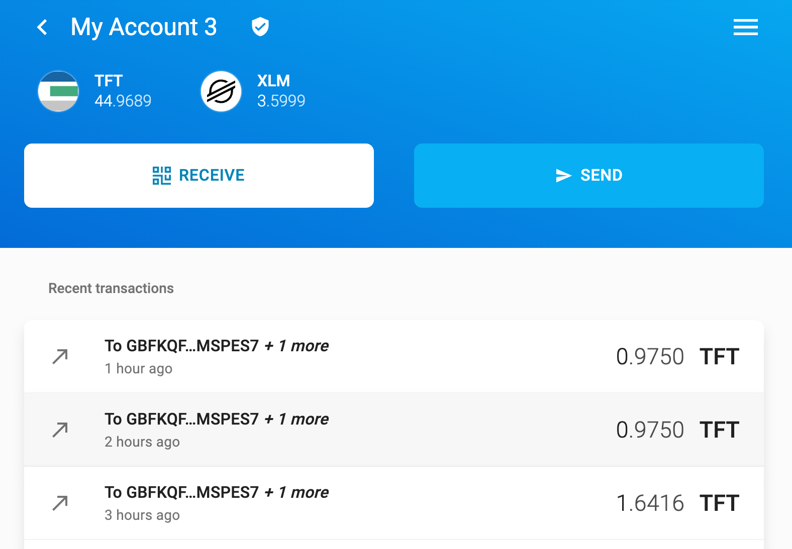

# Import eVDC Wallet to External Wallet

When you have successfully funded your eVDC Wallet with additional TFT, you could also transfer this balance to another eVDC Wallet, or any other stellar wallet by importing your eVDC Wallet to external wallet. In order to do so, there are a few different wallet options you can import your eVDC Wallet to. Read more about supported wallets information on [How get and store TFT tutorial](https://manual2.threefold.io/#/mainnet_gettft).

On testnet, a TFT transfer / wallet import is recommended periodically. Since testnet is used for testing purposes, there will be times when a testnet reset is necessary to be done, thus resulting in evdc wallet, workloads, solutions and evdc accounts become deleted. Therefore, we always remind users to import their testnet eVDC Wallet to an external wallet and transfer their TFT Balance out to another wallet before the reset takes place. 

__Please keep in mind that we would not be able to refund any TFT after each testnet reset is done, if you fail to import your eVDC wallet transfer the TFT out of your eVDC beforehand.__

- You can transfer your TFT from eVDC mainnet or testnet, and import your wallet into a third party Stellar wallet (mainnet), like Sollar Wallet or Interstellar Wallet. 
-  You should only import / transfer your TFT to __a mainnet stellar wallet__, regardless if it is currently on eVDC wallet testnet. Since we are only using mainnet TFT for testing purposes.

You can transfer your TFT onto a third party Stellar wallet; like Sollar Wallet or Interstellar Wallet. On this tutorial, we will be transfering TFT from eVDC Wallet to __Solar Wallet (mainnet)__ as an example.

## Prerequisites

- An active eVDC on testnet / mainnet, with some TFT funds on its [eVDC Wallet](evdc_wallet)
- A [solar Wallet](solarwallet.io) app. Read more on how to get a Solar Wallet [here](solar_wallet) if you have not downloaded yet.

## Import eVDC Wallet to Solar Wallet (Mainnet)

### Open your eVDC Wallet

Once you logged into your eVDC account, access your eVDC Wallet by clicking '__My VDC__' menu on the top navigation bar.

You will be directed to your eVDC Management page with Compute Nodes page as its default display. Click on 'Wallet Information' page on the left sidebar

You will then redirected to your eVDC Wallet page.

Copy your eVDC Secret Key. _(Please copy secret key, not your wallet address)_

## Open your Solar Wallet App / Account (Mainnet)

On your app home screen, create a new Solar Wallet Account by clicking '__Add Account__'.

Choose the option '__Import Account__' to start importing your eVDC Wallet to this new account.

Paste the copied eVDC wallet secret key onto the form, add a password to your new solar wallet account and click 'Import Account'.

Congratulations! You now have successfully imported your eVDC Wallet into Solar wallet.

