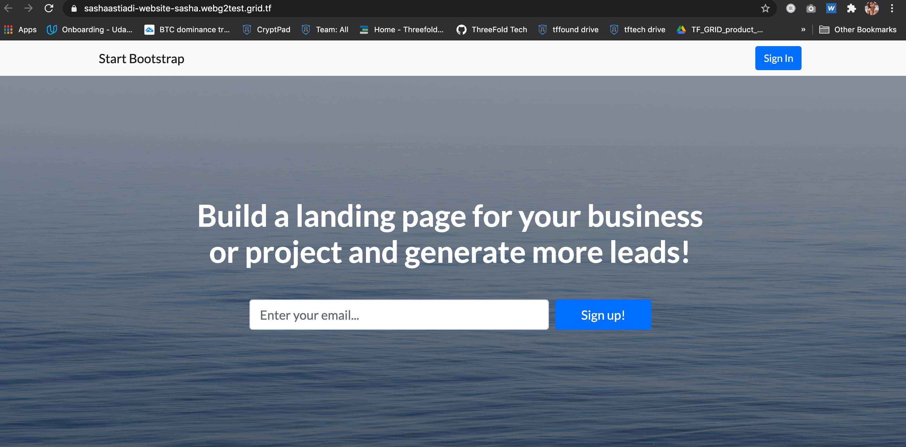
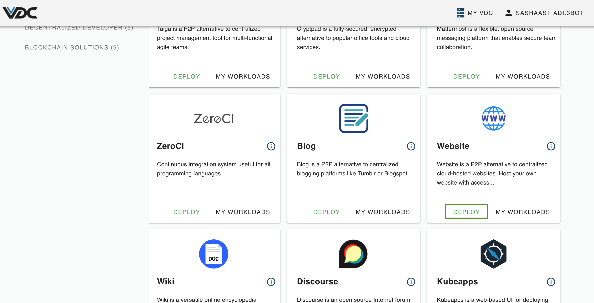
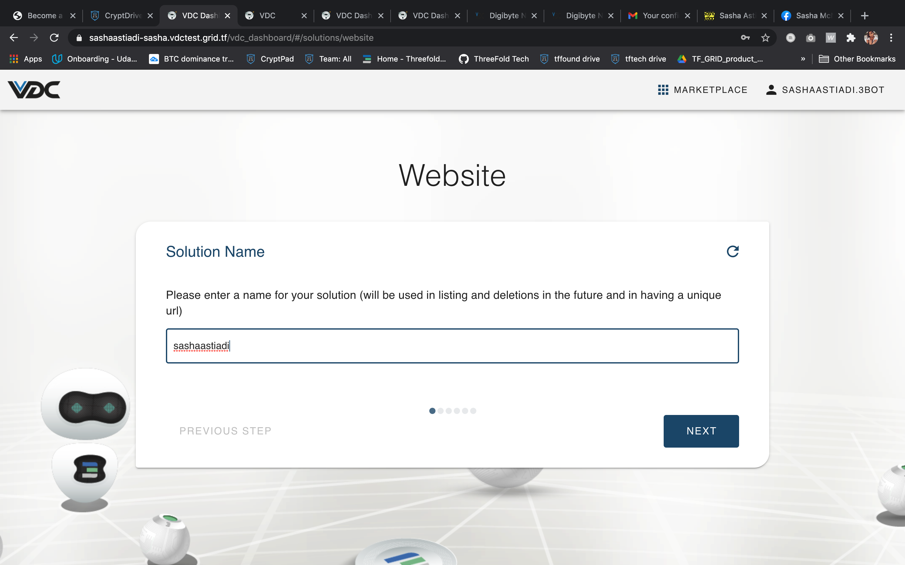
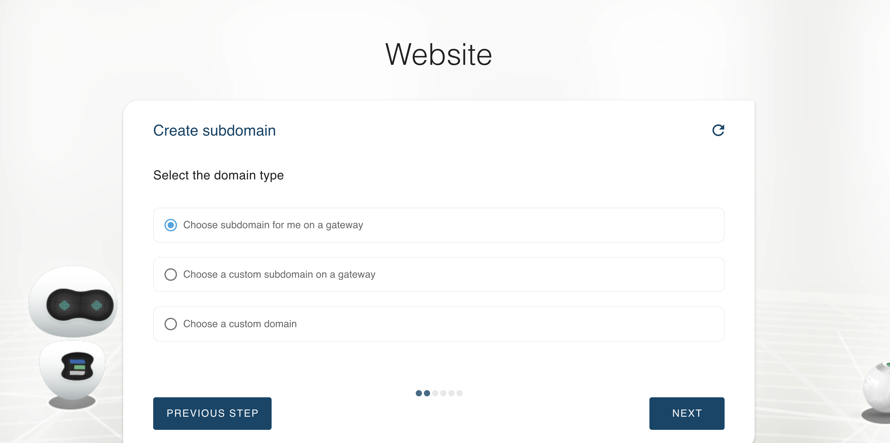
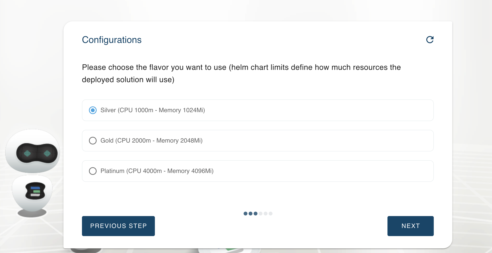
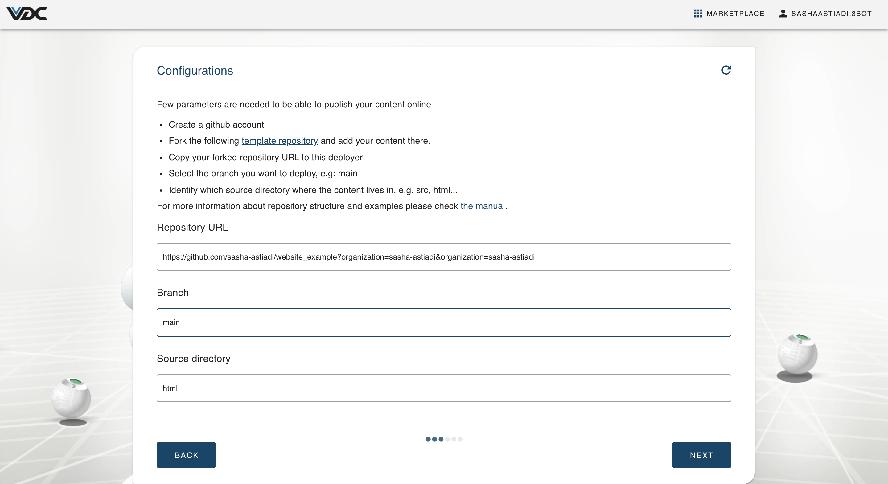
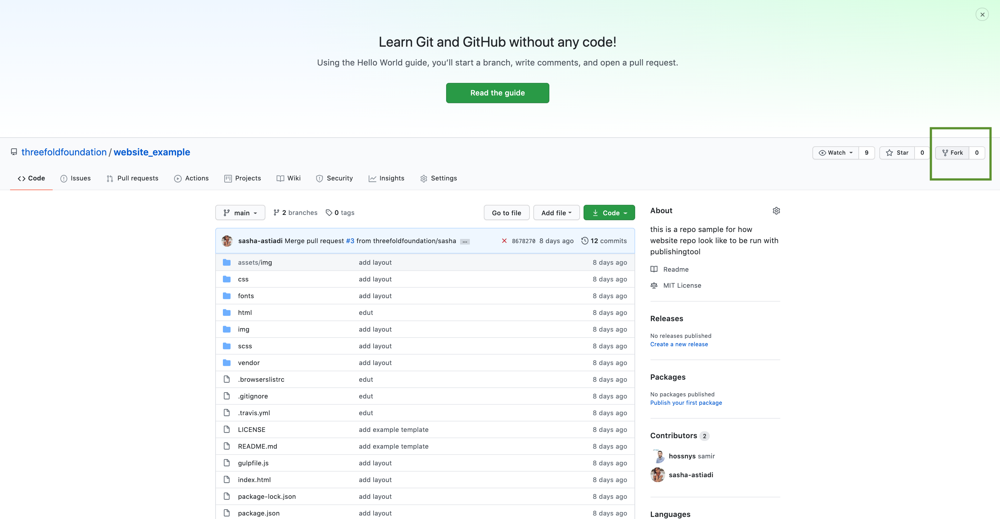
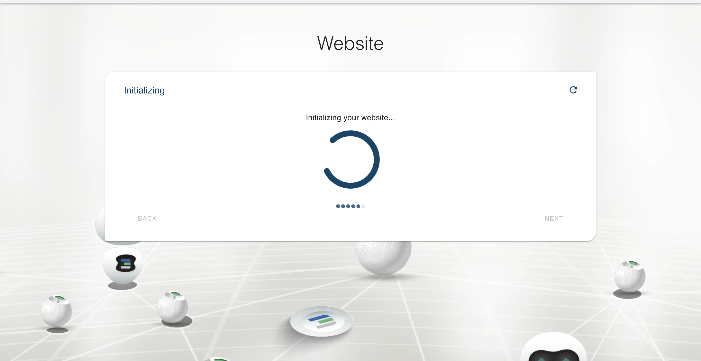
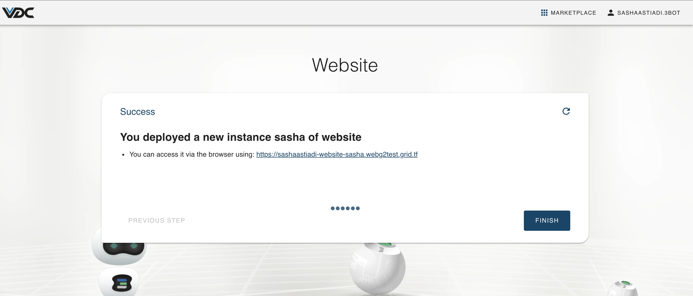

# Host a Website on TF Grid via eVDC

By using eVDC you can now deploy and host your own website on top of the ThreeFold Grid.

## Requirements

- A __github account__.
- A __public github repository__ complete with folders containing your website codes and files. [__Click here__](https://github.com/threefoldfoundation/website_example) to see an example of a website repo that you can fork (copy to your own github).
- __Optional for custom domain__: an active domain that assigns to a particular IP that will be given to you during deployment. Depending where you purchased your domain, each domain registery has its own procedure on how to assign an IP. Click [__here__](https://www.hostmysite.com/support/cpanel/dns/domain_point/) to read a general tutorial on how to assign an IP to your domain.
- An __active eVDC__ with sufficient capacity.

## Get Started

Once youre logged in the eVDC, find the __Website__ marketplace widget on your admin panel and click on __Deploy__ button.

Create a name for your new website. This name will be used to identify your deployment on your 'Deployed Solutions' list.

Select the domain type for your own website. For deployment with random subdomain, select 'Choose subdomain for me on a gateway',. For deployment with a particular available subdomain, select 'Choose a custom subdomain on a gateway. To host a website using your own domain, select 'choose a custom domain'.

Select the vdc capacity plan for your website usage

Add your website repository files to the deployment.

- Repository url: the url address of your website's source codes on github
- Branch: the main official working version of your project. Read more about github branch [here](https://docs.github.com/en/github/collaborating-with-issues-and-pull-requests/about-branches)
- Source directory: the name of the main folder in your github repository where all your html codes, css, index.html page, and other codes that make up your website pages live.

To create a website from a template website from ThreeFold, go to [Template Website](https://github.com/threefoldfoundation/website_example) on github and click on fork.

Go to your newly forked github repository and copy the Repository url on your forked repository

Paste the url to the chatflow 'Repository url' form.

Identify the main branch of your website, identify the main source folder of your website and click 'Next'

Wait a few minutes while your new website is being deployed...

Congratulations! you just successfully hosted a website on the ThreeFold Grid!

Click on the website domain to open and preview your newly hosted website.

Remember, you can always go back to your forked website template and customize your website content even after its deployed. Always remember which github repo you are using for the hosted website, and happy coding!

