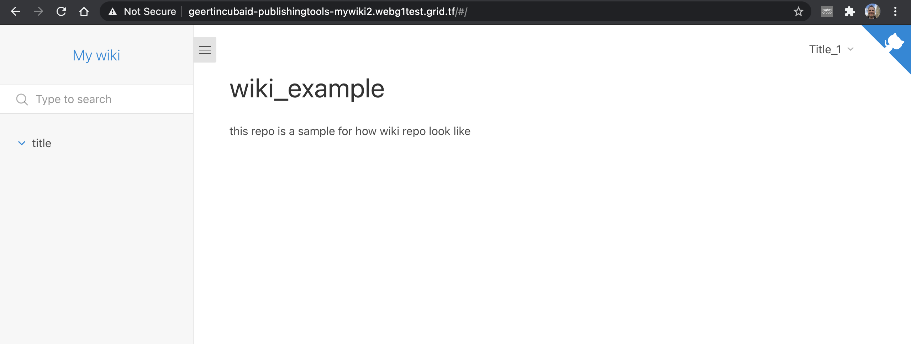
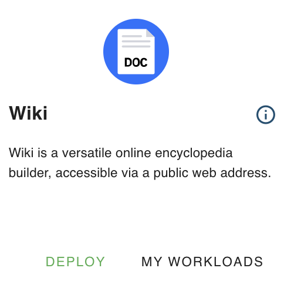
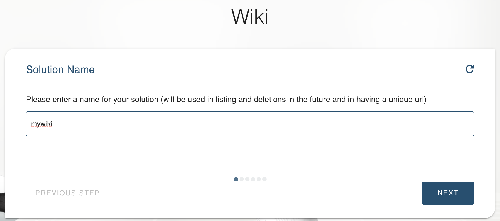
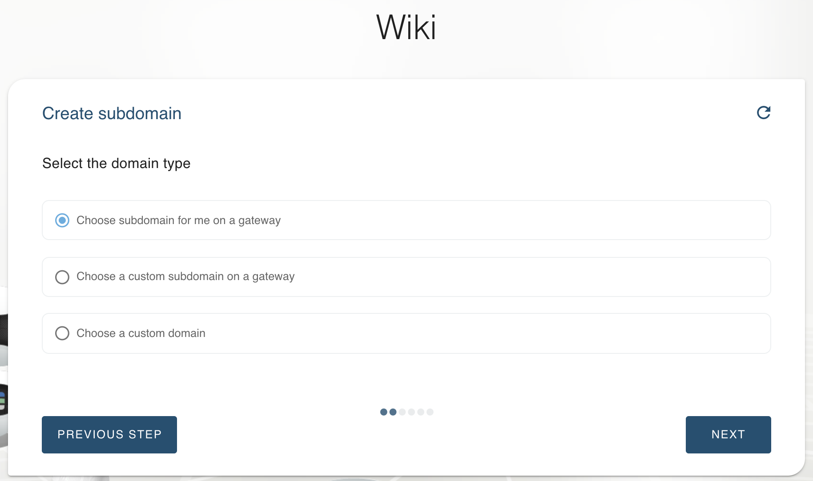
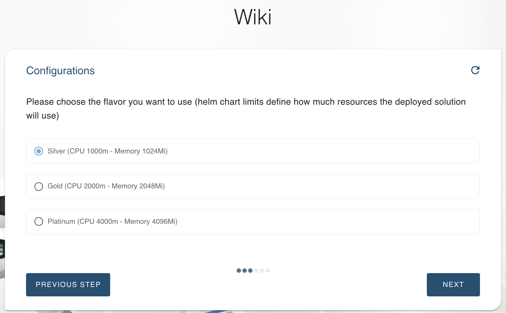
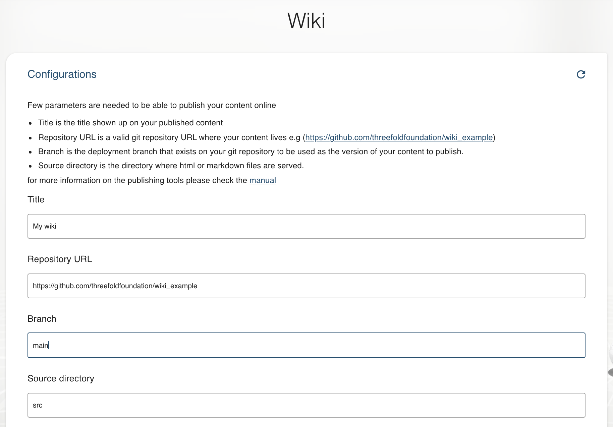
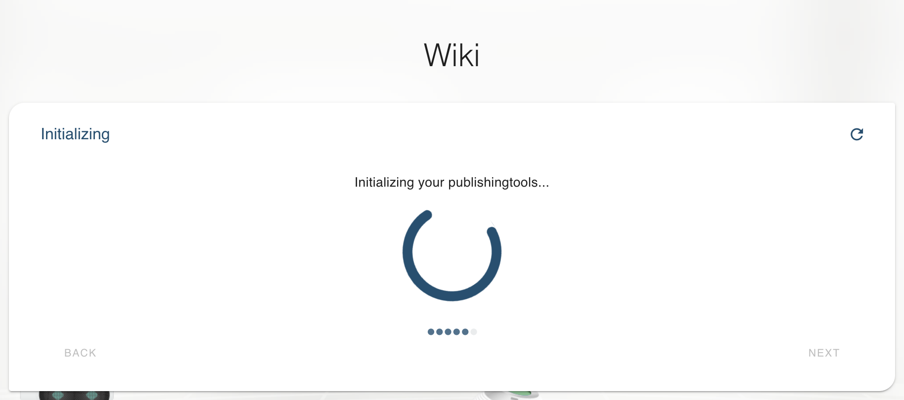
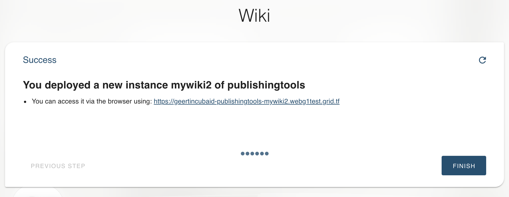

# Host a Wiki on TF Grid via eVDC

By using eVDC you can now deploy and host your own wiki on top of the ThreeFold Grid. 

## Requirements

- A __github account__.
- A __public github repository__ complete with folders containing your wiki codes and files. [__Click here__](https://github.com/threefoldfoundation/wiki_example) to see an example of a wiki repo that you can fork (copy to your own github).
- __Optional for custom domain__: an active domain that assigns to a particular IP that will be given to you during deployment. Depending where you purchased your domain, each domain registry has its own procedure on how to assign an IP. Click [__here__](https://www.hostmysite.com/support/cpanel/dns/domain_point/) to read a general tutorial on how to assign an IP to your domain.
- An __active eVDC__ with sufficient capacity.

## Get Started

In the marketplace, click on the `DEPLOY` button of the `Wiki` widget.

Give your solution a name. 

You can choose to create a url which is part of your own domain, or have one auto-generated. 

Depending on the size of you wiki, you choose bigger or smaller amount of hardware resources to be reserved. 

Configure the setup of your wiki: info on source code (like the Github repo, branch and source location), and give it a title.

With all this info, the wiki can get published. 

Done !

You can directly visit the published wiki through the indicated url. 

Remember, you can always go back to your forked wiki template and customize your wiki content even after its deployed. Add the command `/force_update` at the end in the url to push the latest content. 
Always remember which github repo and branch you are using for the hosted wiki, and happy coding!