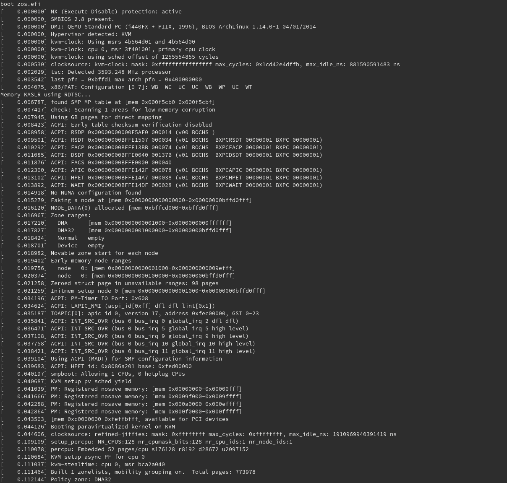

## Boot 3Node

After booting your 3Node, you should see something similar to:

> Note: if you have an AMD gpu you will probably not see something like in the image above. Instead you will see something similar to the picture where the 3Node is booting but the text will be frozen. This is a known issue and does not affect your 3Node's status. You can assume your 3Node is up and running when you see this.

If you go back to your farm management page, you should also see your nodes being part of your farm.

You can also find you nodes / farms on the explorer:

- Mainnet: https://explorer.grid.tf/
- Testnet: https://explorer.testnet.grid.tf/

If you don't see the console or if your nodes never appears in the farm management view, then most probably something is going wrong during the boot of the 3Node. In that case please head to the [forum](https://forum.threefold.io/c/technical-discussion/zero-os/8) or the [0-OS dev channel](https://t.me/zero_os_tech) to seek some help.
