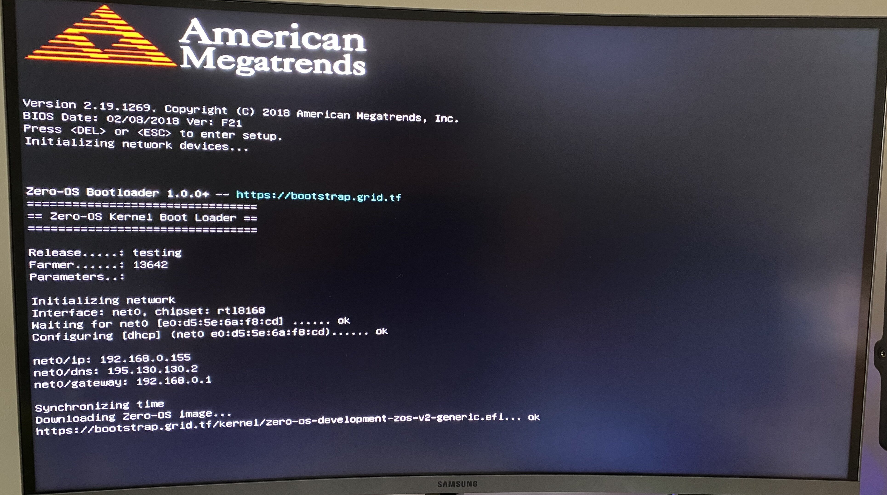

# Boot Your ThreeNode

## Using a USB Boot Disk

* [Creating a 0-OS Bootable Image](bootable_image)

## Start 3Node with Bootable Image

- Plug the USB stick into your node.
- Power on your node.
- Get into the BIOS and select the USB as boot option #1.

In this example we flashed the image to `Generic flash disk 8.07`. We select this option.

Close the BIOS with `Save & Exit`

When the reset happens you should see the following. When your 3Node is successfully connected to the internet it will start downloading the Zero-Os image.

When the 3Node has downloaded the Zero-OS image it will start booting and you should see something like this:

!!!include:boot_3node
