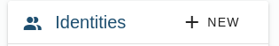
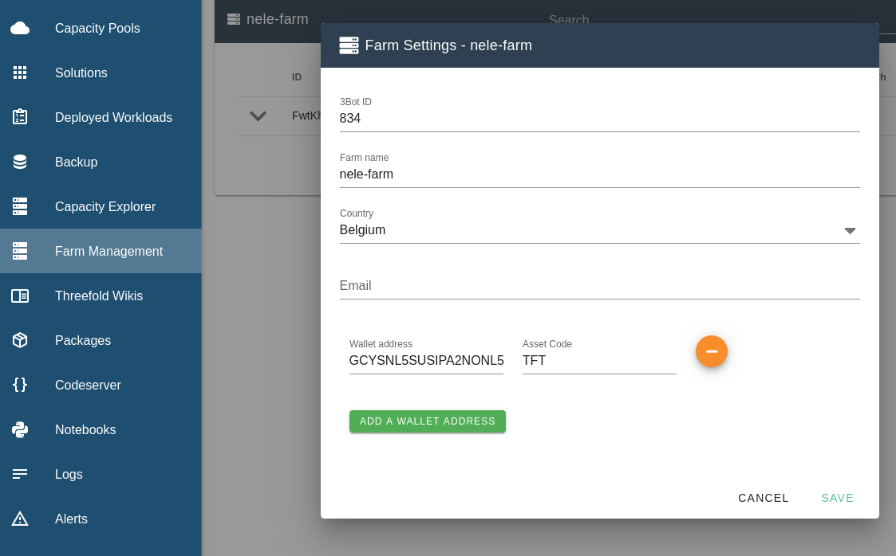

# Migrate your local farm to a hosted 3Bot farm

If you are an existing farmer and you wish to run a hosted 3Bot, you need to migrate your farm. The reason behind is that we cannot move you local identity to a hosted 3Bot, you alone are the owner of your keys and you alone can do this.

Prerequisites:

- An existing Farm
- Your seed words
- A hosted 3Bot

## Step 1
When you have a hosted 3Bot dashboard, navigate to `settings`

Click the plus button to create a new Identity

Fill in the information based on your `threebot connect` identity and the network your farm lives on.
> Warning: make sure you browser sessions is encrypted with HTTPS. Someone might be eavesdropping.
If you dont want to fill in your seed words in the browser please migrate your farm from your local threebot dashboard and go to step 3.

Now that you created your identity you should now see a list of 3 identities. 
Here is what we are going to do next:

Click on the identity with the name of either `Mainnet` or `Testnet`. If your farm is a mainnet farm please select mainnet, otherwise select testnet.

> Take note of the threebot ID of that identity.

## Step 2

Now click on your newly created identity and make it your default! This will make the dashboard load in your identity from your threebot connect app.

## Step 3
Now go to farmmanagement page. You should see your farm. Click on the cogwheel to edit your farm.

For the migration to happen you have to take the threebot ID that you took note off and paste it in the field `3Bot ID`. This will change the owner of your farm to your hosted 3Bot identity! You farm name and other information can stay the same.

Click `Save`. Now you are done!