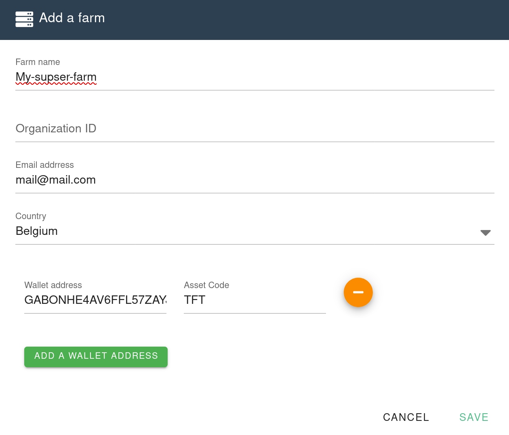
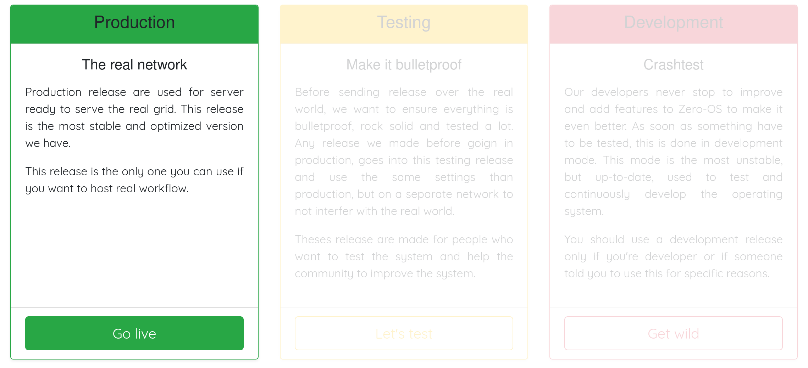

# Farm Management & Setup

In this section, we will help you get started with your farm:

* Setting up a Farm
* Creating a 0-OS Bootable Image
* Booting Your 3Node
* Managing Your Farm & Nodes
* Manage your farm wallet

If you have any questions head to the [Farming Section on the Forum](https://forum.Threefold.io/c/Threefold-grid-support/farmer-discussion)

## Setting up a farm

This document shows how to set up your Threefold Farm and 3Nodes.

### Prerequisite

This document assume you have a 3Bot up and running. If you don't have one yet, head to the [Get a 3Bot section](getting_started_3bot.md) of this manual before continuing.

### Install the Farm Management Application

Next step is to install the farm management application. To do so, click the `Farm Management` tab on the left side menu.
Then click `Install required packages` button

Once the package is installed, the page will reload and the `farm management` UI will appear.

### Create a Farm

**Important**:
Before creating farm, makes sure your 3Bot is configure to use the network you want to use. The Threefold Grid has 2 different networks, Mainnet and Testnet. If you want to learn more about the difference and how to configure your 3Bot to use one or the other, have a look at [3Bot settings](3bot_settings.md#manage-identities) the section of the manual.

Now that your 3Bot is properly configured, you are ready to create your farm. To create a new farm, click the little plus button on the top left corner:

It will open up a form to create a new Farm:

Let's go over each field an explain what they are:

* **Farm name**: This is the name you want to give to your farm. The name can be changed at any time and is just there to make it easier for users to find your farm.
* **Organization ID**: This field is only useful is you are migrating a farm from the TFGrid v1. If you are creating a new farm from scratch, you can ignore it.
* **Email address**: The email address that will be associated with the farm. This email address will be used for all communication to the farmer.
* **Country**: This field is optional but usually you want users to know where the farm is located so they can select nodes that are closer to them.
* **Wallet addresses**: This the address where rewards from farming and renting capacity will be received on. At the time of writing, there are 3 supported tokens: [TFT](https://wiki.threefold.io/#/terms_conditions_griduser?id=_5-use-of-threefold-tokens), [TFTA](https://wiki.threefold.io/#/terms_conditions_griduser?id=_5-use-of-threefold-tokens) and [FreeTFT](https://manual2.threefold.io/#/getting_started?id=claim-your-freetft). You can use any wallet to generate your addresses, you just need to make sure the right [trust line](https://www.stellar.org/developers/guides/concepts/assets.html) are created.

**Make sure you add a valid TFT stellar address. This is required for a user to be able to reserve capacity from your farm.**

Once the farm is created you should see a new entry in the top table.

Notice the first column of the table: ID. This is your farm ID, write this down because you will need to use it when generating the 0-OS image for your nodes of your farm.

### Create a Bootable Image

At this point you should have created your farm and noted its ID. The next step is to generate a bootable image of 0-OS to boot your nodes.

The bootstrap service: https://bootstrap.grid.tf is there for you to generate your 0-OS images.
In the bootstrap wizard, enter your farm ID:

Choose you network:

If you want to run your node on Mainnet, select Production.
If you want to run your node on Testnet, select Testing.
If you want to run your node on Devnet, select Development.

> You can only generate tokens on Mainnet!

If you are not sure what to use, select Production.

Lastly download the generated image. There are multiple formats of images available. Pick the one most appropriate for your setup (if you know what you are doing).

We going to explain here the EFI method. So please click the `EFI Kernel` button

Once the image is download, get a free usb flash disk and prepare it as follows:
- Make one primary partition.
- Make sure the partition is formatted as `FAT32` file system.
- Make sure both flags `boot` and `esp` are set on that partition.
- Mount the usb stick on your PC and then copy the downloaded image to
`EFI/BOOT/BOOTX64.EFI`.
- Safely unplug your stick.

You are now ready to boot your nodes!

### Start 3Node with Bootable Image
- Plug the USB stick to your node, make sure the BIOS is configured to boot from the USB stick
- Power on your node.

When the 3Node is booting you should see something like this:

After booting your 3Node, you should see something similar to:

> Note: if you have an AMD gpu you will probabaly not see something like in the image above. Instead you will something similar to the picture where the 3Node is booting but the text will be frozen. This is a known issue and does not affect your 3Node's status. You can assume your 3Node is up and running when you see this.

If you go back to your farm management page, you should also see your nodes being part of your farm.

You can also find you nodes / farms on the explorer:
- Mainnet: https://explorer.grid.tf/
- Testnet: https://explorer.testnet.grid.tf/

If you don't see the console or if your nodes never appears in the farm management view, then most probably something is going wrong during the boot of the 3Node. In that case please head to the [forum](https://forum.threefold.io/c/technical-discussion/zero-os/8) or the [0-OS dev channel](https://t.me/zero_os_tech) to seek some help.
