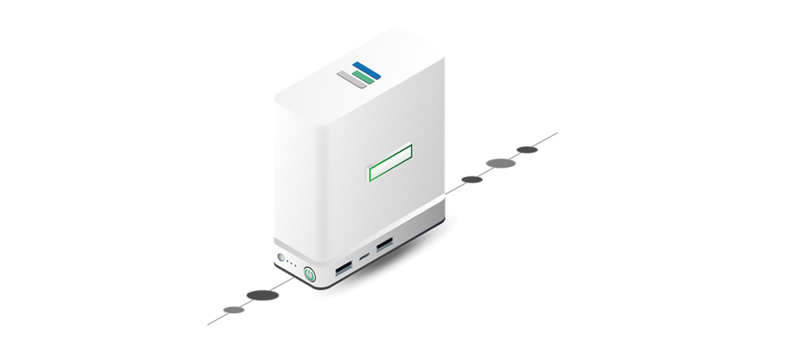

# Prepare a 3Node.



## Minimal Hardware Requirements

- CPU with at least 4 virtual cores.
- At least 8 GB RAM memory.
- At least a 512 GB SSD.

## Check your 3Node disk configuration

We strongly recommend you first check your node's disk configuration.

How a disk should look like for it to be picked up by Zero OS:

- No labels
- No partitions
- No filesystems

To erase a disk do the following:

- Boot the 3Node using a linux distro (live usb) e.g. https://grml.org/download/

then do

```bash
for i in /dev/sd*; do parted -s $i mklabel msdos; dd if=/dev/zero of=$i bs=1M ; done
```

Be very careful because this will erase all your disks.

## Check your 3Node network config.

- A 3Node needs to be connected to the internet (can be behind a NAT firewall) over a physical LAN connection (Ethernet connection).
