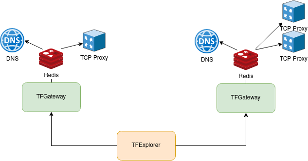

## Supported primitives

- Delegation of domain
- Creation of A or AAAA DNS records
- HTTP(S) proxy
- Reverse tunnel TCP proxy: https://github.com/threefoldtech/tcprouter#reverse-tunneling
- Gateway IPv4 to IPv6

## Deployment



The TFGateway works be reading the reservation detail from the TFExplorer. It then convert these reservation into configuration readable by the TCP Router server or CoreDNS and write them into a redis server.

Both CoreDNS and the TCP router are watching redis and reloads there internal configuration evrytime there is a change in redis.

### Binaries needed
- redis server
- [coredns-redis](https://github.com/threefoldtech/coredns-redis)
- [tcprouter](https://github.com/threefoldtech/tcprouter)
- [tfgateway](https://github.com/threefoldtech/tfgateway)

### Delegation of domain

If you want people to be able to delegate domain to the TFGateway. User needs to create a `NS record` pointing to the a domain of the TFGateway. Which means you need to have an `A record` pointing to the IP of the TFGateway and use the `--nameservers` flag when starting the TFGateway.

### TCP Router server example configuration

```toml
[server]
addr = "0.0.0.0"
port = 443
httpport = 80
clientsport = 18000
[server.dbbackend]
type 	 = "redis"
addr     = "127.0.0.1"
port     = 6379
refresh  = 10
```

### CoreDNS example configuration


```
. {
    redis  {
        address 127.0.0.1:6379
    }
}
```

### Gateway 4 to 6 prerequisite

- The host needs to masquerade the ipv6 traffic going out `ip6tables -t nat -A POSTROUTING -o eth0 -j MASQUERADE`

## NODES and their configuration

There are 7 nodes that have the tfgateway installed, 6 of them are DO nodes, one is a separate machine in the freefarm env.

https://cloud.digitalocean.com/projects/92a99fbe-5fa1-48f0-b088-1d93a56ac817/resources?i=68c689

  -  tf-gateway-prod-01: ssh root@159.89.181.109 -p 34022 (Ubuntu 18.04)
  -  tf-gateway-prod-02: ssh root@167.71.58.136 -p 34022 (Ubuntu 18.04)
  -  tf-gateway-prod-03: ssh root@161.35.35.103 -p 34022 (Ubuntu 18.04)
  -  tf-gateway-prod-04: ssh root@161.35.88.77 -p 34022 (Ubuntu 18.04)
  -  tf-gateway-prod-05: ssh root@64.225.33.77 -p 34022 (Ubuntu 18.04)
  -  tf-gateway-prod-06: ssh root@159.89.181.109 -p 34022 (Ubuntu 18.04)
  -  tf-gateway-prod-07: ssh root@185.69.166.121 -p 34022 (ArchLinux)

the nodes are all configured the same way, where systemd handles the daemons necessary to run the nodes.

### Installation

First, install a systemd driven system (DO droplets default to ubuntu, good enough).

And upgrade it / install some stuff (archlinux users, you know what to do ;-) )

```shell
#!/usr/bin/env bash

sed -ie "s/^#Port.*/Port 22\nPort 34022\n/" /etc/ssh/sshd_config
systemctl restart sshd

apt -y update
export DEBIAN_FRONTEND=noninteractive

# To make for a happy wireguard (better check if this kernel is still available)
apt-get -o Dpkg::Options::='--force-confold' --force-yes -fuy dist-upgrade
apt -o Dpkg::Options::='--force-confold' --force-yes -fuy install linux-image-5.3.0-46-generic linux-headers-5.3.0-46-generic

apt -y autoremove

# That is, if ufw isn't installed by default
apt -o Dpkg::Options::='--force-confold' --force-yes -fuy install ufw
ufw allow 34022/tcp

ech | ufw enable

systemctl enable ufw --now

# you might want to install docker for some ungoldly reason too
# curl -fsSL https://download.docker.com/linux/ubuntu/gpg | apt-key add -
# add-apt-repository "deb [arch=amd64] https://download.docker.com/linux/ubuntu $(lsb_release -cs) stable"
#
# apt update
# apt-get install docker-ce docker-ce-cli containerd.io -y
#
# systemctl enable docker --now

# wget -qO - https://www.mongodb.org/static/pgp/server-4.2.asc | sudo apt-key add -
# echo "deb [ arch=amd64,arm64 ] https://repo.mongodb.org/apt/ubuntu bionic/mongodb-org/4.2 multiverse" | sudo tee /etc/apt/sources.list.d/mongodb-org-4.2.list
# apt-get update
# apt-get install -y mongodb-org

# but you need wireguard
add-apt-repository ppa:wireguard/wireguard
apt-get update
apt-get -y install wireguard

# you might want to reboot before going further... with the kernel upgrade and all, ya know...

```

For networking, I assume you know your way ;-)

Anyway, so the gateway does several things when you want to expose a service. As your container with a service is not directly available for Internet access, you'll want to expose it in some way.

First, you want your service to be reachable by a DNS name (fqdn) in a domain (that can be readily available or that you want to handle).
Secondly, the service you want to expose needs to be reachable.

TFGateway manages as well a dns server (coredns) as a tcp proxy that accepts connections from clients an forwards it to your service.
Configuration of both services happen through a redis backend that is used as a queue, so that coredns and the tcp proxy can add/remove entries in their live configuration..

So all 4 need to be running on a node, with some ip/tcp ports properly opened up to handle traffic.

#### notes after installations

your system might be running resolved and using port 53, needed to be freed for coredns, also the 6379 port of redis will be used as soon as the default redis unit starts
- stop and disable redis unit `systemctl stop redis`
- stop and disable systemd-resolved unit `systemctl stop systemd-resolved`

Hence:

#### Some systemd units

`/etc/systemd/system/tfredis.service`

```
[Unit]
Description=The Redis server for TFGateway
After=network.target

[Service]
Type=simple
Environment=statedir=/run/redis
PIDFile=/run/redis/redis.pid
ExecStartPre=/bin/touch /var/log/redis.log
ExecStartPre=/bin/mkdir -p ${statedir}
ExecStart=/usr/local/bin/redis-server /etc/tfredis.conf
ExecReload=/bin/kill -USR2 $MAINPID
MemoryAccounting=true
MemoryHigh=800M
MemoryMax=1G
LimitNOFILE=10050

[Install]
WantedBy=multi-user.target
```

`/etc/systemd/system/tcprouter.service`

```
[Unit]
Description=TCP router server
After=network.target

[Service]
ExecStart=/usr/local/bin/trs --config /etc/tcprouter/router.toml
Type=simple
Restart=on-failure
MemoryAccounting=true
MemoryHigh=800M
MemoryMax=1G

[Install]
WantedBy=multi-user.target
```

`/etc/systemd/system/coredns.service`

```
[Unit]
Description=CoreDNS
After=network.target
Requires=tfredis.service

[Service]
ExecStart=/usr/local/bin/coredns -conf /etc/coredns/Corefile
Type=simple
Restart=on-failure
MemoryAccounting=true
MemoryHigh=800M
MemoryMax=1G

[Install]
WantedBy=multi-user.target
```

`/etc/systemd/system/tfgateway.service`

```
[Unit]
Description=TCP router server
After=network.target

[Service]
ExecStartPre=/bin/bash -c "/bin/systemctl set-environment ip=$(/sbin/ip r get 1.1.1.1 | awk '{print $7}')"
ExecStartPre=/bin/bash -c "/bin/systemctl set-environment hostname=$(/bin/hostname)"
ExecStartPre=/bin/bash -c "/bin/systemctl set-environment subdom=tfgw$${hostname/tf-gateway}"
ExecStart=/usr/local/bin/tfgateway --seed /etc/identity.seed --nameservers ${hostname}.gateway.tf --endpoint ${ip}:3443 --domains ${subdom}.gateway.tf --domains ${subdom}.3x0.me --domains ${subdom}.ava.tf --domains ${subdom}.base.tf --farm 1

Type=simple
Restart=on-failure
MemoryAccounting=true
MemoryHigh=800M
MemoryMax=1G

[Install]
WantedBy=multi-user.target
```

These services need some config, for our usecases it's all static.

`/etc/tfredis.conf`

```
bind 127.0.0.1
```

`/etc/coredns/Corefile`

```
. {
    redis  {
        address 127.0.0.1:6379
    }
}

```

`/etc/tcprouter/router.toml`

```
[server]
addr = "0.0.0.0"
port = 443
httpport = 80
clientsport = 18000
[server.dbbackend]
type 	 = "redis"
addr     = "127.0.0.1"
port     = 6379
refresh  = 10
```

## Functionality

So how does all that fit together?

There are 2 parts:
  - resolve the dns name to an ip address, so that the client request arrives at the gatway that has been configured to accept requests for the specified fqdn (e.g. `www.myspecialname.gateway.tf`)
  - forwarding traffic from a client to the service that you want to expose.

### DNS

Let's start by playing a dns server for your client, that wants to reach www.myspecialname.gateway.tf.

Your client has a dns server (Recursive DNS server,Rdns) configured in it's IP configuration.
A Recursive DNS server handles the queries for your client, ultimately returning an IP address for and FQDN.
That RDSN server ahs a list of all Top-Level-Domain nameservers it can send queries to.

Client -> Rdns: hey, Rdns, I want the IP address of `www.myspecialname.gateway.tf`

Rdns -> TLD server : Hey, `tld` server, what nameserver can I reach for a `.tf` domain

TLD Server -> Rdns : here is an ip address where you can ask

Rdns -> `.tf` nameserver: Hey, `.tf` nameserver, I'm looking for a nameserver that can answer questions about `gateway.tf`

`.tf` nameserver -> Rdns : you can go ask the server with that ip.

Rdns -> `gateway.tf` nameserver: hey `gateway.tf` server, I want the IP address of `www.myspecialname.gateway.tf`.

`gateway.tf` nameserver -> Rdns: Uh-oh, I'm not authoritative for that fqdn, actually `myspecialname` is a subdomain with it's own nameserver, go ask him, here is the ip address

Rdns -> `myspecialname.gateway.tf` nameserver : Hey `myspecialname.gateway.tf`, can you give me the IP address of `www` in your domain ?

`myspecialname.gateway.tf` nameserver -> Rdns: well of course, Rdns, here is the IP address.


Now the DNS server for `myspecialname.gateway.tf` is that coredns server on the tfgatways. Entries are added by a reservation on the explorer, which the gets picked up by the gateway and set up, zo that above process for resolving the fqdn (`www.myspecialname.gateway.tf`) to an ip address for the client.


## TCP Proxy

The TCP Proxy is special in the sense that it contains 2 parts:
  - a server to accept connections from external clients (like your web browser)
  - and a client-server part that effectively forwards the above connection stream towards the exposed service

The client-server part seems a bit convoluted, but please bear with me:

The moment you want to expose a service, the grid adds a container in the same user network of the running service container, and starts a proxy, that is also a client towards the tfgateway server.
The tfgateway's tcp proxy connects the outside listener with the the proxy client in that addon container, and as such the the proxy in the addon container can forward the queries towards the service.


## example deployment script

```
apt update -y
apt install redis-server redis-tools -y
mkdir -p /etc/coredns
mkdir -p /etc/tcprouter


cat << EOF > /etc/identity.seed
"1.1.0"{"mnemonic":"$$3BOT_WORDS","threebotid":$$3BOT_ID}
EOF

cat << EOF > /etc/tfredis.conf
bind 127.0.0.1
EOF


cat << EOF > /etc/coredns/Corefile
. {
    log
    errors
    redis  {
        address 127.0.0.1:6379
    }
    forward . 174.138.6.79 8.8.8.8 1.1.1.1
}

EOF


cat << EOF > /etc/tcprouter/router.toml
[server]
addr = "0.0.0.0"
port = 443
httpport = 80
clientsport = 18000
[server.dbbackend]
type     = "redis"
addr     = "127.0.0.1"
port     = 6379
refresh  = 10
EOF


cat << EOF > /etc/systemd/system/tfredis.service
[Unit]
Description=The Redis server for TFGateway
After=network.target

[Service]
Type=simple
Environment=statedir=/run/redis
PIDFile=/run/redis/redis.pid
ExecStartPre=/bin/touch /var/log/redis.log
ExecStartPre=/bin/mkdir -p /run/redis
ExecStart=redis-server /etc/tfredis.conf
ExecReload=/bin/kill -USR2 $MAINPID
MemoryAccounting=true
MemoryHigh=800M
MemoryMax=1G
LimitNOFILE=10050

[Install]
WantedBy=multi-user.target
EOF


cat << EOF > /etc/systemd/system/coredns.service
[Unit]
Description=CoreDNS
After=network.target
After=tfredis.target

[Service]
ExecStart=/usr/local/bin/coredns -conf /etc/coredns/Corefile
Type=simple
Restart=on-failure
MemoryAccounting=true
MemoryHigh=800M
MemoryMax=1G

[Install]
WantedBy=multi-user.target
EOF


cat << EOF > /etc/systemd/system/tcprouter.service
[Unit]
Description=TCP router server
After=network.target
After=coredns.target

[Service]
ExecStart=/usr/local/bin/trs --config /etc/tcprouter/router.toml
Type=simple
Restart=on-failure
MemoryAccounting=true
MemoryHigh=800M
MemoryMax=1G

[Install]
WantedBy=multi-user.target
EOF


cat << EOF > /etc/systemd/system/tfgateway.service
[Unit]
Description=tfgateway server
After=network.target
After=tcprouter.target

[Service]
ExecStartPre=/bin/bash -c "/bin/systemctl set-environment ip=$(/sbin/ip r get 1.1.1.1 | awk '{print $7}')"
ExecStart=/usr/local/bin/tfgateway --seed /etc/identity.seed --explorer $$EXPLORER_URL/api/v1 --nameservers $$NAMESERVER --endpoint ${ip}:3443 --domains $$DOMAIN --farm $$FARM_ID

Type=simple
Restart=on-failure
MemoryAccounting=true
MemoryHigh=800M
MemoryMax=1G

[Install]
WantedBy=multi-user.target
EOF

systemctl stop redis
systemctl stop systemd-resolved
systemctl start tfredis && systemctl start coredns && systemctl start tcprouter && systemctl start tfgateway

```

Make sure to replace variables starting with `$$` in the above with the right values