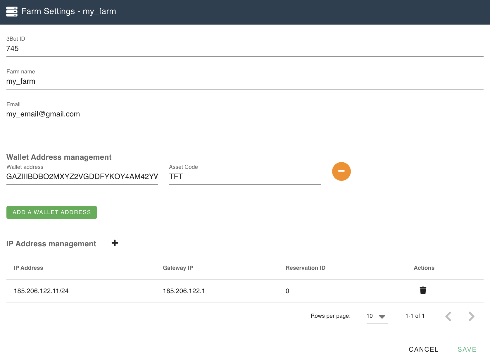
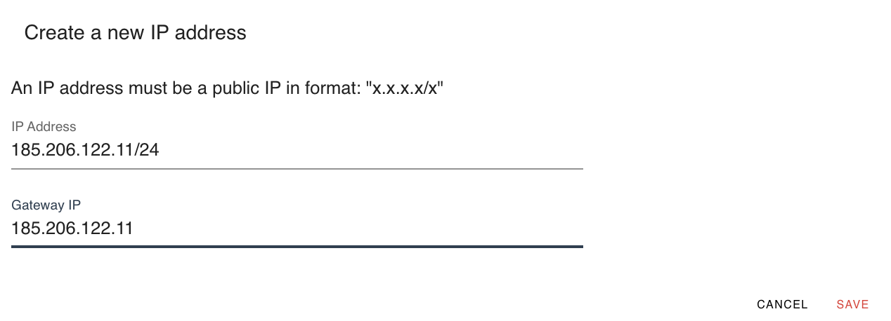

## Add public IPv4 addresses to your farm

Farmers who want to become a network farmer and have public IPv4 addresses available can add their IPs in the farm setup form. 

Click on the `+` to add new IP addresses, define the Gateway IP and click `SAVE`. 

