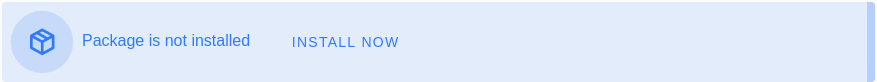

# Farm Initialization

This document explains how to register a farm on the TF Grid.

## Install the Farm Management Application

Install the farm management application. To do so, click the `Farm Management` tab on the left side menu.
Then click the `Install now` button



Once the package is installed, the page will reload and the `farm management` UI will appear.

## Create a Farm

> **Important**: Before creating farm, makes sure your 3Bot is configure to use the network you want to use. The TF Grid has 2 different networks, Mainnet and Testnet. 

To create a new farm, click the little plus button on the top left corner:


It will open up a form to create a new Farm:


Let's go over each field and explain what they are:

* **Farm name**: This is the name you want to give to your farm. The name can be changed at any time and is just there to make it easier for users to find your farm.
* **Organization ID**: This field is only useful is you are migrating a farm from the TF Grid v1. If you are creating a new farm from scratch, you can ignore it.
* **Email address**: The email address that will be associated with the farm. This email address will be used for all communication to the farmer.
* **Country**: This field is optional but usually you want users to know where the farm is located so they can select nodes that are closer to them.
* **Wallet addresses**: This the address where rewards from farming and renting capacity will be received on. At the time of writing, there are 2 supported tokens: [TFT](https://wiki.threefold.io/#/terms_conditions_griduser?id=_5-use-of-threefold-tokens) and [TFTA](https://wiki.threefold.io/#/terms_conditions_griduser?id=_5-use-of-threefold-tokens). You can use any wallet to generate your addresses, you just need to make sure the right [trust line](https://www.stellar.org/developers/guides/concepts/assets.html) is created.

**Make sure you add a valid TFT stellar address.** This is required for a user to be able to reserve capacity from your farm.

Once the farm is created you should see a new entry in the top table.

Notice the first column of the table: ID. This is your farm ID, write this down because you will need to use it when generating the Zero-OS image for your nodes of your farm.


## Use API to check result of creation of farm

You can also check with an API call if your farm is created successfully.

- Mainnet: https://explorer.grid.tf/explorer#api-Farms-getFarm
- Testnet: https://explorer.testnet.grid.tf/explorer#api-Farms-getFarm

Example:

```bash
curl -X GET "https://explorer.testnet.grid.tf/explorer/farms/13646"
{"id":13646,"threebot_id":954,"iyo_organization":"","name":"kristoftest","wallet_addresses":[{"asset":"TFT","address":"GCKOETVYOPF5GW4L5J3EN3RG6Q4WVJ2V3SV5GWNEDY2JBZU75J6XGJE3"}],"location":{"city":"","country":"Belgium","continent":"","latitude":0,"longitude":0},"email":"","resource_prices":null,"prefix_zero":""}
```

<!-- !!!include:bootable_image -->
