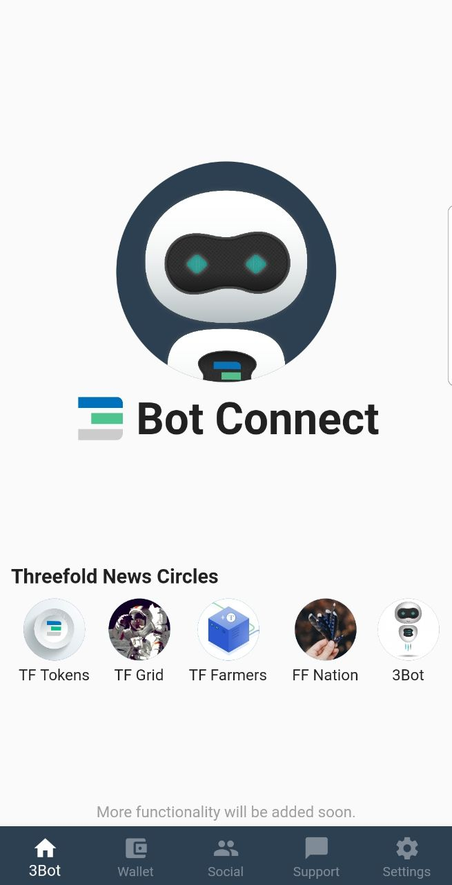
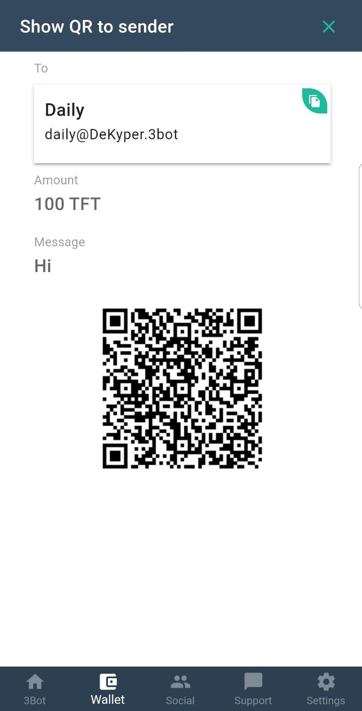
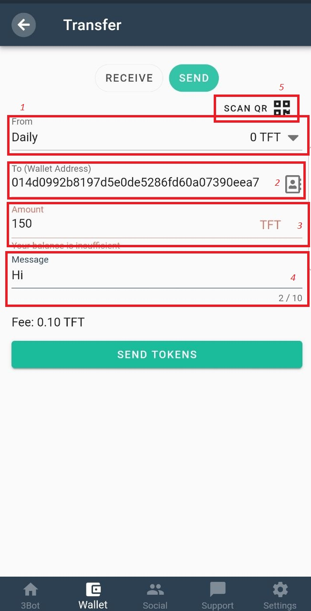

<!--- original content: https://github.com/threefoldfoundation/info_threefold/tree/development/src/docs/token/apps_wallets --->

# 3Bot Connect App

## Introduction

3Bot is a revolutionary digital avatar that will execute your digital needs. It is an unprecedented leap in digital privacy and comes with all the functionalities you need to interact and exchange on the new Internet. With 3Bot, everything changes.

Follow the steps below to set up your 3Bot Connect wallet, and receive and send your first ThreeFold Tokens:

  ## Download
  Download 3Bot from [3Bot.org website](https://3bot.org/3bot.html)
  

  ## Registration and login
  
  To use the 3Bot Connect App you simply need to download the 3Bot Connect App available in the Appstore or Google Play Store. Folow the steps and register using your email address.
 ### Save the seed phrase in a safe place. In the future, it may help to restore your wallet in case your devise is lost.

Seed Phrase allows you to access and recover your wallet from any device. 
We highly recommend write down your seed key on a paper and store it safely offline.

> **3Bot does not have any access to or maintain records of your private key. It is your personal responsibility to keep your 24-word private key in a safe place.**

> **Do not share your private key with anyone, it is strictly personal. Losing your private key means losing access to your wallet and all your ThreeFold Tokens.**

> **Anybody with access to your private key can take ownership of your 3Bot Connect wallet and ThreeFold tokens**

> **To access your wallet from another wallet (on another phone or online) you will need your private key (seed), without this private key your account cannot be recovered on another device or online wallet.**

Finish this steps and choose your new pin, then confirm it and confirm your e-mail adress.

## Home Page

This is the Home Page of your 3Bot Connect App. From here you can open Social - [FreeFlow Pages](https://freeflowpages.com/) - open source social network hosted on ThreeFold decentralizde capacity. 

## Wallet

In this tab you can check your ThreeFold Tokens wallets and balances. You can copy your wallet address using the green "Copy" buttons for each specific wallet. Using the button in the bottom right side you can send or generate QR code to receive ThreeFold Tokens:

### Generate QR Code to receive ThreeFold Tokens

To recieve your ThreeFold Tokens you can copy your button or you have to fill next fields:

1) To - choose wallet that get transaction
2) Amount - amount of TFT to get
3) Message - message to transaction
4) Generate QR - this button generate QR that you have to show

### Send

1) From - choose your wallet with TFT to make transaction
2) To - paste the reciever wallet adress
3) Amount - amount of TFT to send
4) Message - message to transaction
5) SCAN QR - or just scan QR and this fields will be filled autromaticly

## Social
  
In social tab you can join to our FreeFlow network, get actual news from official pages of ThreeFold communities. You can also create your own communities. Home page contains links to the specific ThreeFold communities. 
  

You can find available circles by pressing "My Spaces" -> and start typing a name or select from the proposed list.

## Support
Here you can receive support on any questions related to the ThreeFold Network.

## Settings
You can check your Secret Phrase here, change your pin code or remove your account in Advanced Settings tab.