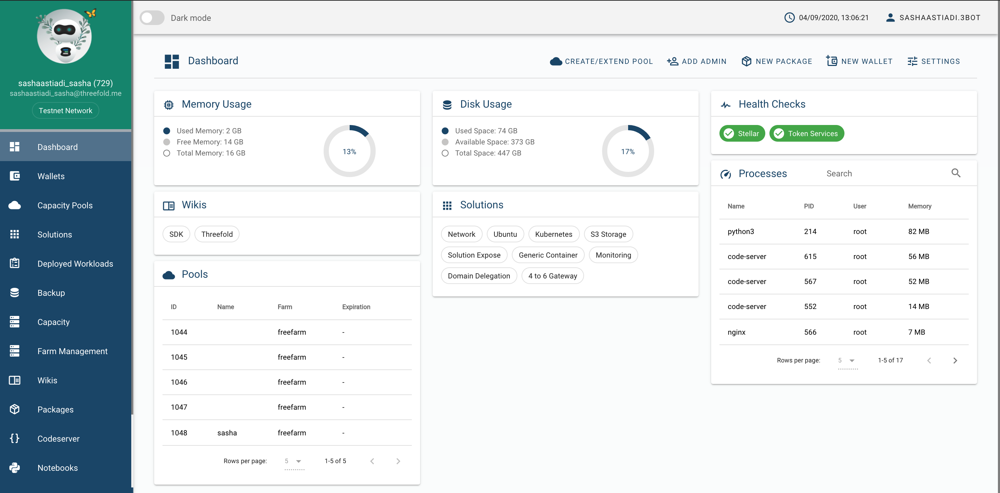

# 3Bot

As your digital presence on the TF Grid, 3Bot plays a crucial role in creating, monitoring, maintaining activities on top of the TF Grid. Therefore, __3Bot__ comes with a system administrator panel; a powerful tool that helps you deploy, maintain and monitor your solutions and workloads on top of the Threefold Grid.

There are 2 ways you could run a 3Bot on testnet and get a 3Bot admin panel on your computer: you could either run a __Testnet Hosted 3Bot__ online via your web browser, or for more advanced users, you could install and run a __Testnet Local 3Bot__ manually on your local machine.

> Easy Set Up: Get [a Testnet Hosted 3Bot](3bot_admin.md) using [Testnet Threebot Deployer](3bot_deployer.md)

> Advanced Set Up: [Create a Testnet 3Bot on your local machine](local_3bot.md)
