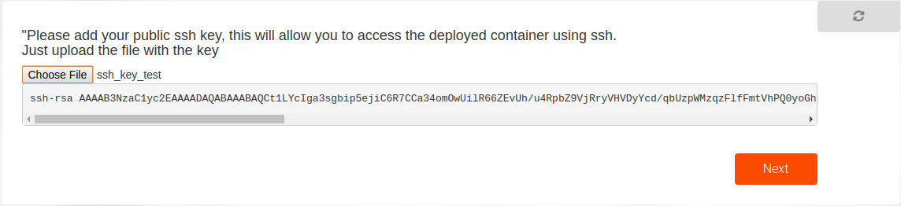
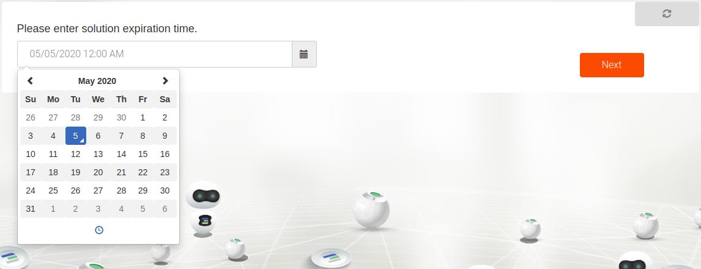
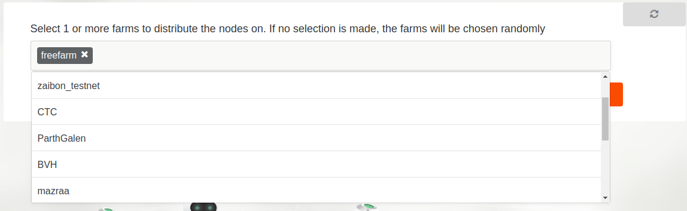
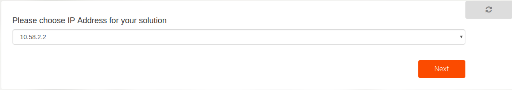
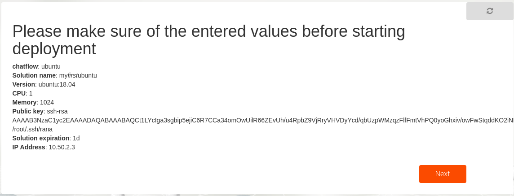

# Deploy your first solution

In this section we will guide you trough deploying your first ubuntu on the TF Grid.

This tutorial will use the example "chat flows" to deploy the solution. The chat flows are wizards that guide you through different steps asking you questions to help you generate a reservation understandable by the grid.


### Deploy your private overlay network

You are now all set to start deploying workloads on the TF Grid. Yeah!

Follow the steps decribed to [deploy your network](getting_started_network.md)

### Deploy a Ubuntu container and connect to it

Now that you have a network in place. We could deploy containers and connect it to the network. To do so we will use the Ubuntu Chat flow

To start the wizard click the left menu on Solutions then Ubuntu


1. First step to deploy Ubuntu is to choose the network on which you want to deploy your Ubuntu container. Use the same name you entered previously when creating the network

 

2. Second enter a name to give your Ubuntu solution. This will be used locally to save the details of the deployment.

 

3. Next choose the version of Ubuntu on you want. We currently support versions 18.04 and 16.04
 

4. Then choose how much CPU and Memory resources you want allocated for the container
 

5. In order to access this container after it is deployed, you will need to upload your public ssh key. Usually your public and private ssh key pairs are found in `~/.ssh` where the public key ends in `.pub`

 

6. The next step is to choose the expiration time of your Ubuntu reservation. Each capacity reservation made on the grid is always bound to an expiration date. Once the date is reached, the capacity is released back to the grid and your workloads deleted.

 For this tutorial one day will be more than enough.

 

7. After that you will encounter an optional question asking for a node ID to deploy the container on. If there is a specific node you want your container to be on then provide its ID otherwise leave it empty. To discover nodes where to deploy your solution the easiest place to look for them is the explorer: https://explorer.grid.tf

 

8. If you left the nodeid empty, you could then choose the farms on which the container could be deployed on. The farms are basically a group of nodes where multiple solutions could be deployed on. You could either choose the farm name from the drop down list or leave it empty to randomly choose any farm.

 

9. You could now choose an IP address that will be given to your Ubuntu container in your network. This is the IP address you will be using to access the container.

 

10. Then read carefully the options you selected previously until this point in the chatflow and confirm them by clicking next to proceed.

 

11. Now that you have chosen all the resources and details required, you will need to proceed with the payment for the solution that will be deployed. As previously mentioned, you will have your wallet setup and funded with an amount of the currency you chose your network with. The following overview will show the price of the deployment and the details regarding the address to be payed to. By clicking on the wallet you will pay with and then next then you accept the payment to be automatically done from it.

 

12. Once the amount is available in the wallet and the payment is successfully completed, the deployment process is continued. After the deployment is successful which may take a couple of minutes sometimes, the following message is shown with details regarding the reservation id which is a unique id used for your specific container deployment. It also views the IP address that is to be used to connect to the container.

 

13. You could now simply access the deployed Ubuntu container by the following command

 ```bash
 ssh root@IP_ADDRESS
 ```

 where the IP address is the one you chose in the chatflow earlier and is shown in the previous success message.

You could view _all_ your deployed solutions that haven't expired such as the network and the Ubuntu container you created by clicking the left menu on **Deployed Solutions**.

