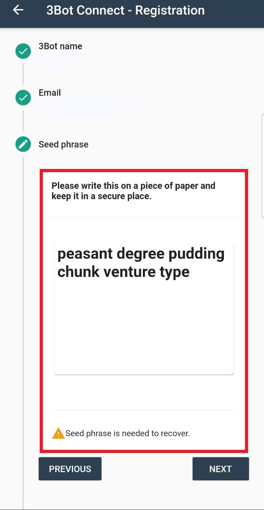

# Getting started

To get your workloads up and running you will need to meet a few prerequisites.

All of them are pretty straightforward and you will be able to start your journey shortly.

- As a first step, you need to get yourself a **3bot.connect** identity.  This can be done by downloading the app on your smartphone and creating yourself an identity.  Please be aware that this is to be your digital identity on the grid, and holds the keys to access it.  The app provides you with access to  ThreeFold social media platforms, has a wallet for managing TFT's and provides support access.  The app can be found on the Google Play store and Apple Appstore.
- In the second step, you need to install the TFGrid SDK (and get access to it by your 3bot.connect).  The Jumpscale Software Development Kit is available for local installation and will be available for grid deployment (with secure web access).  For local installations we use Docker container technology to run the SDK software locally. Going forward we recommend to move to the TF Grid based version as this will provide you access from all web browsers on any device.
- Last you will need TFT tokens in your 3bot.connect app. There are two type of token available (2020 H1):  FreeTFT's and TFT's. The FreeTFT's are meant for developers and interested parties to testdrive the TF grid.  

## 3Bot Connect App

<!--- original content: https://github.com/threefoldfoundation/info_threefold/tree/development/src/docs/token/apps_wallets --->

3Bot will be your digital twin, that will execute your digital needs. 
It is an unprecedented leap in digital privacy and comes with all the functionalities you need to interact and exchange on the new Internet. 
The 3Bot itself is not ready for generic public usage yet but we already use the mobile application for authentication & wallet purposes.

Follow the steps below to set up your 3Bot Connect wallet, and receive and send your first ThreeFold Tokens:

### Install the 3bot connect app on your phone.
  
To use the 3Bot Connect App you need to download the 3Bot Connect App available in the Appstore or Google Play Store. Follow the steps and register using your email address.

### Step 3: Save the seed phrase in a safe place.

In the future, these seed words are required to restore your wallet in case your device is lost.

<!-- 

-->

<!--
TODO #8 See if we can change the seed phrase screenshot into a nices / smaller one
-->

The seed phrase allows you to access and recover your 3bot connect on any device. We highly recommend to write down your seed key on a paper and store it safely offline. The seed phrase is the only "key" to your 3bot and 3bot assets (not only digital currency but also all of the reservations, deployments and data storage on the P2P cloud)

A few very important things to remember you 

- **ThreeFold or any related party does not have any access to or maintain records of your private key. It is your personal responsibility to keep your 24-word private key in a safe place.**
- **Do not share your private key with anyone, it is strictly personal. Losing your private key means losing access to your wallet and all your ThreeFold Tokens.**
- **Anybody with access to your private key can take ownership of your 3Bot Connect wallet and ThreeFold Tokens.**
- **To access your wallet from another wallet (on another phone or online) you will need your private key (seed), without this private key your account cannot be recovered on another device or online wallet.**

Finish this steps and choose your new pin, then confirm it and confirm your e-mail address.

## Install The TFGrid SDK

The TFGrid SDK is the interface where you get access in different ways to build and deploy digital services on the peer2peer grid.  
You can install your TFGrid SDK hosted on the TFGrid, or on a local OS, for this manual we consider you use the SDK on your own machine.

Local installation instructions [using 3sdk binary](sdk_install.md)

