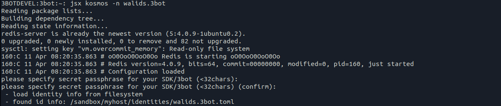
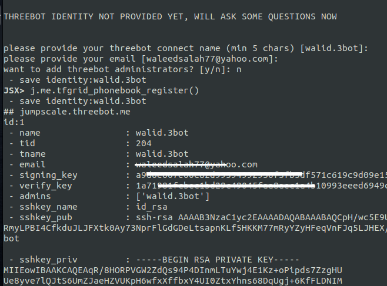
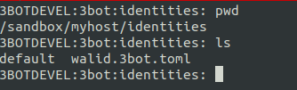

# Initialize your 3bot environment with an identity

## For the first start of jsx container

- Start kosmos shell using ```jsx container```
- it will ask you for your identity
    - if you want to specify it at the start ```jsx container -id someone.3bot``` (there is no need to specify 3bot at the end, this will happen automatically).
- if you want to work with more than 1 container, use ```-n aname```.


## If you want to check your configuration or change

- This will ask you about a secret passphrase, this secret is saved in redis and encrypts your identities.
Please keep it safe and remember it.

 

- After Kosmos starts, configure using j.me
    
    ```python
    j.me.configure()
    ```

This will ask you about your information: 3bot name, email, description, ... . It will also ask if you want to add admins to your system.
This command will automatically register your information in the phonebook.

 

#### Congratulations your 3bot is ready ! Now you can start the 3bot server and start your reservation.

To save your identity, you best copy these files (holding your identity information) to a safe place : 

 

- `default` file contains the name default identity, please make it to refer to your recovered identity

Example:

```
3BOTDEVEL:3bot:identities: cat default
walid.3bot
```

## .test identities (3bot names)

- for tests use ```aname.test```  (aname to be changed)
- the email address you can specify but if not done will be someone@aname.test (--email)
- when using a .test name everything will happen automatically, you will find the generated identity in your identity folder.

Example

```bash
jsx container -id test5.test -n test -d
```

will remove your container & redo your registration. 

Your own 3bot name (the one as configured in the default identity is automatically added as administrator to any 3bot created.)
 
## How to start from an existing private key

```
jsx container -d -id someone.3bot --words='course salon aword ship team broccoli explain gate three again heart busy vessel parrot bar chalk pig world snow ...' --email='...'
```

## Creating multiple identities

You can either start Kosmos with a new identity name ```jsx kosmos -n newname.3bot``` which will guide you through the configuration, or you can do it from Kosmos shell through following steps :

- Create a new identity

```bash
JSX> j.myidentities.get("test2.3bot")
 - save identity:test1.3bot

## jumpscale.threebot.me
ID: 3
 - name                : test2.3bot
 - tid                 : 0
 - tname               :
 - email               :
 - signing_key         :
 - verify_key          :
 - admins              : []
 - sshkey_name         :
 - sshkey_pub          :
 - sshkey_priv         :


JSX> i = j.myidentities.get("test2.3bot")
```
- Configure your new identity
```
JSX> i.configure()

THREEBOT IDENTITY NOT PROVIDED YET, WILL ASK SOME QUESTIONS NOW


please provide your threebot connect name (min 5 chars) [test2.3bot]:
please provide your email: test2@mail.com

 *** WILL NOW CONFIGURE SSH KEY FOR USE IN 3BOT ***


SSH: found preconfigured SSH key, ok to use ssh key: id_rsa [y/n]: y

 *** WILL NOW CONFIGURE YOUR PRIVATE 3BOT SECURE KEY (IMPORTANT) ***


Ok to generate private key (Y or 1 for yes, otherwise provide words)?
make your choice (y,n): y
We have generated a private key for you.
The private key:

fine bitter abandon annual inject among vanish supply custom pause beach type puppy exhibit carbon neutral hole trouble drastic remain artwork antique laptop material
ITS IMPORTANT TO STORE THIS KEY IN A SAFE PLACE
Did you write the words down and store them in safe place?
make your choice (y,n): y

give the 3e word of the private key string: abandon

want to add threebot administrators? [y/n]: n
 - save identity:test1.3bot
 - save identity:test2.3bot
JSX>
```
- Register the identity to the tf_phonebook using
```python
i.tfgrid_phonebook_register()
```

- Start 3bot server with your preferred identity using
```python
JSX> j.servers.threebot.start(background=True, identity="test2.3bot")
```

- You will find your identity set in 3bot server :


## Recovering identites

In case you lost your identites, we can restore from the saved toml keys in `/sandbox/myhost/identities`.

This contains the identity information, please keep them safe

 

- `default` file contains the name default identity, please make it to refer to your recovered identity.

Example:

```
3BOTDEVEL:3bot:identities: cat default
walid.3bot
