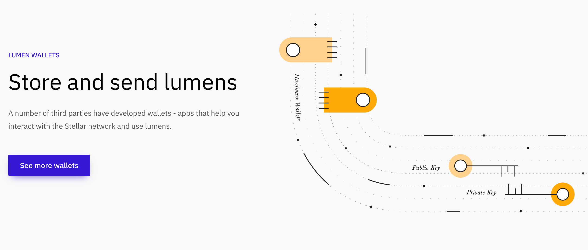

# Get and Store TFT 

On a hosted 3Bot environment, there are a few options on how to get and store TFT to reserve IT Capacity for your workload deployment test. You can use a __pre-configured hosted 3Bot wallet__, __3Bot wallet on your ThreeFold Connect App__, or a __third-party Stellar wallet__ to store your TFT. 

You can purchase TFT by __buying or trading other stellar into TFT__ via Stellar-supported exchangers like Liquid or BTC-Alpha. You can also purchase TFT Directly from the farms. Please check this [__tutorial__ on how to buy and sell TFT](threefold:how_to_buy_and_sell)

## Store your TFT

There are a few options on how you can store your TFT:
- Store your TFT on __Hosted 3Bot Wallet on your hosted 3Bot__
- Store your TFT on your __3Bot Wallet on ThreeFold Connect App__
- Store your TFT on a __third party testnet Stellar wallet__

### Store your TFT on your hosted 3Bot Wallet

Once you've signed up, deployed, and logged into your hosted 3Bot, you can use a pre-configured hosted 3Bot wallet to store your TFT. 3Bot admin panel dashboard comes with a hosted wallet feature to make it easier and faster for you to store your TFT, and to reserve IT Capacity. 

Simply click on __'Wallet'__ menu on your hosted 3Bot sidebar to access your wallet list, and click on one particular wallet to see the details of the wallet, including the wallet address and the amount of TFT balance you have on your account.

> Please go to [__Hosted 3Bot Wallet__](3bot_sdk_wallet) to read more about the 3Bot Wallet feature on your hosted 3Bot.

### Store your TFT on your __3Bot Wallet on ThreeFold Connect App__

 

Your ThreeFold Connect App comes with an inclusive 3Bot Wallet that you can access within the app on your mobile phone. After installing the __ThreeFold Connect App__ on your device, simply click on the app, and click on __Wallet__ to access the 3Bot Wallet. Then click on the big __'transaction' icon__ on the bottom right corner of your screen to start sending or receiving TFT.

> Please go back to [__ThreeFold Connect App__ Installation Manual](threefold:threefold_connect) if you have not installed the ThreeFold Connect App on your mobile phone.

### Store your TFT on your third-party testnet Stellar Wallet

You can use any [__third-party testnet stellar wallet__](https://www.stellar.org/lumens/wallets) to store your TFT. There are a lot of Stellar wallets out there, such as [__interstellar wallet__](https://interstellar.exchange/#download), [__Solar Wallet__](https://solarwallet.io/#download) and many more.... 

> [__Get a third party Stellar Wallet__](https://www.stellar.org/lumens/wallets)

> Please go to [__How to Store Your TFT__](threefold:tf_wallets) section on ThreeFold Wiki for more detailed information on purchasing TFT.

## Get TFT

You have three options for getting / purchasing TFT

1. Get TFT from a public [__digital currency exchange__](threefold:how_to_buy_and_sell) *(with some limitations for certain countries)*
2. Get TFT through a [__Stellar decentralized exchange__](threefold:how_to_buy_and_sell)
3. Purchase TFT directly from a [__ThreeFold Farmer__](threefold:how_to_buy_and_sell)

- If you have had some experience with trading, buying and selling digital currencies:
    - We'd recommend you go through one of the digital currency exchanges if those are available in your country. 
    - Or use a Stellar decentralized exchange.
- If you  have little to no experience with trading, buying and selling digital currencies:
    - We'd recommend you to purchase TFT directly from a TF Farmer.

_Keep in mind buying digital currencies through exchanges does involve some steps and time, but in the end this is because there is an exchange of money happening – so security, verification of identity, and related procedures are quite important._

> Please go to [__How to Buy TFT__](threefold:how_to_buy_and_sell) Section on ThreeFold Wiki for more detailed information on purchasing TFT.