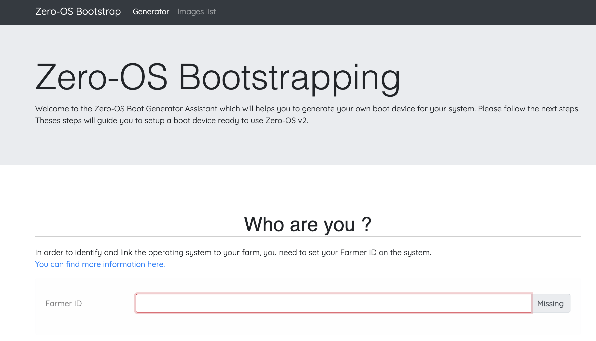
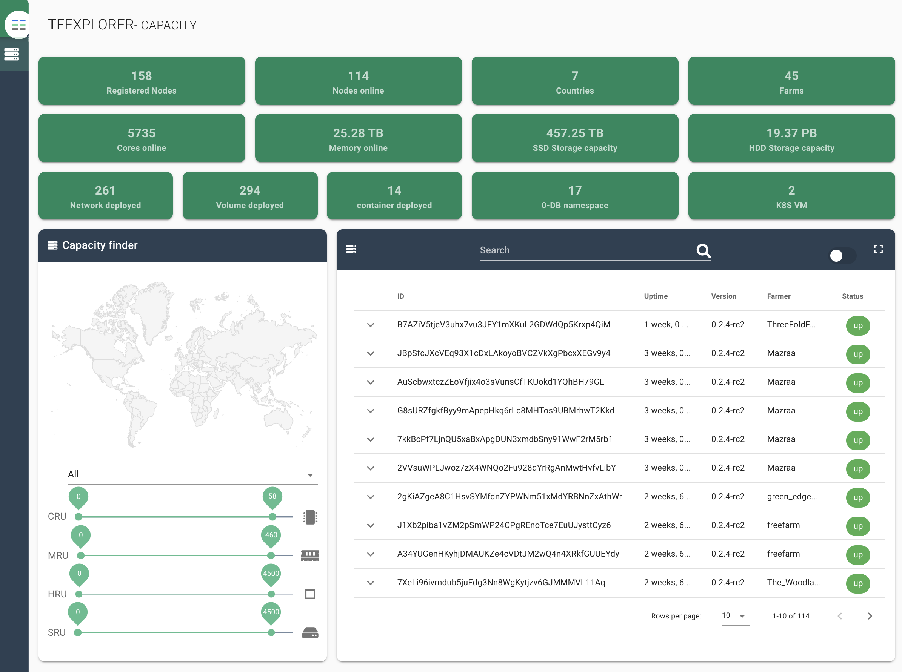
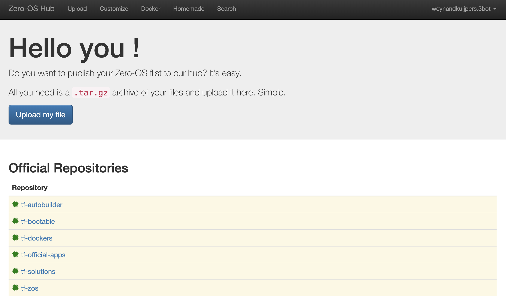
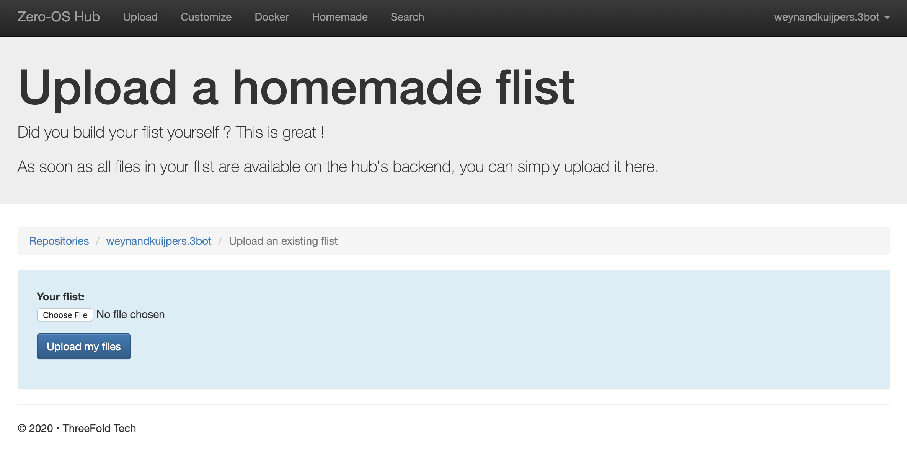

## Online resources

The TF Grid has a number of online resources to create 3nodes, to find 3nodes with capacity and to bring forward and upload container images into flists.  All of these resources are available to use, are run on the grid but also are available as open-source to create your own private hub.

### Create a 3node
Anyone can creates 3nodes.  The process is very simple and requires you to put forward and dedicate hardware for the 3nodes and get a bootloader at [dev.bootstrap.grid.tf](https://dev.bootstrap.grid.tf/). Mode information about the process of listing your farm and getting a `farmID` can be found here 

<!-- TODO #63 Look at the farming pages and see if the description of getting a farm_id and more is cleary documented enough -->

<!--  -->

### Find 3nodes to deploy workloads on

The TF Grid has an explorer which represents all of the 3nodes that form the capacity grid.  The TF grid is ever-expanding and at the time of writing we are in the middle of migrating nodes from grid v1.0 to v2.0. The explorer provide some basic number on total capacity available, geographics spread and actual workloads deployed on the grid.  

Also included is a rudimentary search facility where you can select nodes based on their characteristics (number of CPU cores, memory etc.). For discovery purpose this grid portal is a good starting point to find out what is available on the TF Grid in which geography.

<!--  -->

On a per-node level, node specific details are available.  Opening a specific node tab provides you with the identity and statistics of the node.  All this information is also searchable and available in the SDK.

<!--  -->

### Find or create flists   
The flist principle is explained in the introduction architecture section ([here](../intro/architecture_flist.md)).  It is a very unique and efficient way to store and distribute container images.  We have create a storage mechanism for these flists online which is called the hub: [hub.grid.tf](https://hub.grid.tf/).
<!--  -->

Access to this hub is restricted to people that have a 3bot connect identity.  There is a description in the "getting started" section on how to get one of these [here](3bot_connect_app.md).

Login to the hub and you will not only have access to flists created and uploaded by others but also the ability to create and upload your own. Two principle ways to create (custom) flists:
- import docker images from the docker hub
- create your own tarballs and upload those

<!-- TODO not sure how to restrict sceenshot from being presented very large
original image includes

-->