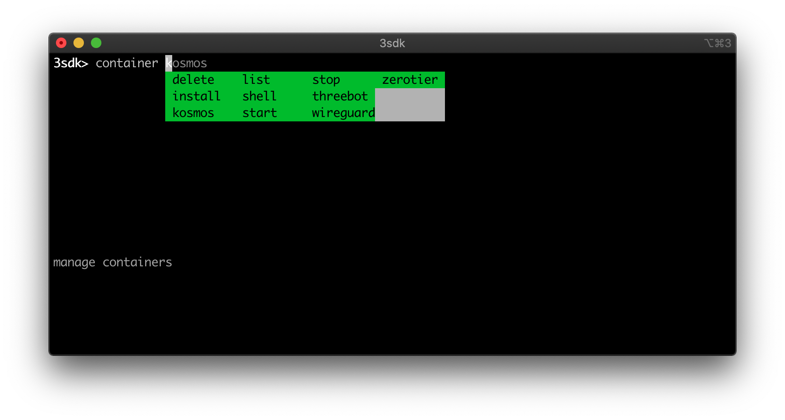

## Install the TFGrid SDK


### What do I need to instal the SDK?

Installing the TFGrid SDK is easy.  There are two ways available today and there will be a third one very soon:

- Install the SDK on your local machine by using the `3sdk` binary 
- Compile and install the `3sdk` binary and install the SDK on you local machine
- Install the SDK on the TF Grid (later Q2 2020)

To install the TFGrid SDK on you local systems you have to have the following software components installed on your machine

- The Docker Desktop.  You can find and download an appropriate version of the Docker Desktop  [here](https://www.docker.com/products/docker-desktop)
- The Chrome browser.  You can find the latest version [here](https://www.google.com/chrome/)

Today the TFGrid SDK is supported on two main operating systems: Linux and macOS.  A version for windows will follow very soon (later Q2 2020)

###  Install the SDK on your local machine by using the 3sdk binary 

Using the binary installation method saves you from having to go through all the requirements to have a full pythin development environment installed on you machine with all the libraries and wheels that we need to build the 3sdk banary.  You can find the latest release candidate (we're still beta with this installer) here:

- [Release Candidate 5 (Linux only)](https://github.com/threefoldtech/jumpscaleX_core/releases/tag/v10.4-rc5)
- [Relaese Candidate 4 (macOS + Linux)](https://github.com/threefoldtech/jumpscaleX_core/releases/tag/v10.4-rc4)

Download this file, make sure its properties are set correct and store it in a location which is included in your `$PATH`.

------
On macOS you will have to allow this binary to run.  Since this application is distributed outside of the official apple store channel macOS does not trust it.  When you execute this application if will tell you tha tthis is from an unidentified deloper.


Please go to the security tab in the system preferences app and click "Security & Privacy".  You will see at the bottom of that windows a message that it was blocked.  Please allow it to run


----

## <a name='Using3sdk'></a>Using 3sdk

Binaries should be in the [release](https://github.com/threefoldtech/jumpscaleX_core/releases) page for osx and linux.  Please select the latest release candidate for you OS and download it.  If yo don;t want to download binaries we have a description available how to compile the binaru from source.  You can find it in the packaged installer section below

Once downloaded please move the binary to a location in your path.  You can launch `3sdk` in a terminal.


### <a name='Gettinghelp'></a>Getting help

Once you have the binary in a location that is part in `$PATH` defnition you can start the 3sdk shell.  In this shell you have a help function that allows you to see what you can do.


### <a name='BasicFeatures'></a>Basic Features

Every command section in the container shell has command completion and further information presented at the bottom of the screen


### Using the 3botconnect app words (mnemonics)

- You have to use same username & same email
- use the `words=` parameter in the your commands (you will see example commands in the upcoming section)

#### <a name='StartThreebotContaineronecommand'></a>Start Threebot Container (one command)


> `container threebot`

if you want to set 3botconnect application words `container install words=''`


#### <a name='InstallNewContainer'></a>Install New Container
> `container install name=notsomeuser3 identity=notsomeuser3 email=notsomeuser3@gmail.com server=True`

- server=True means to start 3bot server


#### <a name='RunningNewContainer'></a>Running New Container

to start a new container `container start name:mycontainer`	

#### <a name='ListingContainers'></a>Listing Containers

```
3sdk> container list                                                                                       
 
list the containers 
                                                                                                           
 - notsomeuser3 : localhost       : threefoldtech/3bot2       (sshport:9000)
 - notsomeuser4 : localhost       : threefoldtech/3bot2       (sshport:9010)
 - 3bot       : localhost       : threefoldtech/3bot2       (sshport:9020)
3sdk>  
```
also using the sshport information you can do `ssh root@localhost -p $SSH_PORT` to manually ssh into the 

#### <a name='AccessingContainerShell'></a>Accessing Container Shell

Either use the sshport info from `container list` command and `ssh root@localhost -p $SSH_PORT` or just execute `container shell` and optionally give it the name of your container

#### <a name='GettingContainerKosmos'></a>Getting Container Kosmos

Execute `container kosmos` to get into kosmos shell


### <a name='Advancedfeatures'></a>Advanced features

##### installing 3bot on the host

just `install` in 3sdk

##### Controlling code branches

use `core branch` command


## <a name='Packagedinstallersdk'></a>Packaged installer (sdk)

To build the SDK yourself, you need to have:
* `python3`: `apt-get install python3`
* `pip`: `apt-get install python3-pip`
* `upx` is used to compress binary executable, can be installed with:
    * ubuntu: `apt-get install upx`
    * macos (using brew): `brew install upx`
* `patchelf`: `apt install patchelf`
* `pyinstaller` can be installed using `pip3 install pyinstaller --user`


### <a name='Build:'></a>Build:

Run the packaging script:

```bash
cd install
./package.sh
```

If nothing gone wrong, you should find the final binary executable at `dist` directory.

Try running it with:

```bash
./dist/3sdk
```

## <a name='Using3sdk.pyfromsource'></a>Using 3sdk.py from source
This will require python3, git on the user system 

- `pip3 install jedi pudb ptpython==2.0.4`
- `cd /tmp && git clone https://github.com/threefoldtech/jumpscaleX_core/ && cd jumpscaleX_core && git checkout unstable && git pull`
- `sudo -s`
- `ln /tmp/jumpscaleX_core/install/3sdk.py /usr/bin/3sdk`
 

## <a name='Troubleshooting'></a>Troubleshooting


## <a name='SignatureVerification'></a>signature verification failed, ensure your pubkey to be the same as local configured nacl

```
Tue 14 19:18:01 e/Jumpscale/me/Me.py - 461 - tfgrid_phonebook_register          : EXCEPTION: 
    signature verification failed, ensure your pubkey to be the same as local configured nacl
--TRACEBACK------------------

```

is most likely caused that you registered on phonebook with different words other than the ones in the 3bot connect app

## case you have an old container with your old key and secret
you can get your private key `cat /sandbox/cfg/keys/default/key.priv`
and the secret `cat /sandbox/cfg/jumpscale_config.toml | grep SECRET`


#### Recovering old words (saved)
if you have your key.priv and secret from jumpscale_config and want to restore them


##### Restore estore the key
either copy the file back into `/sandbox/cfg/keys/default/key.priv` or

```
root@3bot:/sandbox# echo -n 'PRIVATEKEYCONTENT' > /sandbox/cfg/keys/default/key.priv
root@3bot:/sandbox# cat /sandbox/cfg/keys/default/key.priv | wc -c
144
```

make sure the length is 144

##### Restore the secret

edit `/sandbox/cfg/jumpscale_config.toml` and set `SECRET` to the old secret.

when done do `jsx check`
##### Retrieve the words 

execute that in kosmos `j.data.nacl.default.words`

NOTE: these words aren't compatible with the keys you have in 3bot connect 

NOTE: You may have to delete `/sandbox/cfg/bcdb_config` and `pkill redis` if you got secret conflicts


### <a name='REMOTEHOSTIDENTIFICATIONHASCHANGED'></a>REMOTE HOST IDENTIFICATION HAS CHANGED

```
Could not execute:    scp -P 9010 root@localhost:/var/executor_data /tmp/jumpscale/scripts/35865.data

stderr:
    @@@@@@@@@@@@@@@@@@@@@@@@@@@@@@@@@@@@@@@@@@@@@@@@@@@@@@@@@@@
    @    WARNING: REMOTE HOST IDENTIFICATION HAS CHANGED!     @
    @@@@@@@@@@@@@@@@@@@@@@@@@@@@@@@@@@@@@@@@@@@@@@@@@@@@@@@@@@@
    IT IS POSSIBLE THAT SOMEONE IS DOING SOMETHING NASTY!
    Someone could be eavesdropping on you right now (man-in-the-middle attack)!
    It is also possible that a host key has just been changed.
    The fingerprint for the ECDSA key sent by the remote host is
    SHA256:0NLL4zZubYiZ0hhSWAz/LB5VdCybIzfjZ/n0YlLLeBM.
    Please contact your system administrator.
    Add correct host key in /root/.ssh/known_hosts to get rid of this message.
    Offending ECDSA key in /root/.ssh/known_hosts:5
      remove with:
      ssh-keygen -f "/root/.ssh/known_hosts" -R "[localhost]:9010"
    ECDSA host key for [localhost]:9010 has changed and you have requested strict checking.
    Host key verification failed.
```
Just execute `ssh-keygen -f "/root/.ssh/known_hosts" -R "[localhost]:9010"`

### Chrome errors with certificate (OSX)

You can start chrome manually using
```
open -n -a /Applications/Google\ Chrome.app/Contents/MacOS/Google\ Chrome  --args --user-data-dir="/tmp/chrome_dev_test" --disable-web-security --ignore-certificate-errors'
```


TOSORT
## Know your 3bot secret

- From 3botconnect application go to settings, then show phrase to get your mnemonics (24 words for your private key)
- Take a note of the 3bot name and your email
- When registering for the first time you can use these private words in your configurations