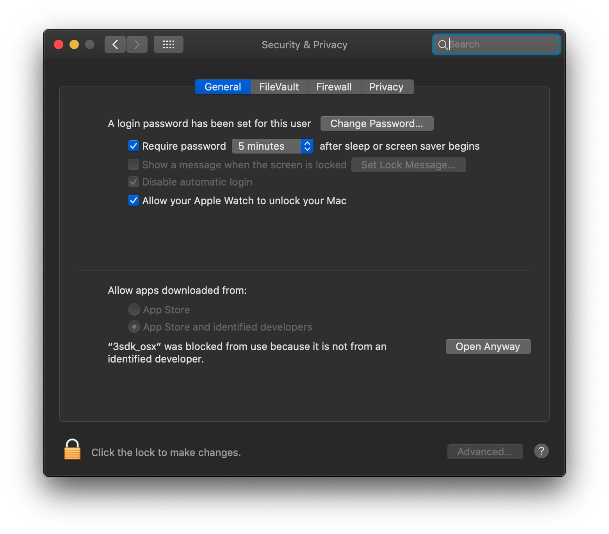
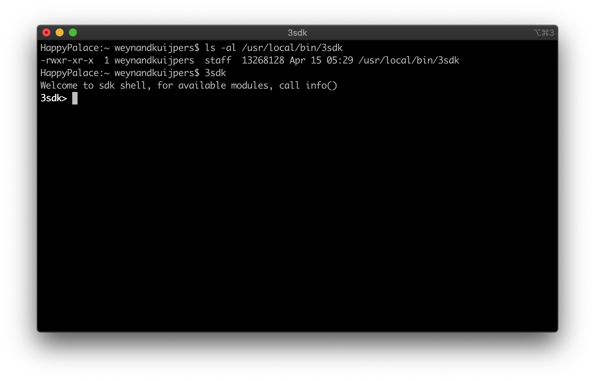
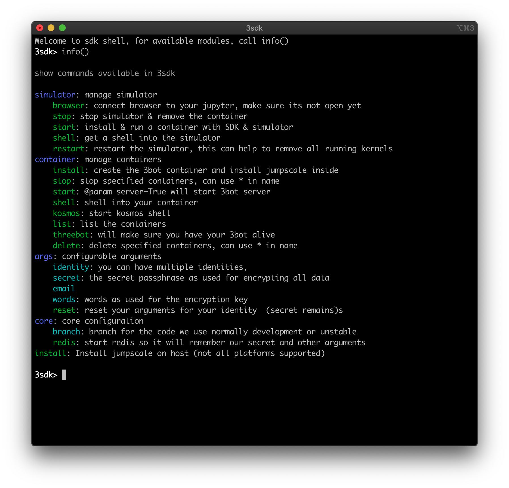

## Install the Jumpscale SDK

### What do I need to install the SDK?

Installing the Jumpscale SDK is easy.  There are two ways available today and there will be a third one very soon:

- Install the SDK on your local machine by using the `3sdk` binary 
- Compile and install the `3sdk` binary and install the SDK on you local machine
- Install the SDK on the TF Grid (later Q2 2020)

To install the Jumpscale SDK on you local systems you have to have the following software components installed on your machine

- The Docker Desktop.  You can find and download an appropriate version of the Docker Desktop  [here](https://www.docker.com/products/docker-desktop)
- The Chrome browser.  You can find the latest version [here](https://www.google.com/chrome/)

Today the Jumpscale SDK is supported on two main operating systems: Linux and macOS.  A version for windows will follow very soon (later Q2 2020)

###  Install the SDK on your local machine by using the 3sdk binary 

Using the binary installation method saves you from having to go through all the requirements to have a full python development environment installed on you machine with all the libraries and wheels that we need to build the 3sdk binary.  You can find the latest release candidate (we're still beta with this installer) here:

- [Release Candidate 5 (Linux only)](https://github.com/threefoldtech/jumpscaleX_core/releases/tag/v10.4-rc5)
- [Relaese Candidate 4 (macOS + Linux)](https://github.com/threefoldtech/jumpscaleX_core/releases/tag/v10.4-rc4)

Download this file, make sure its properties are set correctly and store it in a location that is included in your `$PATH`.

#### macOS remarks
On macOS you will have to allow this binary to run.  Since this application is distributed outside of the official apple store channel macOS does not trust it.  When you execute this application if will tell you that this is from an unidentified developer.

<!--
TODO #71 resize the image to a smaller form - does not need to be this large
-->

Please go to the security tab in the system preferences app and click "Security & Privacy".  You will see at the bottom of that windows a message that it was blocked.  Please allow it to run

#### Linux remarks

We do not provide packages for mainstream Linux distributions (Ubuntu, CentOS, RedHat).  This is something that might come in the future if there is sufficient demand for it.  However we believe that the majority of SDK installs will be running on the grid and providing you with secure access to your SDK container with a web browser.  This is planned later in Q2 2020.

## Compile and install the `3sdk` binary and install the SDK on you local machine

For a detailed description how to compile the SDK binary please click [here](add link)
<!--
TODO #70 write compilation and installation instructions for the 3sdk binary
-->

## Install the SDK on the TF Grid (later Q2 2020)
This option is not available yet and will come later in q2 2020
<!--
TODO #69 write and provide grid based jumpscale SDK access
-->

## Installing the Jumpscale SDK with the 3sdk shell.

Once you have downloaded and installed (or compiled) your own `3sdk` executable please open a terminal window an start the shell.

The `3sdk` prompt indicates that you are in the shell

### Getting help

The shell provides a help facility which provides a brief description for all the commands that are available in the shell.

Main commands are:
- `simulator`: run and manage the ThreeFold simulator.  The ThreeFold simulator is a tool for (future) farmers to look at the token economy for the ThreeFold grid.  Simulator options are:
    - `browser`: launch the simulator and open a browser (tab
    - `stop`: stop the simulator
    - `start`: start the simulator.  You can connect to it by opening up a browser and connect to: `http://localhost:4000`
    - `shell`: connect to the simulator container and provide you with a (bash) shell
    - `restart`: restart the simulator. As it is CPU and memory intensive it help to do this occasionally
- `container`: run and manage the Jumpscale SDK.  The Jumpscale SDK and a local installation of the 3bot development tool.  Container options are:
    - `install`:  install the Jumpscale SDK container and start it
    - `stop [name]`:  stop a Jumpscale container (container name as argument)
    - `start [name]`: starts an (existing) jumpscale container (container name as argument)
    - `shell [name]`: provides a (bash) shell into a jumpscale container ((container name as argument)
    - `kosmos [name]`: provides a kosmos shell into a jumscale container (container name as argument) 
    - `list`: list all created jumpscale containers
    - `threebot`: creates and starts a full jumpscale SDK environment
    - `delete [name]`: deletes a Jumpscale containers
- `args`: configurable arguments that can be passed into the containers running the simulator of the Jumpscale SDK
    - `identity`
    - `secret`
    - `words`
    - `reset`
    - `email`
- `core`
    - `branch`
    - `redis`
    - `install`

<!--
TODO #72 complete the descriptions for the 3sdk Jumpscale install tool
-->

Every command section in the container shell has command completion and further information presented at the bottom of the screen

Next section is on getting started with the [simulator](./sdk_install_simulator.md) and [Jumpscale SDK](./sdk_install_container.md)