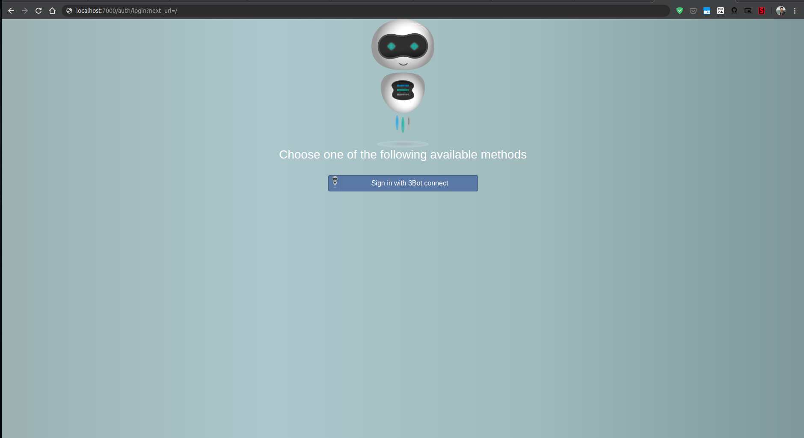

<!--- Original conents: https://github.com/threefoldfoundation/info_threefold/blob/master/docs/wikieditors/installation_linux.md --->

# JumpscaleX SDK Installation Instructions (Linux)

There  are two ways that you can work with the JumpscaleX SDK:
- a local install on a servers / laptop
- a version of the SDK installed online on the TF Grid

In this document we will explain the installation a local installation in a Docker container.

## Step 1: Prepare your machine

The TFGrid SDK is currently supported on Linux, more specifically this installation script will guide you through the steps for the Ubuntu distribution.  Other linux distributions will be supported in the future.

### Prerequisites for the SDK installation.

In order to install the SDK in a container (recommended) you need the Docker software suite. You can find instructions for installing it in ubuntu [here](https://docs.docker.com/install/).

When you have Docker installed on your system, pleass open a terminal and execute the following commands:
```bash
sudo -i; # this may ask you for your password
apt update -y;
apt install -y openssh-server locales curl git rsync unzip lsb python3 python3-pip;
pip3 install click requests;
```
This will update Ubuntu to the latest stable release and make sure you have the required packages installed. 

ssh-agent is a program to hold private keys used for public key authentication (RSA, DSA, ECDSA, Ed25519). ssh-agent is usually started in the beginning of an X-session or a login session, and all other windows or programs are started as clients to the ssh-agent program.  Through use of environment variables the agent can be located and automatically used for authentication when logging in to other machines using ssh(1). The install script needs an agent to be started:
```bash
eval `ssh-agent -s`

# Adds private key identities to the OpenSSH authentication agent
ssh-add

# Show the public key that belongs to the loaded private key
ssh-add -L
```
The last command should show the public key
```bash
sh-rsa AAAAB3NzaC1yc2EAAAADAQABAAABAQC05P5eFki+5vHdn9BMrQwj0LZzl4FxwTAQ4GtwJFTS4Hog10Ly9sdhPQANOWASC1FXwZThVzj91hL8JCFuBZ5pDx29rJCDMQdqqVHQI5j8qkh4ZNNNQr/QLxdGl53RtQgabGe0OSnP+ZdvGHuSQdTg03bomGrpCYcahLbcj1yWBsCuF2VDgnW0AHeMR0lEubbKMSQrTNCuZqrGbRPuxaHzWj9KQSe4xiRtA/PB7ccMsQlXeIh5pv8QI6k858oJzvlswczTgZivCKoHRnU6XyDVd60y9v3BpbB7YgTasw/VXUDt4oH7U61VI3Jy7t/d9jazMcDt3CngDtRpWQqZSO77 .ssh/id_rsa
root@happy:~# 
```

For the next step to be successfull make sure you have added this identity as a known ssh key to you github account.  The SKD code will come from Github and requires you to have a public key configured in GitHub.

## Step 2:  JumscaleX SDK installation

In a terminal execute the following commands: these will download the install script, make it executable and then create and download directories and files.  It depends on executing from `/tmp`.

```bash
curl https://raw.githubusercontent.com/threefoldtech/jumpscaleX_core/development/install/jsx.py?$RANDOM > /tmp/jsx;
chmod +x /tmp/jsx;
```

This script provides a number of commands to operate / configure the SDK.  Options are show with the ```--help``` flag.
```bash

root@happy:~# /tmp/jsx 
- redis loghandler cannot be loaded
Usage: jsx [OPTIONS] COMMAND [ARGS]...

Options:
  --help  Show this message and exit.

Commands:
  basebuilder         create the base ubuntu docker which we can use as
                      base...
  check
  configure           initialize 3bot (JSX) environment
  connect             only for core developers and engineers of threefold,...
  container-delete    delete the 3bot container :param name: :return:
  container-export    export the 3bot to image file, if not specified will...
  container-import    import container from image file, if not specified...
  container-install   create the 3bot container and install jumpcale inside...
  container-kosmos    open a kosmos shell in container :param name: name of...
  container-save      starts from an export, if not there will do the
                      export...
  container-shell     open a shell to the container for 3bot :param name:...
  container-start     start the 3bot container :param name: :return:
  container-stop      stop the 3bot container :param name: :return:
  containers          list the containers :param name: :return:
  containers-reset    remove all docker containers & images :param name:...
  generate
  install             install jumpscale in the local system (only supported...
  jumpscale-code-get  install jumpscale in the local system (only supported...
  kosmos
  modules-install     install jumpscale module in local system :return:
  package-new         scaffold a new package tree structure
  sdk                 jsx threebot -d :param delete: delete the containers...
  threebot-flist      create flist of 3bot docker image ex: jsx...
  threebotbuilder     create the 3bot and 3botdev images
  wiki-load
  wiki-reload         reload the changed files from wikis repo ex: jsx...
  wireguard           jsx wireguard enable wireguard, can be on host or...
  ```

As stated above our recommendation is to install the SDK in a container.  The JSX tool has commands to start and stop the container in a controlled manner. If you have installed 3bot containers in the past - please check and remove the 3bot entries from the known_host file.

Then we can install our TFGrid SDK using
```bash
# Make sure there are no remnissents from previous versions and installations.  If you have installed older version on the TFGrid SDK please cleanup with the following command
/tmp/jsx containers-reset

# If /sandbox exists as a directory
rm -fr /sandbox

# If the known hosts file exists - delete the entries made by previous installations.
cd 
mv .ssh/known_hosts .ssh/known_hosts.original
# install
/tmp/jsx sdk
```

The result will be something like the following, it will take few minutes so please wait untill it's done.


After installation is done you will see the following screen


Congratulations, now you have your 3bot installed. To start your 3bot. just type in shell `3bot start`.

## Step 3: Connect your 3bot identity to the container

<!--
TODO #9 Add instructions of the final version of how you connect your 3bot.connect identity to the installed container.
-->

After that we can go to our browser to this link: http://localhost:7000
or this link: https://localhost:4000 for https

- We will see the following screen

    

Now we will need the 3bot.connect app, you can download it froms the [AppStore](https://apps.apple.com/us/app/3bot-connect/id1459845885) or [GooglePlayStore](https://play.google.com/store/apps/details?id=org.jimber.threebotlogin&hl=en) and use it to login with the 3Bot name you registered.


Also, other people can access the dashboard, but they need to be added to admins from `Settings`, Also, admins can be dded to `j.tools.threebot.me.default.admins` via `kosmos` shell example:

```python3
j.tools.threebot.me.default.admins.append("hamada.3bot")
j.tools.threebot.me.default.save()
```


