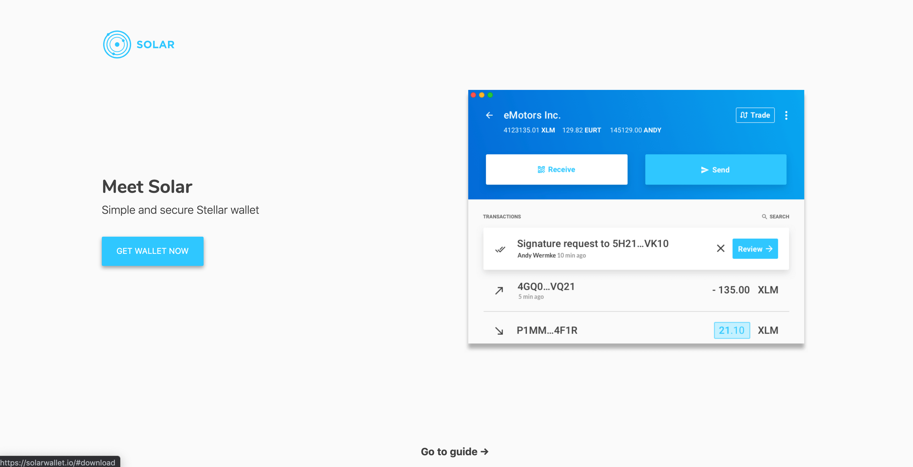
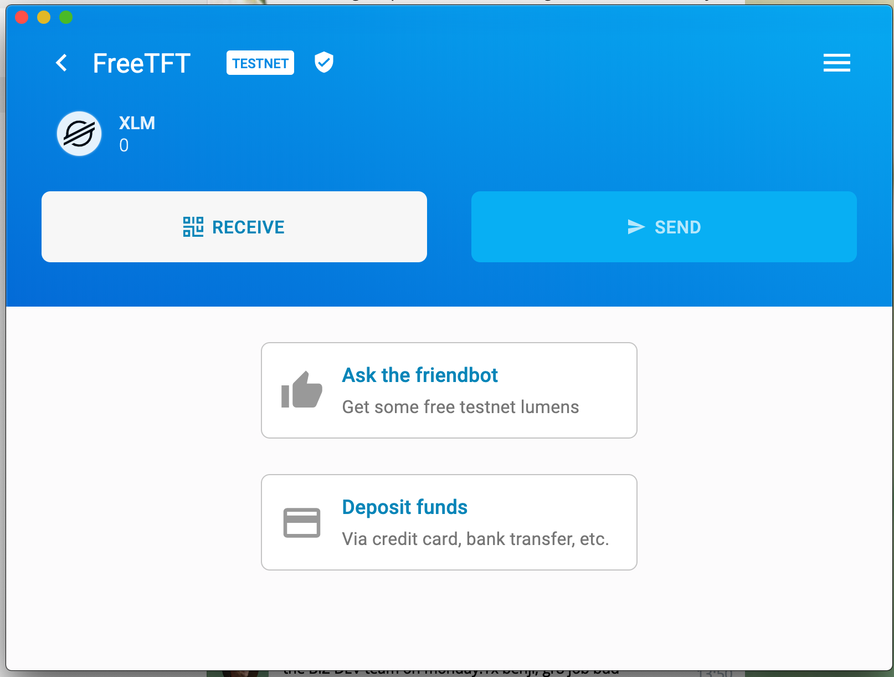
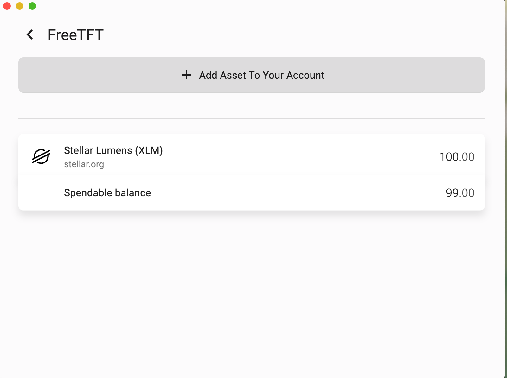
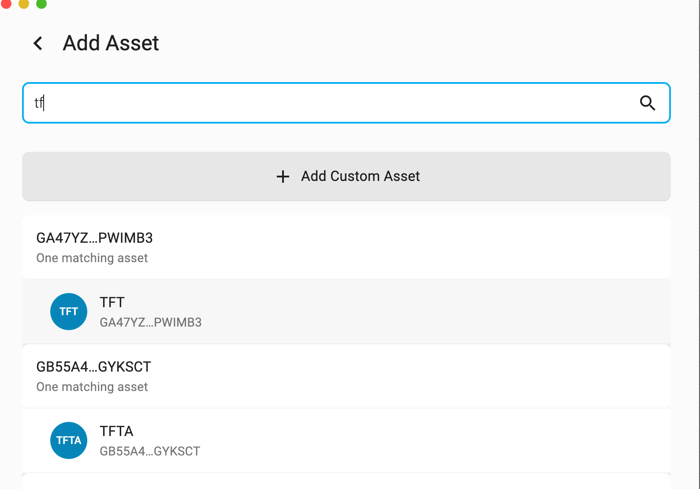
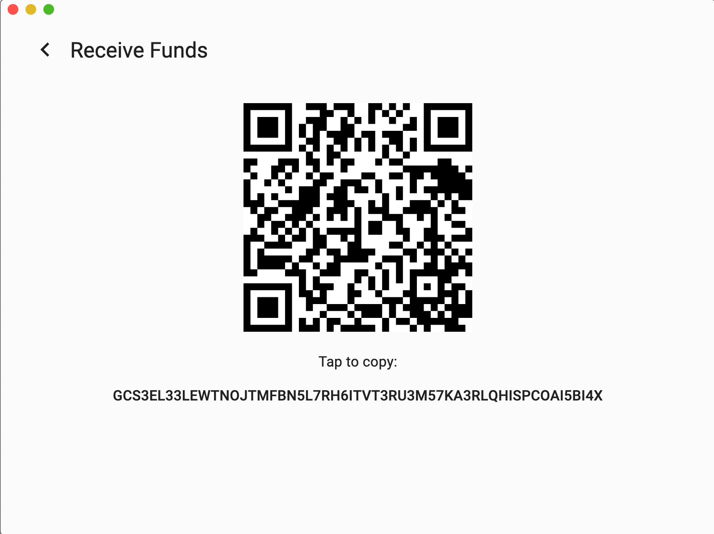
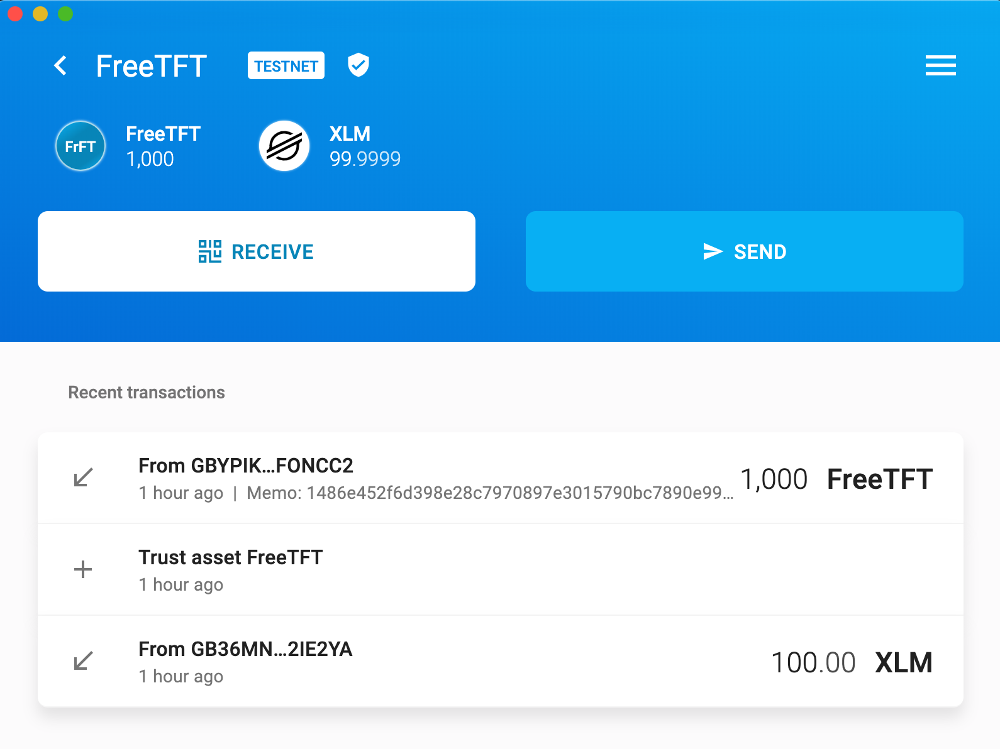

# Set up a Solar Wallet (Testnet)

We will divide this tutorial into two sections:
- Solar Wallet Sign Up
- Add FreeFTT to your Testnet Solar Wallet

## Solar Wallet Sign Up

In this tutorial we'll teach you how to set up a Solar Wallet (testnet) as the wallet address to save your FreeTFT. In order to set up a testnet wallet, by default, we would first need to set up a mainnet Solar wallet.

### Download Solar Wallet via Web Browser

[__Get a Solar Wallet here__](https://Solarwallet.io/) and install a stellar wallet on your desktop or mobile.

### Create a Solar Wallet Account

After your wallet is successfully set, run Solar Wallet software from your computer, read Solar's terms and conditions, agreed if you do so.

Click on __Create Account__ on your wallet home.

### Set up a New Mainnet Solar Wallet Account

You will be directed automatically to the mainnet wallet set up. Set a wallet name and password for your first mainnet wallet. Remember that in order to create a testnet wallet, we must first create a mainnet wallet.

### Back up Your Security Key (Mainnet)

Back up your security key by entering your account password. 

Your key is a very important component of your wallet management and recovery, and should be kept in a secure place and only be known by you.

### Go back to 'Mainnet Wallet Account List' Page

After your key is securely backed up, you will be redirected to your first wallet homepage.

Press the __"<" back__ button next to your wallet name to go back to all your mainnet wallet accounts list

### Activate 'Testnet' via Wallet Account List's Setting

On your mainnet wallet account list page, click on the __'setting'__ icon on the left corner of your page. 

On your wallet account setting, click on the option to __'Show Testnet Account'__ in order to switch from mainnet to testnet wallet environment where we would store our Free TFT.

### Switch to Testnet Wallet Account List

Go back to your mainnet wallet accounts list, and click on __'SWITCH TO TESTNET'__.

### Create Your First Testnet Wallet Account

Congratulations, now you are on the testnet environment. But we need to create a testnet wallet account, so let's click on __'ADD ACCCOUNT'__ to create a new testnet wallet.

### Set up Your First Testnet Wallet Account

Now repeat the same procedure as creating a mainnet wallet account by setting up your wallet name, password and storing your security key in a safe place. 

You will be automatically redirected to your new wallet homepage. Congratulations, now you have officially set up a testnet Solar wallet!

## Add FreeFTT to your Testnet Solar Wallet

### Get some Testnet Lumens

By default, your could only set up another token asset (in this case, FreeTFT) in your testnet wallet once you have addes some testnet lumens (XLM) in your wallet. Simply click on __'Ask the Friendbot'__ to get some free Testnet Lumens.

### Set up a New Asset (FreeTFT)

Once your testnet lumens fund is successfully added, click on the __'menu' button__ on the top left corner of your wallet homepage and click on __'Assets & Balance'__ to add FreeTFT as our new asset.

On the asset list page, click __'add asset to your account'__ button

Find FreeTFT and click on __'add custom asset'__

Here you will find FreeTFT asset information. Set the asset up by clicking on __'add asset to your account'__ button.

Confirm the FreeTFT addition by clicking on __'confirm'__ button.

Congratulations! Now you have successfully add Freetft as an asset on your testnet Solar wallet. Now let's add some funds, go and __claim your FreeTFT!__ by clicking __'RECEIVE'__ on your wallet homepage.

### Claim your FreeTFT

You will now be automatically redirected to your wallet address key. __Copy this address__ as your receiving address for your FreeTFT Claim.

### Claim FreeTFT via ThreeFold 

Now go back to your web browser and click on [getfreetft.testnet.Threefold.io](https://getfreetft.testnet.Threefold.io/#/) to claim your FreeTFT.

__Connect your 3Bot ID__ via 3Bot Connect App to login to the FreeTFT Claim Page.

Insert your paste your Solar Testnet Wallet address on the given form and click _enter_ to receive your FreeTFT within minutes. 

__Go back to your Solar Testnet Wallet account__ and see if 1000 TFT is added automatically. If yes, then, congratulations, you have successfuly claimed your FreeTFT to get started with deploying your solutions via [__TF Grid 2.2 Demo__](threefold_now.md)

> If you have problem with adding FreeTFT, feel free to contact our [Support Helpdesk](https://Threefoldfaq.crisp.help/en/).