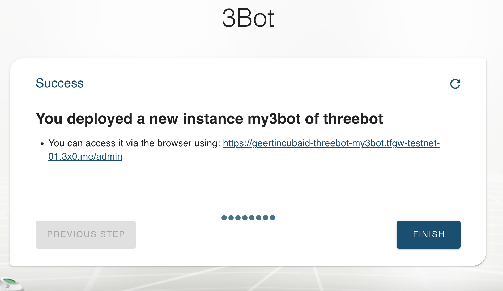

# Getting a hosted 3Bot  on TF Grid Testnet

You can get a hosted 3Bot on testnet [here](https://deploy3bot.testnet.grid.tf). 
Browse to the website and log in using your 3Bot Connect app. 

- Make sure to have a [TFT funded stellar testnet wallet](testnet_wallet_interstellar.md), so you can extend the lifetime of your 3Bot once deployed.

Once you're in, you can either `Deploy a new 3bot`, or you can view the hosted 3Bots that you have created before for recovery (`View my existing 3Bots`). All 3Bots are backed up, so recovery is possible. 

Select `Deploy a new 3Bot` and `Create` 

Give your 3Bot a name: 

Choose a password, needed for recovery afterwards:

Choose the first expiry date of your 3Bot. You will have to pay an amount for the 3Bot to be hosted until that date (extending is possible).

And you're done ! 
Now your hosted 3Bot is available at the indicated url. 

