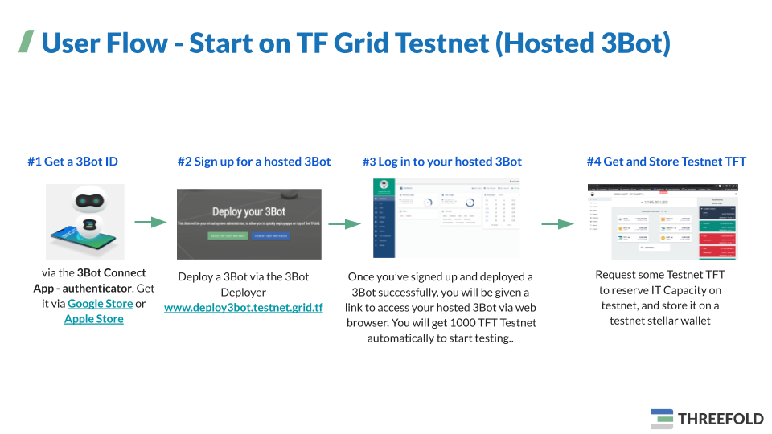

# Getting Started on TF Grid Testnet

## Get ThreeFold Connect App and 3Bot ID

As the first step, you need to get yourself a **ThreeFold Connect** and **3Bot ID**. This can be done by downloading the app on your smartphone and creating your own 3Bot Identity. 

Please be aware that this ID will be used as your main digital identity on the Threefold Grid and holds the keys to access every service on the grid. Therefore, it's very important to remember the login data and the seed phrase of your ID. The ThreeFold Connect App will also provide you with an access to your 3Bot Wallet where you can store your Threefold Tokens.

> Manual: [Get __ThreeFold Connect App__](threefold_connect_install.md)

## Get a 3Bot on Testnet

[__3Bot__](testnet_3bot.md) is your virtual system administrator.

> Easy Set Up (recommended): [Get a __Testnet Hosted 3Bot__ using __3bot Deployer__](3bot_deployer.md)  
> Advanced Set Up: [Create a __Testnet Local 3Bot__ on your local machine](3bot_local_install.md)

## Launch and Log in to Your New Hosted 3Bot

Once you’ve signed up and deployed a hosted 3Bot successfully, you will be given a link to access your hosted 3Bot via a web browser. 

Go to the provided link to launch your 3Bot and login to your new 3Bot admin dashboard by connecting it to your 3Bot ID. You can use the ThreeFold Connect App on your mobile phone to verify your identity.

## Get Testnet TFT (Tokens for IT Capacity)

Once you're logged in to your 3Bot for the first time, a __pre-configured 3Bot Wallet__ will be created for you on your hosted 3bot, with an initial balance of __1000 TFT Testnet__.

> These TFTs are not real TFTs, they are only usable on Testnet.

These TFTs can be used to reserve test IT Capacity on top of the TF Grid testnet. 

You could also use __third-party testnet stellar wallets__ to store your TFT on testnet. 

You can also get TFT from our _testnet TFT faucet_ which is a hosted bot that creates your Testnet TFT to be used on testnet. 

> Manual: [__Get and Store TFT__ on Testnet](testnet_gettft.md)
